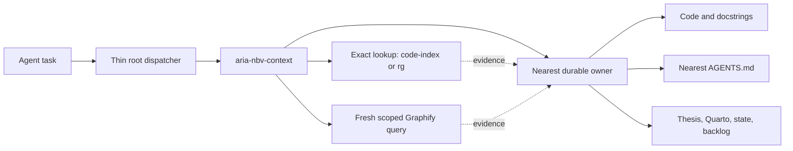

# ARIA-NBV Agent Scaffold Simplification Decision Record

**Status:** Draft with blocking open decisions

**Planning workflow:** OMX `$plan --direct`

**Recorded:** 2026-07-11

**Repository baseline inspected:** `ce2ffbf`

**Implementation authorization:** None

This specification is the durable handoff for the 2026-07-11 scaffold grill.
It records the decisions already accepted by the repository owner, the evidence
that motivated them, rejected alternatives, and the remaining decisions that
must be resolved before changing ARIA-NBV agent guidance, skills, context tools,
Graphify integration, generated context, or LitKG integration.

No agent-scaffold implementation may begin while any item marked **blocking**
in [Open Decisions](#open-decisions) remains unresolved.

## Goal

Reduce ARIA-NBV's agent-scaffold complexity while preserving reliable local
discovery, source-backed project guidance, maintainable API documentation, and
literature navigation.

Success means:

- every durable fact has one authoritative owner;
- always-loaded guidance is small and routing-oriented;
- generated evidence is visibly non-authoritative and provenance checked;
- maintained external tools are preferred over repo-local indexing systems;
- docstrings and Quartodoc provide the canonical Python entity hierarchy;
- Graphify provides bounded relationship discovery, not project truth;
- optional tooling cannot become a mandatory runtime dependency by accident;
- LitKG is removed from ARIA-NBV's default and required paths;
- scaffold production LOC, commands, skills, generated artifacts, and failure
  modes are reduced.

## Governing Model

ARIA-NBV needs three distinct information layers:

1. **Durable truth owners**
   - source code and source-adjacent docstrings for implementation contracts;
   - root and nearest `AGENTS.md` files for agent invariants and package hazards;
   - thesis, Quarto, glossary, memory-state, and backlog owners according to
     `.agents/references/source_order.md`.
2. **Discovery control**
   - `aria-nbv-context` selects a deterministic discovery route, validates
     derived-evidence freshness, and hands work to the nearest owner.
3. **Derived evidence**
   - Graphify, code-index, search output, generated API docs, and optional UML
     or wiki exports help agents navigate; they never override source owners.

## Resolved Decisions

### D01. `aria-nbv-context` is a discovery control plane

**Accepted.** The skill contains everything needed to choose and execute the
correct discovery route: route selection, evidence provenance, freshness
handling, output requirements, and handoff rules.

It does not duplicate package contracts, symbol catalogs, thesis claims,
current project state, formulas, or other durable project truth.

**Completion criterion:** the skill has identified the owning source, nearest
applicable guidance, evidence route, freshness status, and next workflow.

**Rejected:** a comprehensive project handbook and a default all-in-one
generated portal. Both duplicate owners and drift after refactors.

### D02. Retire `agent-behavior`

**Accepted.** Universal invariants belong in always-loaded root guidance.
`agent-behavior` repeats owner inspection, dirty-worktree safety, surgical
scope, lane selection, and verification without introducing a distinct task
capability.

The skill should be removed after any genuinely unique invariant is folded into
the root dispatcher once. Routing fixtures must stop requiring ceremonial
`agent-behavior` co-activation.

**Rejected:** preserving the current skill or retaining it as a mandatory tiny
preflight. Both keep a universal two-skill activation tax.

### D03. Use an intentional hybrid Graphify route

**Accepted.** Discovery distinguishes localization, topology, and authority:

- exact known symbols or paths use code-index when available, otherwise `rg`
  and direct source reads;
- unknown architecture, cross-module behavior, callers/data flow, or
  relationship questions use Graphify first, but only through a scoped,
  vocabulary-expanded, token-budgeted query;
- `graphify path` answers relationships between known nodes;
- `graphify explain` inspects one known concept;
- source-order owners, not the graph, resolve authority conflicts.

This intentionally adapts Graphify's upstream graph-first recommendation.
ARIA-NBV keeps the deterministic fast path because Graphify query is keyword
matching plus graph traversal and because repository worktrees can carry stale
graphs.

**Rejected:** raw broad Graphify queries for every lookup and relationship-only
Graphify after every deterministic search.

### D04. Graphify requires a worktree-aware provenance gate

**Accepted.** A graph may support current-state conclusions only when its scan
root and corpus provenance match the active worktree.

The gate must distinguish at least:

- wrong-root graph: bypass;
- current graph: use scoped query;
- stale graph and graph evidence not material: use deterministic lookup;
- stale graph and graph evidence material: incrementally refresh, then query.

Current evidence shows why this is required: the inspected checkout was at
`ce2ffbf`, while `graphify-out/GRAPH_REPORT.md` identified build commit
`573b9fe6`.

**Rejected:** always refreshing before every query, warning while using stale
evidence for current claims, and mandatory background watchers in every
worktree.

### D05. Retire the custom generated context suite

**Accepted.** The current ignored artifacts do not justify their maintenance
or context cost:

- `source_index.md` mostly restates root/source-order routing;
- `data_contracts.md` is a stale copy of source-derived contracts;
- global UML and class-docstring files are too large for routine navigation;
- the package tree is reproducible with standard tools;
- `context_snapshot.md` combines large weak artifacts into one load;
- `literature_index.md` belongs to literature discovery, not package context.

The inspected artifacts were mostly generated on 2026-07-09 and had no
non-scaffold consumers. Approximate sizes included 96 KB of class docstrings,
182 KB of UML, 53 KB of data contracts, and a 256 KB combined snapshot.

Remove default generation and routing for these outputs. Keep
`docs/_generated/context/glossary.jsonl` only because it belongs to the glossary
pipeline and has a real non-agent documentation role.

**Rejected:** splitting the same catalogs into per-module or per-package files.
That improves packaging while multiplying stale duplicate artifacts.

### D06. Keep UML generation as an explicit operator tool

**Accepted.** Preserve the ability to generate an untracked UML diagram for a
deliberate architecture review. UML is not part of context refresh, normal
agent routing, snapshots, or routing fixtures.

UML output is a class-relationship visualization. It must not be presented as
runtime data flow, package ownership, or current API authority.

### D07. Docstrings and Quartodoc own Python entity documentation

**Accepted.** Source docstrings rendered through the existing Quartodoc pipeline
are the canonical hierarchical documentation for modules, public entities,
contracts, fields, shapes, units, invariants, lifecycle, and cross-references.

Graphify wiki is complementary: it may be generated untracked and on demand
for a broad architecture review, but it is not refreshed by default and does
not define package or API contracts.

**Rejected:** using Graphify wiki as a default or canonical API hierarchy.
Graph communities are algorithmic and may contain inferred relationships.

### D08. Use contract-tiered docstring coverage

**Accepted.** Require:

- a responsibility-oriented docstring for every non-trivial module;
- docstrings for every public top-level class, DTO, protocol, enum, config,
  function, and public method;
- field documentation for public DTO, config, and state contracts;
- private-symbol docstrings only when semantics, invariants, units, shapes,
  lifecycle, side effects, or failure behavior are not evident locally.

Do not require no-op narration for every private helper.

### D09. Keep `python-docstrings`, but compact its entrypoint

**Accepted.** `python-docstrings` remains the sole workflow owner for ARIA-NBV
docstring style and Quartodoc compatibility. Its `SKILL.md` should retain
activation, non-goals, contract-tier classification, a short workflow,
completion criteria, and precise context pointers.

Detailed examples, Jaxtyping/shape rules, field mechanics, theory-rich patterns,
and cross-reference syntax belong in focused references. The current entrypoint
is about 240 lines and exceeds the local default size guidance.

**Rejected:** folding the workflow into general Python conventions or keeping
all detailed branches inline.

### D10. Remove the custom AST context helper

**Accepted.** Remove the multi-mode `aria_nbv/scripts/get_context.py`, its skill
wrapper, broad inventory modes, generated-output uses, and redundant Make
targets. The inspected helper is 435 lines before wrappers and Make recipes.

Use code-index when available, Graphify for fresh relationships, and `rg` plus
direct source reads as the universal fallback. Code-index availability must not
be asserted as a universal invariant; it is absent from some Codex surfaces.

### D11. Keep `context_map.md` conceptual and stable

**Accepted.** The map contains only non-obvious domain concepts, canonical owner
types, stable package roots, and first-reveal query patterns. Runtime discovery
finds exact leaf modules.

**Rejected:** hard-coded volatile leaf paths with an existence validator and a
generated concept-to-owner map inferred from Graphify.

### D12. Debriefs are event-triggered

**Accepted.** Require a debrief only for reusable difficult diagnoses,
experiments or benchmarks whose evidence is not otherwise durable, multi-session
handoffs, surprising tool/scaffold failures, rationale that cannot fit its
canonical owner, or an explicit user request.

Routine code, docs, refactors, and package moves update their owners directly.
Validation checks debrief format when one exists; it does not require an empty
debrief for every non-trivial task.

### D13. Skill invocation follows an independent-reach audit

**Accepted.** A skill remains model-invoked only when agents must autonomously
recognize its distinct task branch or another workflow must hand off to it.
Optional operator modes and capabilities normally invoked explicitly become
user-invoked.

Every repo-local skill requires a recorded classification: independent trigger,
autonomous handoff requirement, invocation mode, and rationale.

**Rejected:** keeping every skill model-invoked and exposing one universal
model-invoked router with all specialists user-invoked.

### D14. Root guidance is a thin dispatcher

**Accepted.** Root guidance retains only universal safety and dirty-worktree
invariants, the source-order pointer, compact task-to-owner routing,
instruction-capture ownership, and a minimal verification rule.

`aria-nbv-context` owns lookup mechanics and provenance. Domain skills own
specialized workflows. Nearest `AGENTS.md` files own package hazards and local
verification.

### D15. Routing tests protect capabilities and outcomes

**Accepted.** Replace exact ceremonial skill-array expectations with scenarios
that assert:

- the owner capability or unique skill where one exists;
- required evidence;
- forbidden routes and tools;
- expected handoff class;
- whether external evidence is allowed or required.

Use exact skill names only for genuine single-owner workflows.

### D16. Package READMEs are selective

**Accepted.** Keep or add a package README only when it provides durable human
subsystem orientation that remains useful outside generated API docs.

Do not store symbol inventories or agent rules in READMEs. Temporary
responsibility and redundancy matrices used during refactors belong in the
active `.omx/specs/` artifact or untracked analysis output. They are not current
API truth.

### D17. The default Graphify corpus stays production-and-design focused

**Accepted for now.** Include maintained production code, thesis/design/public
docs, curated literature pages, and selected architecture/reference material.
Exclude tests, configs, runtime state, generated artifacts, skills, agent
history, archives, and vendored repositories from the default graph.

Complete change-impact analysis still requires deterministic scans over tests,
configs, scripts, and public entry points after Graphify identifies production
owners.

### D18. Remove LitKG from ARIA-NBV's default and required paths

**Accepted.** The standalone `litkg-rs` repository may continue independently,
but ARIA-NBV should remove:

- the `.agents/external/litkg-rs` submodule;
- `.configs/litkg.toml`;
- `aria-litkg-memory` and `semantic-scholar-litkg` routing skills;
- LitKG hooks and automatic refresh behavior;
- LitKG Make targets and mandatory claim-check coupling;
- repo-side LitKG wrappers, status/doctor scripts, compactors, and ingestion;
- Neo4j/export/MCP plumbing;
- LitKG transcript ingestion and generated KG registries where they have no
  independent owner.

Keep `docs/references.bib`, `docs/literature/sources.jsonl`, local paper assets,
curated literature pages, and source-backed citation discipline.

### D19. Use a two-tier Graphify literature model

**Accepted.** The default graph includes curated Quarto literature pages,
`sources.jsonl`, `references.bib`, thesis/design docs, and production code.

Build a separate untracked literature graph from selected local PDFs only when
deep paper retrieval is needed. Curated Quarto pages and citation keys bridge
papers to thesis and code. Strong advisor-facing claims still require direct
source inspection.

Do not merge a full literature graph into every default code graph refresh.

### D20. Use direct TeX search; do not retain the LitKG parser in ARIA

**Accepted.** Agents locate relevant LaTeX source with transparent `rg` recipes
over `docs/literature/tex-src/**/*.tex`, including term and section-heading
searches. Selected PDFs feed Graphify when graph retrieval is useful.

Do not copy the LitKG TeX parser into ARIA. Its immediate parser surface is
about 790 lines and exceeds 1,200 lines with supporting model/BibTeX code.
An optional external section exporter or upstream Graphify TeX support may be
considered later as an independent project, but ARIA cleanup does not wait for
it.

## Rejected Architecture Summary

The following directions are explicitly rejected unless a later evidence-led
decision reopens them:

- an `aria-nbv-context` project handbook;
- mandatory `agent-behavior` co-routing;
- raw broad Graphify queries for every symbol lookup;
- stale Graphify evidence for current-state claims;
- default background graph watchers;
- global or hierarchical custom symbol/context snapshots;
- default Graphify wiki generation;
- docstrings on every trivial private helper;
- package README symbol matrices as durable documentation;
- exact skill-array routing fixtures;
- mandatory debriefs for routine work;
- a whole-repository default Graphify corpus;
- retaining LitKG as an optional-but-wired ARIA subsystem;
- copying LitKG's LaTeX parser into ARIA.

## Open Decisions

No agent-scaffold implementation begins until **O01-O09** are resolved. The
remaining items may be resolved within their named workpackage before that
workpackage starts.

### Blocking

#### O01. Recover the truncated owner instruction

The owner's prior message ended at: `7. Custom skills drop f...`.

The missing remainder may add a broad skill-pruning rule. It must be restated
before finalizing the skill portfolio.

#### O02. Classify every repo-local skill

Produce the independent-reach matrix for every `.agents/skills/*` entry:

`Skill | Distinct branch | Autonomous handoff needed | Model/user invoked | Keep/merge/remove | Rationale`

This decision controls descriptions, routing metadata, fixture changes, and
skill deletions.

#### O03. Define the exact root/context/nearest-owner text budget

Set measurable limits for:

- the ARIA-owned root dispatcher section;
- `aria-nbv-context/SKILL.md`;
- conceptual `context_map.md`;
- nearest package `AGENTS.md` files.

The implementation must remove duplicate statements rather than merely move
them between files.

#### O04. Define the Graphify provenance implementation

Choose the smallest implementation that proves scan root and corpus freshness.
Prefer upstream manifest/root/commit facilities. Avoid a large repo-local
wrapper. Specify dirty-worktree handling, worktree mismatch behavior, and the
exact conditions that trigger `graphify update .`.

#### O05. Confirm the generated-context deletion ledger

For every current `docs/_generated/context/*` artifact and Make target, record:

`Artifact/target | Consumers | Keep/remove | New owner or replacement`

The glossary JSONL is already retained. Any other exception needs a real
non-agent consumer.

#### O06. Define replacement claim-verification behavior

After removing `kg-claim-check`, specify the minimum evidence contract for
advisor-facing and thesis claims. The likely baseline is citation-key
resolution, direct inspection of the cited paper section or authoritative
source, explicit claim-strength wording, and Quarto/Typst render validation.

Do not replace LitKG with an equally complex custom claim engine.

#### O07. Inventory the exact LitKG removal surface

Separate:

- active integration to delete;
- generic bibliography/download functionality to retain under a non-KG owner;
- historical `.agents` records that remain provenance only;
- generated/runtime artifacts that are safe to purge;
- external standalone-repository work that is out of ARIA scope.

#### O08. Define the default and literature Graphify corpus manifests

Specify exact included roots and exclusion rules for:

- the default production/design graph;
- an on-demand selected-PDF literature graph;
- any explicit merged graph used for a thesis architecture review.

The manifests must prevent plans, archives, generated docs, and runtime state
from being interpreted as implemented truth.

#### O09. Define implementation workpackages and clean baseline

The current checkout contains extensive user-owned modifications and staged
deletions, including many historical `.omx` artifacts. Before scaffold edits,
choose a clean branch/worktree and confirm which `.omx` artifacts are intended
to remain tracked.

No scaffold implementation commit may absorb unrelated current changes.

### Workpackage-Local

#### O10. UML command contract

Decide its final command name, whether package/path scoping is required, which
external generator remains supported, and whether the current filter helper is
still justified.

#### O11. Docstring audit enforcement

Define which contract-tier checks block CI, how public exports are discovered,
how public methods and field documentation are checked, and how private
complexity findings remain advisory rather than rewarding no-op prose.

#### O12. Select durable package READMEs

Inventory current package READMEs and retain only those with lasting human
orientation value. Temporary refactor matrices must not silently become
permanent documentation.

#### O13. Literature graph selection profile

Define how papers are selected, where untracked PDF graph state lives, how
freshness is checked, and how agents cite source locations after a graph query.

#### O14. Exact direct-TeX discovery recipes

Fix the currently misrooted literature-search helper or remove it in favor of
documented direct `rg` commands. Decide whether any wrapper earns its existence.

## Suggested Workpackages

These are planning packages, not approved implementation. Their final boundaries
depend on the blocking decisions above.

### WP0. Resolve blockers and establish a clean baseline

- recover the truncated instruction;
- complete skill and LitKG ledgers;
- choose a clean worktree;
- record baseline skill count, scaffold LOC, Make target count, generated
  artifact count, submodule count, and root-guidance size.

### WP1. Root, context, and routing simplification

- retire `agent-behavior`;
- make root guidance a thin dispatcher;
- refocus `aria-nbv-context` on discovery control;
- make `context_map.md` conceptual;
- convert routing fixtures to capability/outcome assertions.

### WP2. Generated-context and lookup-tool pruning

- remove the custom generated context suite and default refresh paths;
- remove the AST context helper and redundant wrappers/Make targets;
- preserve only the approved manual UML command;
- update all stale scaffold references.

### WP3. Python documentation contract

- compact `python-docstrings` with progressive disclosure;
- define and enforce contract-tier coverage;
- improve module/public entity docstrings in bounded package batches;
- regenerate and validate Quartodoc;
- prune temporary package README matrices.

Docstring content changes should be separate reviewable commits from scaffold
routing deletion.

### WP4. Graphify routing and provenance

- implement the minimal root/corpus freshness gate;
- encode exact-vs-relational routing in `aria-nbv-context`;
- update `.graphifyignore` to the approved production/design manifest;
- document optional untracked UML and Graphify wiki generation;
- add provenance and stale-graph tests.

### WP5. LitKG removal

- remove active ARIA integration, submodule, configs, skills, hooks, Make
  targets, wrappers, Neo4j/export plumbing, and mandatory claim coupling;
- retain bibliography, manifest, local paper assets, and generic downloads
  under clear docs ownership;
- update source order and all agent/docs references atomically.

### WP6. Lightweight literature replacement

- define direct TeX search recipes;
- validate bibliography/manifest indexing without LitKG;
- document the two-tier Graphify corpus flow;
- validate selected-PDF graph generation and direct-source verification;
- do not introduce a new section parser or graph database.

## Verification Contract

Every implementation workpackage must be independently reviewable and reduce
or hold total scaffold complexity. Required checks should include:

- `git diff --check`;
- `make scaffold-audit` and its self-tests after fixture changes;
- `make check-agent-memory` after guidance/memory changes, revised so absent
  routine debriefs are valid;
- local skill validation for every changed retained skill;
- stale-reference scans for removed skills, commands, paths, KG names, and
  generated artifacts;
- Graphify wrong-root, stale-commit, dirty-corpus, current-corpus, and fallback
  scenarios;
- Quartodoc generation and Quarto API render after documentation changes;
- bibliography and `sources.jsonl` validation after LitKG removal;
- direct TeX term/section lookup smoke tests;
- no required Neo4j, Rust submodule, embedding service, or KG runtime in root CI;
- before/after counts for scaffold Python/Rust/shell/Make LOC, skills,
  model-invoked descriptions, generated artifacts, commands, submodules, and
  CI/runtime dependencies.

## Stop Conditions

Stop and return to planning when:

- a blocking open decision is unresolved;
- a proposed deletion has an active non-agent consumer;
- Graphify provenance cannot distinguish active worktrees;
- removing LitKG would remove bibliography or source-manifest authority without
  a tested replacement;
- docstring enforcement would require no-op prose on trivial private helpers;
- a workpackage increases scaffold complexity without deleting a larger,
  measured surface;
- the implementation branch contains unrelated user-owned changes.

## Evidence Snapshot

Evidence gathered during the grill:

- root Graphify report build commit: `573b9fe6`;
- inspected checkout commit: `ce2ffbf`;
- generated context artifacts were predominantly dated 2026-07-09;
- `aria_nbv/scripts/get_context.py`: 435 LOC;
- `python-docstrings/SKILL.md`: approximately 240 LOC;
- `litkg-core/src/tex.rs`: 790 LOC;
- TeX parser plus immediate BibTeX/model support: over 1,200 LOC;
- current Graphify upstream supports PDF ingestion but does not list `.tex` as
  a direct source type;
- current literature search wrapper resolves the wrong root (`literature/`
  instead of `docs/literature/`);
- current LitKG integration spans a submodule, two skills, config, a large Make
  target family, scripts, hooks, Neo4j/export/MCP support, generated registries,
  and mandatory claim routing;
- the current checkout has substantial unrelated modifications and staged
  deletions, so this specification does not authorize edits in place.

### Source anchors

- `AGENTS.md`
- `.agents/references/source_order.md`
- `.agents/references/skill_style_guide.md`
- `.agents/references/scaffold_routing_fixtures.json`
- `.agents/skills/aria-nbv-context/SKILL.md`
- `.agents/skills/aria-nbv-context/references/context_map.md`
- `.agents/skills/agent-behavior/SKILL.md`
- `.agents/skills/python-docstrings/SKILL.md`
- `aria_nbv/scripts/get_context.py`
- `scripts/quarto_generate_api_docs.sh`
- `docs/_quarto.yml`
- `.graphifyignore`
- `graphify-out/GRAPH_REPORT.md`
- `.agents/external/litkg-rs/crates/litkg-core/src/tex.rs`
- `docs/literature/sources.jsonl`
- `docs/references.bib`
- [Upstream Graphify repository](https://github.com/Graphify-Labs/graphify)

## Next Planning Action

Resume the grill at **O01**, beginning with the missing text after
`7. Custom skills drop f...`. Then resolve O02-O09 one decision at a time with
pros, cons, and a recommended default. Only after those decisions are recorded
should this specification be converted into an executable OMX plan or
Ultragoal ledger.
