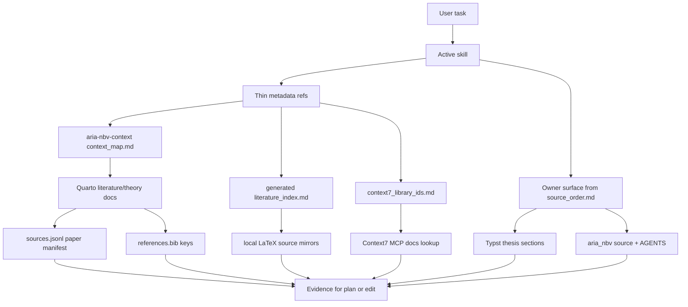

# RALPLAN: Context7 And Literature Routing Alignment

## Requirements Summary

Improve ARIA-NBV scaffold routing so conceptual planning and domain skills discover relevant Context7 library docs, local literature pages, BibTeX keys, source manifests, and local LaTeX mirrors earlier. The implementation must increase horizontal linking without creating more sources of truth or turning `SKILL.md` files into mini literature reviews.

Planning mode only. This artifact is the consensus handoff target for a later implementation lane.

## Current Repo Facts

- `.agents/references/context7_library_ids.md` already owns Context7 library IDs and is published into generated docs by `scripts/quarto_generate_agent_docs.py`.
- `docs/contents/literature/index.qmd` already owns the public literature review navigation and explicitly points to `docs/literature/sources.jsonl` as the canonical paper manifest and `docs/literature/tex-src/` as local source mirrors.
- `docs/_generated/context/literature_index.md` is generated from local registry/source mirrors. It is a rebuild-and-inspect output, not a manual edit target.
- `.agents/skills/aria-nbv-context/references/context_map.md` already owns non-obvious cross-surface concept routing for local deterministic discovery.
- `.agents/references/source_order.md` and `.agents/references/alignment_tools_contract.md` already define owner-first truth and tool-evidence boundaries.

## RALPLAN-DR Summary

### Principles

1. Owner-first: every durable claim points to one owning surface before adding helper links.
2. Evidence-linked, not evidence-owned: MCP, Context7, KG, browser, code-index, paper tools, and generated indexes produce retrieval evidence; they do not own project truth.
3. Reuse existing owners: extend `context7_library_ids.md`, literature pages, and `context_map.md`; update generator/source inputs when a generated literature index needs new derived routes; do not add second Context7 or bibliography maps in the first slice.
4. Curated horizontal links beat broad prose: use compact metadata pointers and references to existing anchors, not repeated explanatory paragraphs in every skill.
5. Fixture-gated routing: new links must improve activation/evidence selection without ambiguous duplicate activation.
6. Progressive disclosure: reveal external docs and literature tools only when the task shape warrants them.

### Decision Drivers

1. Reduce drift by keeping thesis/package/literature truth in current owners.
2. Increase planning quality by making Context7, MCP tools, BibTeX keys, and local literature evidence discoverable from relevant skills.
3. Keep scaffold validation auditable through static checks and routing fixtures.
4. Preserve hot-path skill brevity.

### Viable Options

#### Option A: Extend Existing Owners Plus Thin Per-Skill References

Extend `.agents/references/context7_library_ids.md` as the only Context7 lookup surface. Extend `.agents/skills/aria-nbv-context/references/context_map.md` as the authored local concept-to-literature routing surface, and regenerate `docs/_generated/context/literature_index.md` only from its owned inputs when needed. Add short `metadata.context7_refs`, `metadata.literature_refs`, and `metadata.tool_refs` pointers in domain skills only after `scaffold-audit` can validate them.

Pros: lowest drift risk; matches current source ownership; easy to audit; keeps skills focused on activation/routing; improves horizontal links without adding a second map family.

Cons: one extra lookup hop through existing references; requires careful generator/audit updates.

#### Option B: Create New Context7 And Literature Maps

Create `.agents/references/context7_library_map.md` and `.agents/references/literature_link_map.md`, then point skills at map rows.

Pros: very explicit shape for the new feature.

Cons: rejected for first slice. It duplicates existing Context7 ownership and risks creating a second bibliography/literature authority beside `docs/contents/literature/index.qmd`, `sources.jsonl`, `references.bib`, and the generated literature index.

#### Option C: Generate A Full Symbol/Literature/Tool Graph

Build a derived graph from `sources.jsonl`, `references.bib`, Quarto pages, Typst citations, local TeX mirrors, source symbols, Context7 IDs, MCP tool names, and skill metadata.

Pros: strongest long-term query surface; can power route explanations and drift checks.

Cons: too large for the first implementation slice; high risk of another generated truth artifact unless owner rules and fixture needs are proven first.

### Recommended Option

Use Option A. Reuse current owners, add narrow schema/audit support, and defer any generated graph until the curated pointers prove useful.

## Conceptual Model



The distinction is vertical authority versus horizontal evidence:

- Vertical authority answers which surface owns the truth.
- Horizontal evidence answers what the agent should read or query next to verify the claim.

## Proposed Artifacts And Edits

### 1. Extend `.agents/references/context7_library_ids.md`

Purpose: keep this as the single curated Context7 lookup surface.

Change shape, not ownership:

- Keep exact Context7 library IDs as the stable values.
- Add compact routing hints where helpful: owner skill refs, use-when, and local-first caveats.
- Add missing high-value IDs only when verified through `mcp__MCP_DOCKER.resolve_library_id` or already known from repo evidence.
- Do not add a second `context7_library_map.md` in the first slice.

Candidate additions/normalizations:

| Context7 ID | Domain skill refs | Use when | Local-first caveat |
| --- | --- | --- | --- |
| `/facebookresearch/pytorch3d` | `nbv-geometry-contracts`, `rerun-nbv-inspector` | camera projection, transforms, rendering semantics | read local geometry contracts and source first for project conventions |
| current owner PyTorch ID after reconciliation | `counterfactual-rollout-planner`, `python-docstrings`, `code-review-aria-nbv` | tensor/autograd/dataloader/model API behavior | reconcile `/rocm/pytorch` vs `/pytorch/pytorch` before metadata |
| `/pydantic/pydantic` | `dataset-cache-ops`, `counterfactual-rollout-planner` | config/schema validation behavior | local config classes remain authoritative |
| current owner Streamlit ID after reconciliation | `diagnose-aria`, `rerun-nbv-inspector` | dashboard/session/widget behavior | reconcile `/websites/streamlit_io` vs `/streamlit/docs` before metadata |
| `/rerun-io/rerun` | `rerun-nbv-inspector` | Rerun logging/viewer/frame APIs | only after local `.rrd` and logging code inspection |
| current owner Gymnasium ID after reconciliation | `counterfactual-rollout-planner` | explicit M6/bridge environment contracts | reconcile `/farama-foundation/gymnasium` vs `/websites/gymnasium_farama` before metadata |
| `/dlr-rm/stable-baselines3` | `counterfactual-rollout-planner` | explicit M6/SB3 bridge baseline work | gated; not default fitted Double-Q planning |
| `/e3nn/e3nn` | `nbv-geometry-contracts`, `counterfactual-rollout-planner` | equivariant/spherical-harmonic feature work | only when the plan explicitly touches that feature family |

Reconciliation policy: before any metadata edit, re-run `mcp__MCP_DOCKER.resolve_library_id` for candidate Context7 IDs that conflict with the owner file, compare the result against `.agents/references/context7_library_ids.md`, and update metadata only with exact verified owner IDs. If a candidate remains ambiguous or unresolved, record it under `unresolved_context7_refs` in the plan/audit output and keep it out of skill metadata. For example, do not invent a `coral-pytorch` Context7 ID; route to BibTeX/local package docs/source evidence instead.

### 2. Extend Existing Literature Discovery Surfaces

Do not create `.agents/references/literature_link_map.md` in the first slice. Use existing owners:

- `docs/contents/literature/index.qmd`: public literature domain hierarchy and adoption-state overview.
- `docs/literature/sources.jsonl`: canonical paper manifest.
- `docs/references.bib`: canonical citation keys.
- `docs/literature/tex-src/`: local source mirrors where available.
- `docs/_generated/context/literature_index.md`: generated lookup index from registry/source mirrors; regenerate, inspect, and diff-check only.
- `.agents/skills/aria-nbv-context/references/context_map.md`: compact non-obvious concept-to-source routes.

Planned improvement:

- Add a compact `Literature evidence routing` section to `context_map.md` as the authored route surface. If generated literature output needs corresponding derived entries, update the generator or its owned inputs, then rebuild `docs/_generated/context/literature_index.md`; do not hand-edit the generated file.
- Keep each row to concept label, Quarto owner page, representative BibTeX keys, local TeX mirror family, and first reveal command.
- Do not restate paper summaries in the scaffold.

Candidate concept routes:

| Concept route | Quarto owner | Representative citation keys | Local source mirrors | First reveal command |
| --- | --- | --- | --- | --- |
| `quality-driven-rri` | `docs/contents/literature/vin_nbv.qmd` | `VIN-NBV-frahm2025` | `docs/literature/tex-src/arXiv-VIN-NBV/` | `scripts/nbv_literature_search.sh RRI` |
| `egocentric-aria-substrate` | `project_aria.qmd`, `efm3d.qmd` | `projectaria-engel2023`, `ProjectAria-ASE-2025`, `EFM3D-straub2024`, `EVL-Doc-2025` | `arXiv-project-aria/`, `arXiv-EFM3D/` | `scripts/nbv_literature_search.sh EFM3D` |
| `finite-candidate-rl` | `rl_planning.qmd` | `DoubleDQN-vanHasselt2015`, `DuelingDQN-wang2016`, `IQL-kostrikov2021`, `CQL-kumar2020`, `BCQ-fujimoto2019` | `arXiv-DQN/`, `arXiv-Double-DQN/`, `arXiv-CQL/`, `arXiv-BCQ/` | `scripts/nbv_literature_search.sh Double` |
| `continuous-nbv-bridge` | `gen_nbv.qmd`, `hestia.qmd`, `pb_nbv.qmd` | `GenNBV-chen2024`, `Hestia-lu2026`, `PB-NBV-jia2025` | `arXiv-GenNBV/`, `arXiv-Hestia/`, `arXiv-PB-NBV/` | `scripts/nbv_literature_search.sh PPO` |
| `radiance-field-nbv-bridge` | `active_3dgs_nbv.qmd`, `scone_fisherrf.qmd` | `ActiveNeRF-pan2022`, `FisherRF-jiang2024`, `ObjectCentricNBV-jeong2026`, `li2025bestviewselectionssemantic`, `FOVHPE-bae2025` | `arXiv-FisherRF/`, `arXiv-Instance-NBV/`, `arXiv-Dynamic-3DGS/` | `scripts/nbv_literature_search.sh FisherRF` |
| `semantic-scene-memory-bridge` | `scene_script.qmd` | `SceneScript-avetisyan2024` | `arXiv-scene-script/` | `scripts/nbv_literature_search.sh SceneScript` |

Line-level citation policy:

- Skills should store concept routes, BibTeX keys, and owner paths, not brittle line numbers.
- Final answers and review findings should cite concrete file lines after fresh lookup with `rg -n`, `nl -ba`, code-index, or generated index search.
- For paper-specific claims, cite the local Quarto page and then verify against `references.bib`, `sources.jsonl`, and local TeX/PDF when the claim is narrow or advisor-facing.

### 3. Skill Metadata Extensions

Add short metadata keys only after audit support exists:

```yaml
metadata:
  context7_refs:
    - /facebookresearch/pytorch3d
  literature_refs:
    - VIN-NBV-frahm2025
    - docs/contents/literature/vin_nbv.qmd
  tool_refs:
    - mcp__code_index.search_code_advanced
    - mcp__MCP_DOCKER.get_library_docs
```

Rules:

- `context7_refs` values are exact IDs present in `.agents/references/context7_library_ids.md`.
- `literature_refs` values are BibTeX keys, Quarto literature paths, `context_map.md` route labels, or local TeX family paths that resolve in current repo state. Generated literature-index anchors may be cited in answers after regeneration, but are not the canonical metadata owner.
- `tool_refs` values use the canonical callable form from the installed inventory: `mcp__<server>.<tool_name>` for MCP/deferred tools, with underscores exactly as exposed. Human aliases such as `Context7 get-library-docs` are documentation prose only unless `scaffold-audit` explicitly normalizes them.
- Audit rejects unknown Context7 IDs and missing local literature paths/BibTeX keys.
- Audit warns if a skill has external-library/API trigger language but no `context7_refs`.
- Audit warns if a skill has literature/thesis/advisor-facing trigger language but no `literature_refs`.
- Cap first-pass refs to the top 3-5 per skill; use owner surfaces for detail.

### 4. Strengthen `plan-grill` Conceptual Planning

Add a `--conceptual` behavior contract to `plan-grill` that integrates with `$plan`, `$ralplan`, and `$prometheus-strict`:

- Start with architectural/system-boundary framing before implementation detail.
- Explicitly name vertical owners and horizontal evidence sources.
- Include a Mermaid diagram in chat or plan artifacts for non-trivial architecture/planning tasks.
- Link to local Python standards for implementation-facing plans, especially `.agents/references/python_conventions.md` and relevant `aria_nbv/**/AGENTS.md` files.
- Use Context7 only for external library/API behavior and only after local owner/source inspection when project-specific behavior matters.
- Use local literature owners before web search for thesis/research claims.
- Teach the user by explaining why the source/order/tool routing matters, not just listing edits.

### 5. MCP And Tool Progressive Disclosure

Improve symbolic interlinking without flooding every skill:

- Add `tool_refs` metadata for high-value domain skills after audit support exists.
- Keep MCP tool guidance in reference surfaces, not long skill prose.
- Recommended tool edge examples:
  - `aria-nbv-context`: `mcp__code_index.search_code_advanced`, `mcp__code_index.get_symbol_body` for symbol/file localization.
  - `plan-grill`: `mcp__MCP_DOCKER.resolve_library_id`, `mcp__MCP_DOCKER.get_library_docs`, `mcp__code_index.search_code_advanced`, generated literature index lookup.
  - `diagnose-aria`: `mcp__MCP_DOCKER.browser_*` tools only for live app/UI diagnosis; `mcp__MCP_DOCKER.analyze_python_file`, `mcp__MCP_DOCKER.analyze_python_package`, and related Python analyzer tools for package-level diagnostics.
  - `nbv-geometry-contracts`: Context7 PyTorch3D plus local geometry source lookup.
  - `counterfactual-rollout-planner`: Context7 PyTorch/Gymnasium/SB3 only when external API semantics affect the plan.
  - `typst-authoring` and `docs-curator`: local literature index, `references.bib`, and Typst/Quarto docs IDs.

## Implementation Steps

1. PR0/preflight inventory and ownership guard.
   - Record `git status --short -- .agents scripts docs Makefile` before implementation.
   - Name the exact files each slice will touch before editing.
   - Preserve unrelated dirty worktree changes; final report must distinguish pre-existing drift from executor edits.
   - Keep generated/evidence outputs separate from owner edits.

2. Preserve single-owner surfaces.
   - Update `.agents/references/context7_library_ids.md`; do not create a second Context7 map.
   - Reconcile candidate Context7 IDs by re-running `mcp__MCP_DOCKER.resolve_library_id` where the planning pass disagrees with the owner file; metadata uses verified owner IDs only.
   - Update `.agents/skills/aria-nbv-context/references/context_map.md` as the authored route surface; update literature-index generator/source inputs only when generated output needs derived support; do not create a standalone bibliography-like scaffold map.
   - Update `source_order.md` only if wording is needed to clarify that Context7/literature links are evidence-routing aids.

3. Add audit support.
   - Extend `scripts/scaffold_audit.py` with accepted metadata keys `context7_refs`, `literature_refs`, and `tool_refs`.
   - Parse valid Context7 IDs from `.agents/references/context7_library_ids.md`.
   - Validate literature refs against `docs/references.bib`, local paths, `context_map.md` route labels, and source mirror paths; treat generated literature-index anchors as derived evidence, not metadata owners.
   - Validate `tool_refs` against canonical `mcp__<server>.<tool_name>` names or an explicit audit-owned alias table; warn on unknown environment-dependent tools instead of hard failing if MCP availability can vary.

4. Add minimal per-skill metadata.
   - `nbv-geometry-contracts`: PyTorch3D/PyTorch refs plus literature refs for Project Aria/EFM3D where geometry is tied to egocentric data.
   - `entity-aware-rri`: VIN-NBV and Project Aria/EFM3D literature refs; no default Context7 unless implementation API docs are needed.
   - `counterfactual-rollout-planner`: PyTorch plus gated Gymnasium/SB3 refs; finite-candidate RL literature refs.
   - `rerun-nbv-inspector`: Rerun, Streamlit, PyTorch3D refs.
   - `dataset-cache-ops`: Pydantic/msgspec/Zarr refs plus ASE/EFM3D literature refs.
   - `typst-authoring` and `docs-curator`: literature refs and Typst/Quarto Context7 IDs.
   - `semantic-scholar-litkg` and `aria-litkg-memory`: literature/source refs as claim-check aids, not default local lookup.

5. Strengthen `plan-grill`.
   - Add `--conceptual` trigger instructions.
   - Require owner/evidence split, Mermaid diagram for substantial plans, local Python standards links for implementation planning, and Context7/literature lookup triggers.
   - Keep workflow ownership with `$plan`, `$ralplan`, and `$prometheus-strict`; `plan-grill` remains the ARIA sidecar.

6. Add routing fixtures and negative tests.
   - Context7 needed: “Plan a PyTorch3D camera convention change.”
   - Context7 not needed: “Find the thesis target-RRI section.”
   - Literature needed: “Advisor-facing claim about finite-candidate Double-Q.”
   - Local source mirror needed: “Verify a specific claim from VIN-NBV methods.”
   - Tool refs needed: “Locate the implementation of candidate frustum rendering.”
   - Plan-grill integration: “Run `$ralplan --conceptual` on a PyTorch3D geometry plan” activates `plan-grill` as ARIA sidecar while `$ralplan` remains workflow owner.
   - Negative: browser MCP tools do not activate for non-live docs/literature planning.
   - Negative: Python analyzer tools do not activate for pure Typst/prose/literature edits.
   - Negative: unknown `context7_refs` ID fails.
   - Negative: missing BibTeX key or literature path fails.
   - Negative: local lookup should not route to KG/Context7 by default.

7. Validate and iterate.
   - `make scaffold-audit`
   - `make scaffold-audit-self-test`
   - `make agents-db AGENTS_ARGS='validate'`
   - `make check-agent-memory`
   - `make context-literature-index`
   - `git diff --check -- .agents scripts docs`
   - `git diff --exit-code -- docs/_generated/context/literature_index.md` after regeneration, unless the implementation intentionally updates generated literature output from owner inputs

## Acceptance Criteria

- Future execution starts with a dirty-state preflight: record status, touch set, and pre-existing drift before edits.
- There is still exactly one Context7 lookup owner: `.agents/references/context7_library_ids.md`.
- New or changed Context7 refs are freshly reconciled against `mcp__MCP_DOCKER.resolve_library_id`; ambiguous IDs stay out of skill metadata and are reported as `unresolved_context7_refs`.
- Literature routing points to existing owners: `docs/contents/literature/`, `docs/literature/sources.jsonl`, `docs/references.bib`, local TeX mirrors, and authored `context_map.md` routes.
- Generated context indexes, including `docs/_generated/context/literature_index.md`, are evidence surfaces only: regenerate via `make context-literature-index`, inspect, and do not manually edit them as sources.
- `plan-grill --conceptual` can tell agents when to use Context7, local literature pages, BibTeX keys, local LaTeX mirrors, and canonical `mcp__...` code-index/browser/Python MCP tools, while `$plan`, `$ralplan`, and `$prometheus-strict` remain workflow owners.
- At least six high-value domain skills have compact, audit-valid `context7_refs`, `literature_refs`, or `tool_refs`.
- Routing fixtures prove local lookup does not route to KG/Context7 by default, browser tools require live UI/app evidence, and Python analyzer tools require implementation-analysis tasks.
- Advisor-facing literature claims route to Quarto/Typst/BibTeX/source mirrors before final prose.
- No new skill body repeats paper summaries, formulas, or planned thesis detail.

## Risks And Mitigations

- Existing Context7 IDs may be stale: keep them as evidence-routing hints; re-run `mcp__MCP_DOCKER.resolve_library_id` when version/currentness matters.
- Markdown parsing can be brittle: parse only exact Context7 ID bullets and local path/BibTeX values first; move to structured data only if audit code becomes brittle.
- Literature routes can become a second literature review: include only owner path, BibTeX key, source mirror, and reveal command; no summaries beyond route labels.
- Tool availability varies by environment: validate canonical names when the inventory is present; hard-fail repo-owned malformed names; warn for optional MCP tool refs when the tool inventory is absent.
- Too many metadata links increase hot-path noise: cap refs and rely on owner surfaces for detail.
- Generated graph work expands scope: defer until curated refs and audit fixtures pass.

## Verification Matrix

| Claim | Required evidence | Owner/lane |
| --- | --- | --- |
| Dirty worktree is preserved | preflight `git status --short -- .agents scripts docs Makefile` plus final changed-file attribution | executor/verifier |
| Context7 refs use one owner file | `make scaffold-audit` plus direct check for no new duplicate map and `resolve_library_id` reconciliation notes | executor/test-engineer |
| Literature refs resolve to local owners | audit checks against BibTeX, paths, source mirrors, authored `context_map.md` routes, and rebuilt generated evidence | executor/test-engineer |
| Domain skills link horizontally without prose bloat | skill diff review and hot-path length warnings | executor/code-reviewer |
| Context7/browser/Python analyzer triggers fire only for their intended task shapes | routing fixture before/after comparison including over-trigger negatives | executor/test-engineer |
| Advisor-facing literature claims route to local evidence | fixtures covering Quarto, Typst/BibTeX, and TeX mirrors | executor/test-engineer |
| No source-of-truth drift | `make check-agent-memory` and source-order review | verifier |

## ADR

### Decision

Extend existing owner surfaces plus thin per-skill metadata references. Do not create new Context7 or literature map files in the first implementation slice.

### Drivers

- Minimize redundant truth.
- Improve progressive disclosure.
- Keep skill activation fast and auditable.
- Preserve thesis/docs/package/literature ownership.
- Make MCP and Context7 use intentional rather than accidental.

### Alternatives Considered

- New central Context7/literature maps: rejected for first slice as duplicate-owner risk.
- Direct per-skill embedding: rejected as drift-prone and noisy.
- Full generated symbolic graph immediately: deferred as too broad for the first implementation slice.

### Why Chosen

The owner-extension approach gives the agent more edges to traverse while keeping each edge accountable to an already accepted source surface. It also lets scaffold audit enforce ID/path/key validity without creating more human-maintained catalogs.

### Consequences

- Agents get better retrieval prompts and fewer vague tool choices.
- Implementation needs small audit/schema, Context7 reconciliation, dirty-state preflight, and fixture work.
- Existing owner files gain more routing responsibility and must stay compact.
- Future graph/KG ingestion can treat these refs as derived evidence, never owner truth.

### Follow-Ups

- Consider a generated `docs/_generated/context/evidence_link_index.md` only after curated refs and audit checks are stable.
- Consider KG ingestion of metadata refs as derived evidence for route explanations, not as source-of-truth migration.
- Consider line-level evidence extraction in final-answer tooling after robust owner/path/key validation exists.

## Available Agent Types Roster

- `executor`: implement reference, metadata, and audit code changes.
- `test-engineer`: add scaffold audit self-tests and routing fixtures.
- `code-reviewer`: review source-order drift and skill hot-path bloat.
- `verifier`: run gates and compare routing before/after.
- `writer`: tighten `plan-grill` conceptual instructions and docs wording.

## Proposed Next Execution Lane

Use `$ultragoal` or direct executor/test-engineer slices after this RALPLAN artifact is accepted:

0. Preflight inventory slice for dirty-state capture and exact touch-set declaration.
1. Audit/schema slice for `context7_refs`, `literature_refs`, canonical `tool_refs`, and Context7 reconciliation.
2. Owner-file slice for `context7_library_ids.md`, `context_map.md`, and literature-index generator/source-input behavior.
3. Skill metadata and `plan-grill --conceptual` slice.
4. Routing fixture and verification slice.
5. Code-review/QA slice focused on source-of-truth drift and accidental broad activation.

## Critic Iteration 1 Applied

Critic found four execution-readiness gaps: noncanonical MCP names, inconsistent Context7 IDs between planning observations and the owner file, dirty-worktree collision risk, and missing over-trigger fixtures for browser/Python analyzer tools plus `plan-grill --conceptual` integration. This revision requires canonical `mcp__<server>.<tool_name>` refs, Context7 reconciliation before metadata, PR0 dirty-state inventory, and expanded negative fixtures.

## Architect Iteration 2 Applied

The second Architect review found one remaining ambiguity: the generated literature index still sounded like a manual edit target. This revision makes `context_map.md` and generator/source inputs the authored surfaces, adds `make context-literature-index` plus a generated-file diff/no-op check, removes fallback wording around `make scaffold-audit-self-test`, and separates generated indexes from owner surfaces in acceptance criteria.

## Architect Iteration 1 Applied

The first draft proposed new `.agents/references/context7_library_map.md` and `.agents/references/literature_link_map.md`. Architect rejected that as duplicate-owner risk because the repo already has a Context7 owner and literature owners/generated indexes. This revision replaces new map creation with owner extension, makes exact Context7 IDs and BibTeX/path refs the metadata values, and adds explicit “do not create duplicate maps” acceptance criteria.
