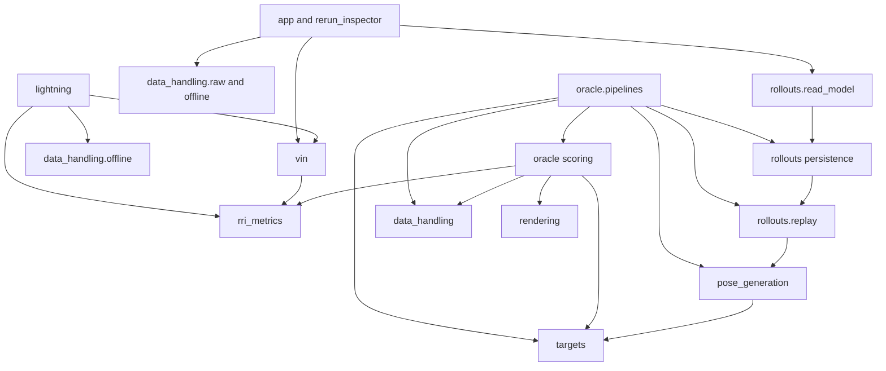
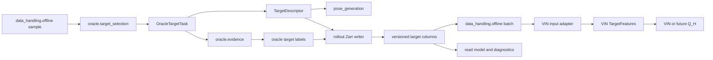

# ARIA-NBV Thesis-Core Module Pruning And Ownership Report

Original date: 2026-07-09
Revised: 2026-07-10 after PR #15, the architecture decision grill, review of the supplied revisions, and the target-selection ownership decision
Status: canonical planning report; implementation is gated per workpackage

## Executive Verdict

The refactor must reduce active owners, public surfaces, configuration degrees
of freedom, duplicated behavior, and production LOC. Moving the same code into
more directories is not sufficient.

The roadmap has two layers:

1. **Required ownership spine.** Repair the contracts between `rri_metrics`,
   `targets`, `oracle`, `rollouts`, and `data_handling` so scientific formulas,
   privileged labels, replay, and persisted data each have one owner.
2. **Independent contraction packages.** Remove unsupported renderers, false VIN
   model surfaces, unused encoders, experiment-management UI, and other proven
   dead or speculative interfaces without coupling those deletions to the
   ownership spine.

The governing ownership rule is:

> `rri_metrics` owns RRI-derived computation and evaluation. `vin` owns model
> objectives and tensorized model inputs. `targets` owns the sanitized target
> instruction shared across candidate generation, persistence, inspection, and
> future model adapters. `oracle` owns privileged target-task selection,
> evidence, labels, and generation composition. `rollouts` owns replay and
> persistence. `data_handling` owns raw source access and immutable offline
> adapters. Lightning owns lifecycle and the frozen current training profile,
> not formulas.

This report is decision-complete for deriving atomic workpackages. It is not
permission to implement a workpackage whose listed open decision remains
unresolved.

## Scope Contract

### Required Ownership Spine

- one prepared RRI implementation and one tensor-first return implementation;
- reusable one-step and multi-step evaluation/TorchMetric adapters;
- sanitized oracle-specified target descriptors and privileged target-task selection;
- privileged scene and target evidence preparation and scoring;
- generic finite-candidate replay with one policy specification;
- pipeline-local composition of replay, labels, and retained evidence;
- stable rollout persistence, codecs, manifests, inspection, and read models;
- raw EFM access and immutable VIN offline adapters;
- retained Streamlit and Rerun trust paths over the same domain read models.

### Independent Contraction Lane

- online VIN oracle source deletion;
- unsupported EFM3D/trimesh renderer deletion;
- false target-myopic and finite-horizon scorer surface deletion;
- evidence-gated PointNeXt, feature-bank, and shell-encoder pruning;
- W&B Analysis and Optuna Sweep page deletion;
- late evidence-led command and dependency pruning;
- a separate pre-scale Zarr physical-layout and manifest compaction package.

### Explicitly Out Of Scope

- real target-conditioned model or `Q_H` implementation;
- changed RRI, reward, crop, split, invalidity, or candidate-distribution semantics,
  except the explicitly resolved minimal target-task admission gate in WP07c;
- candidate-profile and collision-backend pruning;
- Rerun configuration contraction;
- package-root export or vendored `sys.path` cleanup;
- download/catalog redesign, which is handled separately under
  `data_handling/atek_downloads`;
- simulator expansion, online RL, continuous control, and real-device work.

## Architecture Rules

1. **One owner per semantic contract.** A producer owns its result DTO; storage
   and model views adapt it rather than redefining it.
2. **Deep modules over directory count.** A new package or module must hide a
   coherent body of behavior behind a smaller interface.
3. **Tensor-first scientific math.** Scalar, table, NumPy, and reporting helpers
   delegate to authoritative tensor kernels.
4. **Task/oracle separation.** `TargetDescriptor` may contain sanitized
   GT-derived pose, extent, and class because the target is an explicitly
   oracle-specified task. It never contains the GT source row, mesh/crop data,
   matching diagnostics, privileged validity, labels, gains, or headroom. This
   protocol makes no actor-only target-discovery claim.
5. **Invalidity is data.** Expected invalid cases return typed reasons and hard
   masks; they are not low scores, NaNs without masks, or broad exceptions.
6. **Semantic and storage lifecycles differ.** Domain reason types and DTOs do
   not mirror versioned Zarr rows merely to simplify a writer.
7. **Configuration is interface.** Every retained field must be classified as
   `keep`, `fix`, `derive`, `profile`, `move`, or `delete`.
8. **Factories stop at composition edges.** `TargetConfig.setup_target()` may
   remain at TOML, CLI, Lightning, and pipeline boundaries; refactored domain
   modules receive explicit specifications and dependencies.
9. **No generic facade without leverage.** Do not introduce `RriMetric`, a
   universal evaluator DTO, general query language, or one-implementation
   protocol merely to make the tree appear uniform. A closed serialized enum
   retained solely as frozen protocol lineage may have one active member; it
   must not imply unavailable strategy implementations.
10. **No compatibility modules by default.** Preserve frozen persisted science
    and retained commands, not old internal Python import paths.
11. **Every workpackage is independently green.** One workpackage maps to one
    reviewable commit with a bounded owner, verification set, and stop condition.
12. **Every implementation PR is production-LOC net-negative.** The report-only
    planning PR is excluded. A justified ownership commit may be LOC-neutral,
    but it cannot be hidden behind unrelated deletion.

## Dependency Direction

In this diagram, `A --> B` means **A imports or calls B**. It does not mean data
flows from B to A.



Forbidden active imports:

- `rri_metrics -> oracle|rollouts|vin|lightning|app|rendering`;
- `targets -> data_handling|oracle|rollouts|vin`;
- `data_handling -> oracle|oracle.pipelines|rollouts`;
- `rollouts.replay -> oracle`;
- `oracle` scoring modules -> rollout replay, store, or pipeline DTOs;
- `vin -> oracle` or rollout generation;
- any lower-level owner -> `oracle.pipelines`;
- Streamlit or Rerun code redefining formulas, joins, masks, or reason semantics.

## Single-Owner Matrix

| Concept | Canonical owner | Explicitly not owned by |
|---|---|---|
| Point-mesh distance and `DistanceBreakdown` | `rri_metrics.point_mesh` | `oracle`, `rendering` |
| Prepared RRI and `RriResult` | `rri_metrics.rri` | scorer facades |
| Root/log/endpoint gains and discounted returns | `rri_metrics.returns` | `oracle`, Zarr writer |
| Top-k, rank, percentile, regret | `rri_metrics.ranking` | Lightning, app |
| RRI ordinal binning | `rri_metrics.ordinal` | VIN heads |
| CORAL head, loss, decode, monotonicity | `vin.ordinal` | `rri_metrics` |
| Metric/loss names and key policy | `rri_metrics.logging` | Lightning |
| Lightweight RRI result plots | `rri_metrics.plotting` | oracle |
| Single/multi-step TorchMetrics | `rri_metrics.torchmetrics_*` | Lightning formulas |
| TorchMetric lifecycle | Lightning | metric modules |
| Sanitized target instruction | `targets.descriptor` | VIN, rollout rows, Zarr schema |
| Oracle target-task selection and provenance | `oracle.target_selection` | `targets`, `data_handling`, `rollouts` |
| Tensorized target model input | `vin.types.model_inputs` | semantic target owner; deferred until the real model |
| Privileged evidence and crop validity | `oracle.evidence` | replay, metrics |
| Scene/target scorer facades | `oracle.scene_rri`, `oracle.target_rri` | rollouts, metrics |
| Generation composition | `oracle.pipelines` | top-level pipelines, rollouts |
| Replay policy and transitions | `rollouts.replay` | oracle |
| Operational rollout audits | `rollouts.audits` | core return kernels |
| Persisted reason codecs | rollout persistence | domain semantic reason types |
| Zarr arrays and manifests | rollout persistence | oracle, metrics |
| Store projections and joins | `rollouts.read_model` | Streamlit, Rerun |
| Raw EFM access | `data_handling.raw` | oracle |
| Immutable VIN adapters | `data_handling.offline` | rollouts |

## Target Package Shapes

### Current State Versus Migration Target

The live implementation remains
`data_handling._target_selection`: it currently owns both
`ActorVisibleTargetSelector` and `OracleTargetTaskSampler`, while
`rollouts.dataset_writer` instantiates both and adapts oracle task rows into
actor-candidate rows. The trees below are migration targets, not claims about
current imports. Current `data_handling` and `rollouts` guidance remains true
until WP07a-WP07c land; the same commits must update those owner surfaces.

### `aria_nbv.rri_metrics`

```text
rri_metrics/
  __init__.py
  AGENTS.md
  point_mesh.py
  rri.py
  returns.py
  ranking.py
  ordinal.py
  torchmetrics_single.py
  torchmetrics_multi.py
  logging.py
  plotting.py
```

Responsibilities:

- `rri.py` exposes `compute_rri(...)`, its immutable config, and `RriResult`.
- `returns.py` is the sole owner of differentiable gain/return kernels.
- `ranking.py` is explicitly non-differentiable evaluation.
- `ordinal.py` owns RRI-to-class labels, not CORAL model behavior.
- `torchmetrics_single.py` and `torchmetrics_multi.py` are stateful evaluation
  adapters over pure functions, not alternative formula owners.
- `logging.py` and `plotting.py` remain flat because another package level is
  not justified.
- no generic `types.py`, `metrics/`, `objectives/`, `logging/`, or `reporting/`
  subpackage remains.
- no generic stateful `RriMetric` facade is introduced.

The exact root `__init__` allowlist remains open. Regardless of that choice,
Oracle scorers, TorchMetrics, plotting helpers, and specialized kernels must
not all be convenience-exported together.

### `aria_nbv.targets`

```text
targets/
  __init__.py
  AGENTS.md
  descriptor.py
```

`TargetDescriptor` is the only production symbol exported by
`targets.__init__`. It is an immutable semantic task instruction containing an
opaque target id, semantic id/name, world-object pose, object extents in metres,
and reference-object pose. Candidate generation, persistence adapters,
inspection, and future VIN adapters may consume it.

The descriptor deliberately excludes confidence, support, projected area, GT
source-row identity, matching, crop state, invalidity, labels, gains, and
headroom. It is GT-derived in the thesis-core protocol because the target is an
explicitly oracle-specified task. Actor-visible discovery and actor-derived
descriptors are deferred research, not compatibility requirements.

### `aria_nbv.oracle`

```text
oracle/
  __init__.py
  AGENTS.md
  evidence.py
  target_selection.py
  scene_rri.py
  target_rri.py
  _scoring.py
  pipelines/
    __init__.py
    scene_labels.py
    rollout_dataset.py
    shards.py
    cli.py
```

`target_selection.py` owns `OracleTargetTask`, `OracleTargetTaskSelector`,
`OracleTargetTaskSelectionConfig`, `OracleTargetTaskSelectionResult`, typed
target invalidity, and `OracleTargetTaskSelectionPolicy`. These symbols use
leaf imports; they are not added to the compact `oracle.__init__` scorer
allowlist.

`OracleTargetTask` composes `TargetDescriptor` with privileged GT source
identity, selection provenance, and typed invalidity. It is an oracle-owned
in-memory contract, never a replay transition or persisted Zarr row.

`OracleTargetTaskSelectionPolicy` initially has one serialized member,
`UNIFORM_WITHOUT_REPLACEMENT`. The enum is retained as protocol lineage, not as
an advertisement of unimplemented policy alternatives. The selection config
contains only this policy, a deterministic seed, and the maximum targets per
sample.

The selector builds its pool from finite positive-extent GT OBB rows with
unique source-row identity, then samples uniformly without replacement. It
does not compute self-IoU, ambiguity threshold sweeps, actor scores,
temperature-softmax probabilities, confidence gates, visibility gates, or
support gates. Selected tasks are passed to `oracle.evidence`, which resolves
the GT OBB and validates mesh crops and reconstruction evidence through typed
outcomes. Invalid selected tasks are recorded and skipped without backfilling.
Low-headroom and near-solved tasks remain valid negative evidence.

`evidence.py` owns the current `target_gt_obb_world` responsibility together
with crop and scoring-evidence validation. App and plotting callers consume
the resulting task/evidence contracts rather than importing a selection
helper.

The package exposes separate `SceneRriScorer` and `TargetRriScorer` facades
over one private render/backproject/fuse/score engine. Rendering and metric
math remain delegated to `rendering` and `rri_metrics`.

Expected evidence failures return typed outcomes with stable semantic reasons.
Unexpected runtime or implementation failures raise exceptions. The package
root exports only the supported scorer facades/configs; evidence builders,
pipeline DTOs, and private engine types use leaf imports.

All label and rollout generation implementations live under
`oracle.pipelines`. Stable command names may point there. Existing-store
inspection and validation remain in `rollouts.info_cli`.

### `aria_nbv.rollouts`

```text
rollouts/
  __init__.py
  AGENTS.md
  replay/
    __init__.py
    engine.py
    policy.py
    state.py
    types.py
  audits.py
  read_model.py
  trace.py
  zarr_store.py
  manifest.py
  shard_manifest.py
  inspection.py
  info_cli.py
```

Replay consumes only `CandidateScores`: score vector, hard action mask, score
name, and the stable candidate-order link. One immutable `RolloutPolicySpec`
owns horizon, branching, beam, selection, temperature, diversity guards, and
seed validation. Pipeline recipes compose this spec rather than copy its
fields.

Scientific labels and heavy evidence are not fields on replay transitions.
Operational provenance, invalidity shares, path increments, policy entropy,
order checks, and table-health metrics live in `audits.py`. Core endpoint and
return formulas remain in `rri_metrics.returns`.

`read_model.py` provides bounded typed projections for rollout, trajectory,
step, candidate, and target inspection. It is not a general query language and
does not own DataFrames, Plotly figures, or Rerun entities.

### `aria_nbv.data_handling`

```text
data_handling/
  __init__.py
  AGENTS.md
  raw/
    __init__.py
    dataset.py
    loader.py
    views.py
  offline/
    __init__.py
    batch.py
    adapter.py
    dataset.py
    format.py
    store.py
    writer.py
    diagnostics.py
    inventory.py
    cli.py
    info_cli.py
  atek_downloads/       # already handled; excluded from this roadmap
  mesh_cache.py
```

The raw/offline hierarchy is a later atomic workpackage, not incidental churn
inside target/oracle moves. It must pair path movement with narrowed exports,
dead-helper deletion, and no dependency on oracle composition.

The online oracle-labelled VIN iterable is deleted. Counterfactual Rollouts
uses the immutable offline store and does not require it. Offline generation
remains an oracle pipeline; Lightning and diagnostics consume persisted data.

## DTO And Data-Flow Policy

### Producer-Local DTOs

- `DistanceBreakdown` lives with point-mesh computation.
- `RriResult` lives with `compute_rri`.
- return/ranking result objects live beside their reducers.
- `TargetDescriptor` lives in `targets.descriptor`.
- `OracleTargetTask` and its selection result live in `oracle.target_selection`.
- crop and reconstruction evidence outcomes live in `oracle.evidence`.
- replay states/transitions live in `rollouts.replay`.
- persisted rows live with the store schema.
- pipeline run summaries remain pipeline-local.
- TorchMetric states are typed attributes on their metric classes.

No package-wide DTO dumping ground is introduced.

### Replay, Labels, And Evidence

Replace the current many-optional-field evaluator/step result with three
contracts:

1. `CandidateScores`: replay policy input only.
2. `OracleCandidateLabels`: scene/target RRI, canonical gains, masks, typed
   invalid reasons, diagnostics, and label provenance.
3. `RetainedOracleEvidence`: optional point clouds, depth, crop metadata, or
   other heavy audit payload selected by an explicit retention profile.

`oracle.pipelines` owns an evaluated-rollout aggregate that associates labels
and optional evidence with replay using `(chain_id, step_index)` and stable
candidate-shell order. The Zarr writer flattens that aggregate into the frozen
persisted schema. Replay never inspects oracle labels; scorers never construct
Zarr rows.

### Target Descriptor Flow



The semantic descriptor, privileged task, evidence result, persisted columns,
offline batch fields, and tensorized model features are separate lifecycle
contracts. `CandidateGenerationRuntimeContext` carries `TargetDescriptor`
rather than duplicating target id/center fields. Oracle scoring consumes the
full `OracleTargetTask`. The writer alone flattens descriptor and oracle
provenance into the frozen Zarr schema.

`data_handling` does not import VIN: a VIN-side adapter will consume the
offline batch and produce `TargetFeatures`. The descriptor contract is resolved
by WP07b; exact tensor shapes, masks, and encoding remain deferred until the
real target-conditioned model rather than blocking the ownership refactor.

### Lineage

In-memory lineage composes `SourceLineage`, `TargetLineage`, and
`PolicyLineage`. Pipeline composition fills those concepts independently. The
writer alone flattens them into existing source/target/rollout tables. The
persisted table schema does not force a 50-field in-memory DTO.

### Invalidity

Candidate generation, oracle target-task selection, and oracle evidence
preparation own typed semantic invalid-reason enums. Rollout persistence owns
the frozen numeric encoding, version labels, historical actor-reason values,
and encode/decode mapping required by stored arrays. Existing arrays and
numeric values do not change in WP07a-WP07c; unavailable retired audit fields use
their existing sentinel representation.

## Metric Contracts

| Family | Owner | Differentiable | Intended use |
|---|---|---:|---|
| Point-mesh distances | `point_mesh.py` | yes where underlying operations permit | reconstruction primitive |
| Prepared RRI | `rri.py` | yes | scientific metric and labels |
| Root/log/endpoint gains | `returns.py` | yes | objectives and evaluation |
| Discounted selected return | `returns.py` | yes | finite-horizon objective/evaluation |
| Top-k/rank/percentile/regret | `ranking.py` | no | model evaluation |
| RRI ordinal binning | `ordinal.py` | no | label construction |
| Candidate provenance/invalidity/path audits | `rollouts.audits` | no | operational diagnostics |
| Single/multi-step TorchMetrics | `torchmetrics_*.py` | no | stateful evaluation |

Requirements:

- tensor kernels are authoritative; scalar/table helpers delegate;
- gradient tests cover root-normalized gain, log gain, endpoint gain, and
  discounted return;
- fixed masks and invalid rows have explicit behavior;
- every TorchMetric state has a type annotation, attribute docstring, and
  explicit distributed reduction;
- tests cover unequal batch sizes, reset, stage isolation, and aggregation;
- Lightning uses stage-owned metric instances rather than averaging batch
  averages;
- selected-rollout metrics update only from batches that genuinely carry the
  required rewards and endpoint errors.

## Configuration Policy

Every affected public field is entered into a workpackage ledger:

| Classification | Meaning |
|---|---|
| `keep` | required scientific, reproducibility, or retained operator input |
| `fix` | one supported value; remove from routine public configuration |
| `derive` | computed from another retained contract |
| `profile` | named baseline or ablation, not arbitrary combinatorics |
| `move` | valid field owned by another composition edge |
| `delete` | unused, duplicate, debug-only, or hypothetical flexibility |

Resolved configuration decisions:

- one rollout-owned `RolloutPolicySpec`; pipeline recipes compose it;
- one oracle-owned target-selection config with policy, deterministic seed,
  and maximum targets per sample;
- `target_source`, the writer-level duplicate target cap, actor selector
  configuration, source mode, temperature, confidence/visibility/support
  thresholds, self-IoU thresholds, and ambiguity sweep fields are deleted;
- canonical rollout TOMLs use one `[oracle_target_selection]` section and no
  inactive `[target_selector]` section;
- current VIN training behavior is frozen as the baseline profile before
  pruning inactive loss/scheduler/coverage switch branches;
- canonical repository TOMLs migrate atomically with field removals;
- arbitrary historical internal TOMLs receive no permanent compatibility
  aliases;
- `TargetConfig.setup_target()` remains at composition edges only.

## Public-Surface Budget

The implementation baseline must record exact counts before the first source
workpackage. The report sets these target rules:

| Surface | Baseline measurement | Target rule |
|---|---|---|
| `rri_metrics.__init__` | exported names | exact allowlist resolved before WP05 |
| `targets.__init__` | new surface | exactly `TargetDescriptor` |
| `oracle.__init__` | new surface | scene/target scorer facades and configs only |
| `rollouts.__init__` | exported names | replay core only; no store/pipeline barrels |
| `data_handling.__init__` | exported names | no target selection/task symbols and no broad raw/offline convenience barrel |
| VIN scorer union | union members | runnable scorer implementations only |
| config fields | fields by owner | lower after each affected PR |
| CLI commands | installed scripts | preserve retained workflows; remove proven orphans late |
| dependencies | core/extra packages | remove or split only after approved surface deletion |

No new root or mid-level barrel is accepted merely to keep old imports working.

## Persisted-Contract Matrix

| Contract | Policy during ownership work | Allowed migration |
|---|---|---|
| Rollout Zarr logical arrays/tables | frozen | none incidentally |
| Numeric invalid-reason codes/versions | frozen | writer-side mapping from typed domain reasons |
| Retired actor target audit columns | frozen | preserve arrays and write existing unavailable sentinels |
| Manifest hashes and audit identity | preserved | compact repeated payload in dedicated storage WP |
| Active scene-VIN state-dict keys | frozen | targeted loader migration only for named checkpoint |
| Canonical repository TOMLs | migrated atomically | remove obsolete fields and update hashes |
| Arbitrary historical internal TOMLs | unsupported by default | no permanent aliases |
| Core retained command names | preserved | implementation module path may move |
| Internal Python import paths | not preserved | update all repository callers in one commit |

## Redundancy And Disposition Ledger

| Current redundancy or false surface | Disposition | Workpackage |
|---|---|---|
| duplicate scalar/tensor gain and endpoint formulas | tensor-first single owner | WP05 |
| operational audits mixed with core returns | move to rollout audits | WP05 |
| nested logging/reporting packages | flatten to named files | WP05 |
| generic `RriMetric` proposal | reject | resolved decision |
| active actor-visible target selector and source modes | delete; future actor discovery is deferred research | WP07a |
| `target_source` branch and inactive `[target_selector]` TOMLs | delete; oracle selection is the only thesis-core path | WP07a |
| duplicate actor/oracle target row DTOs and oracle-to-actor adapter | compose `TargetDescriptor` into `OracleTargetTask` | WP07b-WP07c |
| fabricated oracle actor scores (`1/1/0`, self-IoU score) | delete rather than persist false semantics | WP07c |
| writer and sampler target-count caps | one oracle selection cap | WP07c |
| self-IoU identity threshold and ambiguity sweep | replace with minimal GT-row admission; evidence validates crops | WP07c |
| `target_gt_obb_world` in selection monolith | move to `oracle.evidence` | WP07c |
| Oracle scorer under `rri_metrics` | move to `oracle` | WP08 |
| scene/target scorer render-fuse-score duplication | one private engine, two facades | WP09 |
| wide evaluator and step DTOs | split scores/labels/evidence | WP10-WP11 |
| duplicated rollout policy config | one `RolloutPolicySpec` | WP10 |
| flat mixed lineage | compose in memory, flatten in writer | WP11 |
| rollout generation inside `rollouts` | move to `oracle.pipelines` | WP12 |
| top-level `pipelines` | delete after migration | WP12 |
| app/Rerun duplicate store joins | bounded rollout read model | WP14 |
| online VIN oracle iterable | delete | WP01 |
| EFM3D/trimesh depth renderer | delete | WP02 |
| scaffold target/Q_H scorers and union branches | delete/archive | WP03 |
| PointNeXt, feature bank, unused shell encoders | independent caller-gated pruning | WP04a-c |
| W&B Analysis and Optuna Sweep pages | delete | WP15 |
| row-per-candidate chunks/repeated manifest configs | physical-layout storage fix | WP17 |

## Green-Commit Workpackages

Each row is one independently green commit. A small dependency-related group
may share a PR, but each implementation PR must be production-LOC net-negative
and may not use a later compatibility-shim deletion to satisfy that gate.

| ID | Workpackage | Depends on | Required outcome | Primary validation |
|---|---|---|---|---|
| WP00 | Canonical planning report | user pushes current HEAD to `main` | report-only PR; close/do not reuse PR #18 | diff scope, CI |
| WP01 | Delete online VIN oracle source | WP00 | remove iterable, config union branch, UI/Lightning fallback | data/Lightning/app tests |
| WP02 | Delete unused EFM3D/trimesh renderer | WP00 | one supported PyTorch3D renderer seam; keep CPU PyTorch3D tests | rendering tests |
| WP03 | Remove false target/Q_H scorer surfaces | WP00 | remove scaffold models and narrow scorer union | VIN/Lightning contract tests |
| WP04a | Prune PointNeXt | WP03, caller/checkpoint scan | remove test-only optional encoder/dependency surface | VIN/package tests |
| WP04b | Prune feature bank | WP03, caller/checkpoint scan | remove unused bank/export surface | VIN tests |
| WP04c | Prune unused shell encoders | WP03, caller/checkpoint scan | retain active R6D/LFF path only | VIN model/encoder tests |
| WP05 | Canonical `rri_metrics` architecture | WP03 | flatten, deduplicate, move CORAL, narrow exports, separate audits | RRI/VIN parity and gradient tests |
| WP06 | TorchMetrics and Lightning lifecycle | WP05 | typed states, weighted accumulation, real update paths | Lightning multi-batch/reset tests |
| WP07a | Remove actor target selection | WP00 | delete actor selector/policies/source branch, inactive TOMLs, UI controls, and actor-only tests/docs | config/writer/app/public-export tests |
| WP07b | Extract target instruction | WP07a | introduce `TargetDescriptor`; migrate candidate, plotting, lineage, and inspection consumers | descriptor/context/schema tests |
| WP07c | Establish oracle target selection | WP07b | move/simplify selector, add one-member policy enum, move GT-OBB evidence, collapse adapters, remove data exports | oracle/data/rollout parity tests |
| WP08 | Scene oracle extraction | WP05, WP07c | move remaining evidence and scene scorer; remove metric-owned scorer | numerical parity tests |
| WP09 | Target oracle extraction | WP08 | move target scorer and collapse private engine duplication | target scorer parity/invalidity tests |
| WP10 | Minimal replay and policy contract | WP09 | `CandidateScores`, replay split, one policy spec | rollout policy/replay tests |
| WP11 | Split labels/evidence and compose lineage | WP10 | pipeline aggregate; no wide optional replay DTO; unchanged store | writer/store parity tests |
| WP12 | Oracle pipeline and shard migration | WP11 | move generation/CLI; split execution from stable manifests/status | CLI/shard/integration tests |
| WP13 | Raw/offline data hierarchy | WP07c, WP12 | cohesive subpackages plus export/dead-helper reduction | complete data-handling tests |
| WP14 | Rollout read model | WP11 | shared typed store projections; presentation remains local | reader/app/Rerun tests |
| WP15 | Workbench contraction | WP14 | remove W&B/Optuna pages; retain nine trust pages | Streamlit AppTest/browser smoke |
| WP16 | Late CLI/dependency pruning | WP02, WP04a-c, WP12, WP15 | remove only proven orphaned commands/deps; test build extras | package build/CLI/CI matrix |
| WP17 | Pre-scale storage physical-layout fix | WP12 | reduce chunk/file count and repeated manifest payload; no logical schema change | compatibility, scale, CLI validation |

### Workpackage Stop Conditions

- stop when a package requires a scientific semantic change listed out of scope;
- stop when an active checkpoint/config/command consumer is found but its
  migration decision is unresolved;
- stop when a persisted Zarr field or numeric code would change outside WP17;
- split a workpackage if it cannot remain one independently green commit;
- do not add a compatibility facade to make an oversized move appear atomic.

## Suggested PR Grouping

Grouping is advisory; workpackage commits remain independently reviewable.

1. **Planning PR:** WP00 only.
2. **False/dead surfaces PR:** WP01-WP04c, omitting any package whose caller or
   checkpoint gate is unresolved.
3. **Metrics/Lightning PR:** WP05-WP06.
4. **Target-selection PR:** WP07a-WP07c in order; every commit is green and the
   combined PR is production-LOC net-negative.
5. **Oracle scoring PR:** WP08-WP09.
6. **Replay and generation PR:** WP10-WP12.
7. **Data/read-model/workbench PRs:** WP13, WP14-WP15, split as needed.
8. **Packaging/storage PRs:** WP16 and WP17 remain separate.

Every PR starts from its merged predecessor when there is a dependency edge.
Independent deletion packages may be rebased and reviewed separately.

## Retained Workbench Surfaces

The final ownership series must keep these nine Streamlit pages functional:

1. Data;
2. Candidate Poses;
3. Candidate Renders;
4. RRI;
5. Counterfactual Rollouts;
6. Stored Rollout Zarr;
7. VIN Diagnostics;
8. VIN Offline Dataset;
9. RRI Binning.

W&B Analysis and Optuna Sweep are removed. Rerun remains the richer 3D
inspection surface, but its configuration contraction is deferred.

## Revisions Disposition

| Revision suggestion | Decision | Rationale |
|---|---|---|
| whole-package context rather than metrics-only view | adopt as two-layer roadmap | adjacent owners matter, but one mega-series is not reviewable |
| scientific formula owner | adopt | removes metric drift |
| dedicated privileged oracle owner | adopt | separates labels from ordinary metrics/replay |
| keep actor-visible target selection active | reject | thesis-core generation uses oracle-specified target tasks only |
| move target selection into `rollouts` | reject | replay consumes tasks; it does not choose supervised tasks |
| place `TargetDescriptor` in VIN | reject | the descriptor is shared domain input; VIN owns only its future tensor projection |
| preserve current self-IoU identity gate | reject | direct GT rows already have source identity; crop/evidence validity is checked by oracle evidence |
| retain a StrEnum selection policy | adopt narrowly | one uniform-without-replacement member records protocol lineage |
| split wide evaluator result | adopt | prevents optional-field combinatorics |
| generic `RriMetric` facade | reject | no state or abstraction leverage |
| delete multi-step TorchMetrics | reject | retained for Lightning/future finite-horizon evaluation per owner decision |
| move ordinal binning with CORAL into VIN | partially reject | CORAL moves to VIN; RRI label binning remains in metrics |
| move logging/plotting out of metrics | reject | flat named files are retained; nested packages are removed |
| fixed three-family candidate profile | defer | changes scientific candidate distribution |
| prune collision backends | defer | coupled to deferred candidate protocol decision |
| delete unused CPU/trimesh renderer | adopt | production composition already uses PyTorch3D |
| remove false VIN scaffold models | adopt | avoids claiming unimplemented target/Q_H capability |
| prune unused VIN extras | adopt with caller/checkpoint gate | deletion must not break named evidence |
| pure CORAL-only objective | reject for refactor | freeze current baseline before pruning switches |
| remove W&B/Optuna/RRI-binning pages | partially adopt | remove W&B/Optuna; retain RRI Binning trust page |
| two Rerun profiles | defer | not required for ownership correction |
| package-root cleanup | defer | valid but independent and not approved now |
| data/download catalog redesign | exclude | already handled separately under `atek_downloads` |
| Zarr schema engine rewrite | reject | persisted schema remains frozen |
| focused chunk/manifest scale fix | adopt as WP17 | operational blocker, but separate from ownership |
| track raw OMX revisions/runtime artifacts | reject | one canonical report only |

## Open Decisions

These choices block only the named workpackage. They do not reopen settled
ownership rules.

| ID | Open decision | Blocks | Required evidence |
|---|---|---|---|
| O1 | `rri_metrics.__init__`: four stable exports or empty root | WP05 | caller/public-doc scan and explicit `__all__` test |
| O2 | update `SelectedRolloutMetrics` in current VIN Lightning batch or reserve it for finite-horizon Lightning | WP06 portion | actual batch fields and lifecycle owner |
| O4 | retained-evidence profiles and memory limits | WP11 | writer/app/Rerun consumers and one-sample footprint |
| O5 | active checkpoints/configs requiring VIN migration support | WP03-WP04, WP16 | named checkpoint/config inventory |
| O6 | exact retained commands and core/optional dependencies | WP16 | automation/config/import/package-build ledger |
| O7 | physical chunk strategy and compact manifest representation | WP17 | current file counts, read/write benchmarks, compatibility tests |

O3 is resolved for the ownership series: `TargetDescriptor` contains target id,
semantic id/name, world-object pose, extents in metres, and reference-object
pose. Exact `TargetFeatures` tensors, masks, and encoding are deferred to the
real target-conditioned model and do not block WP07b-WP07c.

## Deferred Decisions

- candidate production profile and family set;
- collision backend contraction;
- Rerun profile/configuration contraction;
- root `aria_nbv.__init__` exports and vendored EFM fallback;
- pairwise GT-overlap gates, target matching thresholds, crop policy, reward,
  or split changes beyond WP07c's minimal finite-positive GT-row gate;
- actor-visible target discovery and actor-derived descriptor protocols;
- exact tensorized `TargetFeatures` fields, masks, and encoding;
- real target-conditioned scorer architecture and finite-horizon `Q_H`;
- Zarr logical schema redesign or schema-generated table engine;
- external simulator/data expansion and online interaction.

## Validation Gates

### This Report Revision

1. Run `git diff --check` or an equivalent `HEAD`-to-working-copy whitespace
   check when the report is intentionally ignored or staged for deletion.
2. Lint both Mermaid blocks and verify that `A --> B` has one consistent
   import/call meaning.
3. Scan for stale `targets.selection`, `oracle.targets`, actor-selection owner,
   unsplit `WP07`, and unresolved O3 references.
4. Confirm that this planning change modifies only the canonical report; do not
   implement source, test, config, or generated-doc changes in the report PR.

### Every Workpackage Commit

1. Ruff format/check for touched Python source and tests.
2. Complete affected-package tests plus the nearest cross-package contracts.
3. `git diff --check`.
4. Stale import/path scan.
5. Forbidden-edge and cycle check for changed owners.
6. Production LOC, exported-name, and config-field delta.
7. No unrelated source, docs, generated, archive, or OMX churn.

### Target-Selection Workpackages

- **WP07a:** config-loading, rollout-writer, Counterfactual Rollouts AppTest,
  stale actor-symbol, and public-export tests prove the actor path is gone.
- **WP07b:** descriptor field/serialization tests, a forbidden-oracle-field
  assertion, candidate-context tests, and frozen Zarr column parity prove that
  the shared instruction is narrow and storage-compatible.
- **WP07c:** deterministic selection, reset, finite-geometry rejection,
  missing-GT behavior, cap behavior, typed evidence invalidity, low-headroom
  retention, stale-import scans, and complete oracle/data-handling/rollout
  tests prove the new owner and simplified semantics.
- The combined WP07a-WP07c PR must remain production-LOC net-negative and
  preserve every logical Zarr array and numeric reason-code value.

### Every Implementation PR

- root CI and GitHub checks succeed;
- production LOC is net-negative relative to the PR base;
- every commit is independently green and revertible;
- no unresolved decision for an included workpackage;
- persisted-contract matrix reviewed for all affected rows;
- public docs and nearest `AGENTS.md` match the implemented owner boundary.

### Final Ownership-Series Validation

1. Generate a fresh one-sample CUDA rollout store from a temporary variant of
   `.configs/build_rollouts_v1_smoke.toml`.
2. Run `nbv-rollouts-info --validate --stats --preflight --profile smoke` on
   that exact store.
3. Run Streamlit AppTest against that exact store.
4. Launch `nbv-st` and browser-smoke all nine retained pages.
5. Capture screenshots and assert no Streamlit exception or visible error state.
6. Smoke the retained Rerun geometry/rollout inspection path.
7. Record config, manifest and source hashes plus any skipped environment gate.
8. Require all GitHub CI checks to succeed.

## LOC Accounting

Record production Python LOC at the post-baseline commit and after every
workpackage/PR. Exclude tests, generated files, archives, debriefs, OMX
artifacts, and PR #17 deletion credit.

Rules:

- deletion/pruning workpackages must be strictly production-LOC negative;
- ownership workpackages may be LOC-neutral only when their ledger proves a
  reduction in duplicate formulas, public exports, config fields, or forbidden
  dependency edges;
- every implementation PR is strictly production-LOC negative; the report-only
  planning PR is excluded;
- the cumulative production LOC after the ownership series is below baseline;
- moving code without deletion does not count as simplification.

## Planning PR And Artifact Policy

- PR #18 is not reused.
- After the user pushes the current local HEAD to `main`, create a new planning
  branch from that `main`.
- The planning PR changes this canonical report only.
- The supplied revisions, critiques, addenda, raw sessions, temporary handoffs,
  completion files, and sandbox artifacts remain comparison evidence, not
  parallel tracked sources of truth.
- The accidental `rri-metrics-lightning-pr1` worktree remains quarantined and
  uncommitted until separately reviewed or discarded.
- No implementation diff is accepted before the report-only planning PR is
  reviewed and green.

## Implementation Entry Gate

Implementation may start only when:

1. the current local HEAD has become the intended `main` baseline;
2. the report-only planning PR is open, reviewable, and green;
3. the first selected workpackage has no unresolved blocking decision;
4. its caller, symbol, config, compatibility, deletion, and test ledgers are
   complete inside this report or the PR description;
5. its production-LOC and public-surface baseline is recorded;
6. the accidental implementation worktree is not treated as accepted source;
7. the workpackage can finish as one independently green commit.

Until those conditions hold, this report is the canonical decision and
sequencing document, not authorization for a broad source-tree rewrite.
