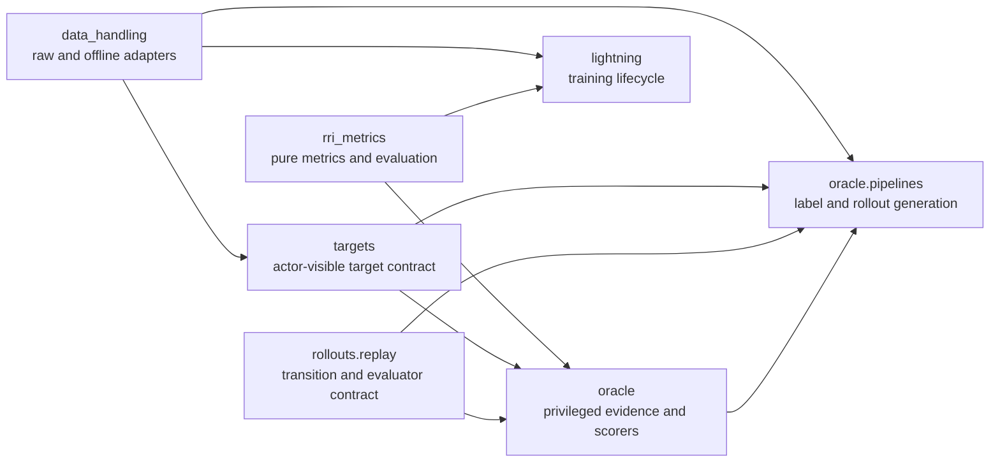

# ARIA-NBV Module Pruning And Ownership Report

Original date: 2026-07-09  
Revised: 2026-07-10 after PR #15 and the architecture decision grill

## Verdict

The refactor must reduce owners, public surfaces, and production LOC rather
than merely redistribute files. The governing rule is:

> `rri_metrics` computes reconstruction metrics, returns, ranking measures,
> and reusable TorchMetric adapters. `targets` owns actor-visible target
> descriptions and selection. `oracle` owns privileged evidence, scene/target
> scorers, target-task sampling, and label-generation pipelines. `rollouts`
> owns replay transitions, persisted traces/stores, operational audits, and
> read-side queries. `data_handling` owns raw EFM access and immutable VIN
> offline adapters. Lightning owns metric lifecycle and source-choice
> composition, but never metric formulas.

This replaces the earlier report's proposed `aria_nbv.metrics` rename,
`data_handling.targets` owner, broad `data_handling.downloads` move, and any
suggestion that multi-step TorchMetrics should be removed.

## Dependency Direction



Forbidden reverse edges are `rri_metrics -> oracle`, `rollouts -> oracle`, and
`data_handling -> oracle.pipelines`. The composition layer may depend on all
lower-level owners; lower-level owners must not import the composition layer.

## Single-Owner Matrix

| Concept | Canonical owner | Explicitly not owned by |
|---|---|---|
| Point-mesh distance and `DistanceBreakdown` | `rri_metrics.point_mesh` | `oracle` |
| Prepared RRI computation and `RriResult` | `rri_metrics.rri` | `oracle` |
| Root/log/endpoint gains and discounted return | `rri_metrics.returns` | `oracle`, `rollouts.zarr_store` |
| Candidate top-k, rank, percentile and regret | `rri_metrics.ranking` | Lightning |
| RRI binning and ordinal labels | `rri_metrics.ordinal` | VIN |
| CORAL head, decode and loss primitives | `vin.ordinal` | `rri_metrics` |
| Metric/loss names and key policy | `rri_metrics.logging` | Lightning |
| TorchMetric implementation | `rri_metrics` or `rollouts.audits`, by semantics | Lightning |
| TorchMetric update/compute/log/reset lifecycle | Lightning | `rri_metrics` |
| Actor-visible target descriptor and selection | `targets` | `oracle`, `data_handling` |
| GT matching and oracle target-task sampling | `oracle.targets` | `targets`, `data_handling` |
| Scene/target evidence and crop validity | `oracle` | `rri_metrics`, `rollouts` |
| Scene and target RRI scorer facades | `oracle` | `rri_metrics`, `rollouts` |
| Label and rollout generation | `oracle.pipelines` | top-level `pipelines`, `rollouts` |
| Selected-transition replay | `rollouts.replay` | `oracle` |
| Provenance, invalidity, path and policy audits | `rollouts.audits` | `rri_metrics.returns` |
| Rollout store and persisted schema | `rollouts.zarr_store` | `oracle`, `rri_metrics` |
| Store joins and reusable summaries | `rollouts.queries` | Streamlit, Rerun |
| Raw snippets and EFM views | `data_handling.raw` | `oracle` |
| VIN offline batch/store adapters | `data_handling.offline` | `rollouts` |
| Online/offline source choice | Lightning datamodule | `data_handling` |

## Final Package Shapes

### `aria_nbv.rri_metrics`

```text
rri_metrics/
  __init__.py              # RriMetric, RriMetricConfig, RriResult, RriOrdinalBinner
  AGENTS.md
  point_mesh.py            # DistanceBreakdown and point-mesh primitives
  rri.py                   # prepared RRI computation
  returns.py               # differentiable gains, endpoints and discounted returns
  ranking.py               # evaluation-only top-k, rank, percentile and regret
  ordinal.py               # RRI binning and ordinal labels
  torchmetrics_single.py   # one-step stateful evaluation
  torchmetrics_multi.py    # return/ranking/regret stateful evaluation
  logging.py               # Metric, Loss, LogSpec and key policy
  plotting.py              # lightweight RriResult charts only
```

There is no generic `types.py`, `objectives/`, `metrics/`, `logging/`, or
`reporting/` subpackage. Result DTOs live beside their producers. The package
root exports only `RriMetric`, `RriMetricConfig`, `RriResult`, and
`RriOrdinalBinner`; specialized functions and TorchMetrics use leaf imports.

`returns.py` is the sole mathematical owner of root-normalized gain, log gain,
endpoint gain, and discounted return. Tensor implementations are authoritative;
scalar and table adapters delegate to those tensors. Core kernels preserve
autograd. Ranking, argmax, top-k and stateful TorchMetrics are evaluation-only.

Keep `SelectedRolloutMetrics`, `CandidateTopKOracleHitMetric`, and
`SelectedActionOracleComparisonMetric`. Integrate the currently applicable
top-k and selected-action metrics into `VinLightningModule`; integrate selected
rollout return metrics only when a batch actually carries rewards and endpoint
errors. Every TorchMetric state is an explicitly annotated attribute with a
contract docstring and a distributed sum reduction.

Move CORAL model, decoding, monotonicity and loss primitives to
`aria_nbv.vin.ordinal`. Keep RRI binning in `rri_metrics.ordinal`. Move
camera/scene plotting to `rendering`; retain only result charts in
`rri_metrics.plotting`. Delete the unreferenced copied
`context_pytorch_3d_losses.md`.

### `aria_nbv.targets`

```text
targets/
  __init__.py
  AGENTS.md
  types.py                 # TargetDescriptor, ActorTargetCandidate
  selection.py             # actor-visible selector/config/result
```

Use composition rather than two copied flat rows. `TargetDescriptor` contains
neutral immutable identity and geometry. `ActorTargetCandidate` adds only
actor-observable support, visibility, score, selection and invalidity fields.
It never contains GT IDs, IoU, crop state, oracle validity, or oracle headroom.

### `aria_nbv.oracle`

```text
oracle/
  __init__.py              # scene/target scorer classes and configs only
  AGENTS.md
  evidence.py              # root/current/candidate evidence preparation
  targets.py               # OracleTargetTask, GT matching and task sampling
  scene_rri.py
  target_rri.py
  _scoring.py              # shared render/backproject/fuse/scoring engine
  pipelines/
    __init__.py
    scene_labels.py
    online_vin.py
    rollout_dataset.py
    shards.py
    cli.py
```

Expose separate `SceneRriScorer` and `TargetRriScorer` facades over one shared
private engine. Rendering, backprojection, current-history fusion, prepared RRI
evaluation and replay-result shaping must not be duplicated between scorers.

Expected target-evidence failures return a typed preparation outcome containing
a stable invalid-reason code. They are not low or NaN RRI labels. Exceptions
mean unexpected implementation/runtime failure.

All data-generation implementations and generation CLI entrypoints live under
`oracle.pipelines`. Preserve the existing console command names. Existing-store
information, validation and preflight remain under `rollouts.info_cli`.
Delete top-level `aria_nbv.pipelines` after callers and entrypoints migrate.

### `aria_nbv.rollouts`

```text
rollouts/
  __init__.py              # replay core only
  AGENTS.md
  replay/
    __init__.py
    engine.py
    state.py
    selection.py
    types.py
  audits.py
  queries.py
  inspection.py
  trace.py
  zarr_store.py
  manifest.py
  shard_manifest.py
  info_cli.py
```

All replay evaluators return one rollout-owned `CandidateEvaluation` with
required selection scores/name and optional nested scene-RRI, target-RRI and
retained-evidence payloads. Do not preserve the current flat, many-optional-field
metric bundle. Persisted trace/Zarr DTOs remain separate because their versioned
lifecycle differs from in-memory evaluator results.

Move provenance shares, primary invalid-reason shares, candidate path
increments, policy entropy, order consistency and candidate-table health to
`rollouts.audits`, including their TorchMetric accumulators. Keep Streamlit
DataFrames and Rerun entities local, but centralize row selection, dictionary
decoding and candidate/target/step summaries in typed `rollouts.queries`.

Do not rewrite `zarr_store.py` as a schema engine in this series. Persisted
schemas, Q_H views and field semantics are compatibility gates. Only delete an
independently proven dead or shadowed helper.

### `aria_nbv.data_handling`

```text
data_handling/
  __init__.py
  AGENTS.md
  raw/
    __init__.py
    dataset.py
    loader.py
    views.py
  offline/
    __init__.py
    batch.py
    adapter.py
    dataset.py
    format.py
    store.py
    writer.py
    diagnostics.py
    inventory.py
    source.py
  mesh_cache.py
  offline_cli.py
  offline_info_cli.py
```

`VinOracleBatch` remains an offline/data-output contract. The online labelled
iterable moves to `oracle.pipelines.online_vin`; `VinOfflineSourceConfig` stays
with the offline adapter; the discriminated online/offline source union moves
beside the Lightning datamodule that consumes it. Serialized field names and
the `online`/`offline` discriminator values remain unchanged.

Residual `aria_nbv.data` consolidation is deferred because downloads do not
block the ownership correction.

## DTO Policy

- `DistanceBreakdown` lives in `point_mesh.py`.
- `RriResult` and RRI computation config live in `rri.py`.
- Return/ranking result DTOs live beside their reducers.
- `TargetDescriptor` is the only deliberately shared target DTO.
- Actor selection DTOs live in `targets`; privileged task DTOs live in
  `oracle.targets`.
- The in-memory evaluator result lives in `rollouts.replay`; persisted rows live
  beside `trace.py` or `zarr_store.py`.
- Pipeline run summaries remain pipeline-local.
- No giant common `types.py`, untyped dictionaries, or parallel flat DTOs.

## Redundancies To Remove

1. Scalar and tensor endpoint/root/log gain implementations collapse into
   tensor-first `rri_metrics.returns` kernels.
2. Manual Lightning top-k/regret/rank/percentile batch means are replaced by
   stage-owned TorchMetrics with correct accumulated denominators.
3. Scene and target rollout scorers share rendering, backprojection, root
   evidence caching, history fusion and result shaping.
4. `TargetCandidateRow` no longer mixes actor-visible and GT audit fields;
   `OracleTargetTaskRow` no longer copies the complete flat actor row.
5. Rollout generation leaves `rollouts`; top-level `pipelines` is deleted.
6. Streamlit and Rerun stop independently rebuilding store joins and code
   dictionaries.
7. Broad package roots stop re-exporting persistence, diagnostics, framework
   adapters and pipeline internals.
8. Dead aliases such as `OracleRRI.score_batch` and unused types such as
   `DistanceAggregation` are removed when import scans confirm test-only use.

## Delivery Sequence

### Prerequisite: PR #17

Merge PR #17 before this series. Its RL and interpretability archive is owned
elsewhere and its approximately 1.8k-line deletion must not be counted toward
this refactor's LOC reduction.

### PR1: Metrics And Lightning

- Flatten `rri_metrics`, colocate DTOs and delete the copied PyTorch3D context.
- Deduplicate gain/return formulas and separate evaluation-only ranking/audits.
- Move CORAL to VIN and scene plotting to rendering.
- Integrate stage-specific top-k and selected-action TorchMetrics in Lightning.
- Add gradient, multi-batch weighting, empty-state, reset and typed-state tests.
- Narrow roots and update imports/docs without compatibility facades.

### PR2: Targets And Data Contracts

- Introduce composed actor-visible target DTOs under `aria_nbv.targets`.
- Move GT matching/task sampling to `oracle.targets`.
- Form `data_handling.raw` and `data_handling.offline` shallow groups.
- Move online oracle-labelled iteration under `oracle.pipelines`.
- Move the discriminated source union beside the Lightning datamodule.

### PR3: Oracle, Replay And Pipelines

- Extract scene/target scorers behind the shared oracle engine.
- Deepen selected-transition code under `rollouts.replay`.
- Move rollout generation, shard execution and generation CLI implementations
  to `oracle.pipelines`; preserve console command names.
- Introduce bounded typed rollout queries and migrate Streamlit/Rerun callers.
- Delete top-level `pipelines`, scorer modules in `rollouts`, and stale roots.
- Run final real-data generation and application validation.

Each PR starts from the merged predecessor and must be independently green.

## Validation Gates

Every PR must pass formatting, Ruff, complete tests for affected packages,
stale-import scans, import-cycle/public-contract tests, root CI, and GitHub
checks before the next PR begins.

PR1 additionally proves:

- differentiable return kernels preserve gradients;
- top-k and selected-action metrics aggregate by valid table, not mean of
  batch means;
- train/validation/test state is isolated and resets at epoch end;
- all TorchMetric states are typed, documented scalar sum reductions.

After PR3:

1. Create a temporary config from `.configs/build_rollouts_v1_smoke.toml` with
   a fresh output path.
2. Generate one real CUDA-backed rollout dataset from the configured VIN
   offline cache.
3. Run `nbv-rollouts-info --validate --stats --preflight --profile smoke`.
4. Run Streamlit AppTest against that exact store.
5. Launch `nbv-st` and browser-smoke Data, Candidate Poses, Candidate Renders,
   RRI, Counterfactual Rollouts, Stored Rollout Zarr, VIN Diagnostics, VIN
   Offline Dataset and RRI Binning.
6. Capture screenshots and reject visible exceptions or error states.
7. Open the final PR and require all GitHub CI checks to succeed.

Portable synthetic store/AppTest coverage remains in GitHub CI. The real
one-sample CUDA/data smoke is local acceptance evidence recorded in the final
PR because ordinary GitHub-hosted runners have neither the private cache nor a
GPU.

## LOC Gate

Record tracked production Python LOC for the affected active packages at the
starting commit and after each PR. Exclude tests, generated files, archives,
debriefs and the separate PR #17 deletion. Every PR reports additions and
deletions; cumulative production LOC after PR3 must be strictly below the
starting baseline.

## Resolved Decisions

- Keep the package name `aria_nbv.rri_metrics`; do not rename it to generic
  `metrics`.
- Use compact core package roots, not empty roots or broad convenience barrels.
- Use clean internal migration with no Python compatibility shims.
- Keep logging vocabulary in `rri_metrics.logging`; Lightning owns emission.
- Keep lightweight result plotting in `rri_metrics.plotting`; move scene plots.
- Use two public oracle scorers over one private engine.
- Use typed invalid preparation outcomes rather than low/NaN labels.
- Use a deep `rollouts.replay` submodule and a bounded shared read-query layer.
- Merge PR #17 first.
- Deliver the architecture as three sequential, independently green PRs.

## Deferred Work

- A schema-driven rewrite of `rollouts.zarr_store`.
- Consolidating residual `aria_nbv.data` download/metadata modules.
- Real Q_H implementation, new target descriptors for models, scene memory,
  online RL, or changed scoring/reward semantics.

## Review Status

The earlier report is superseded by this revision. The architecture is ready
for implementation under the three-PR sequence above. Any implementation that
duplicates gain formulas, leaves oracle scorers or generation pipelines in
`rollouts`, retains actor/GT fields in one flat DTO, removes multi-step
TorchMetrics, adds compatibility facades, or fails the final LOC gate should be
rejected.
