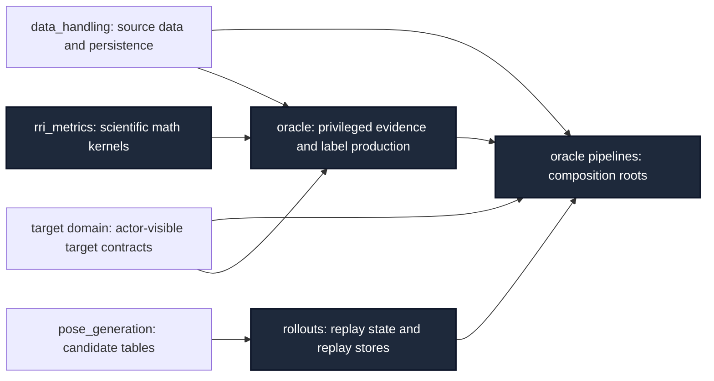

# ARIA-NBV Module-Pruning Plan Revision

Date: 2026-07-10

Status: pre-RALPLAN review

Reviewed draft:
`.omx/plans/autopilot-aria-nbv-oracle-metrics-refactor-20260709T165010Z.md`

## Verdict

**REQUEST CHANGES. The latest draft is not ready to become the execution
RALPLAN.**

Its central direction is sound: metric math, privileged oracle label
production, counterfactual replay, and source/persistence handling need distinct
owners. The draft still treats several file moves as if they settle those
owners. They do not. In current code, the hardest conflicts cross the proposed
modules through concrete configs, result DTOs, and import-order-dependent
composition.

The next RALPLAN must start from this dependency invariant:

The forbidden reverse dependencies are more important than the final filenames:

- `rri_metrics` must not import `oracle`, `rollouts`, Lightning, app, or
  rendering orchestration.
- `rollouts` must not import concrete oracle scorers.
- `data_handling` must not import concrete oracle labelers or pipelines.
- `oracle` must not return rollout persistence DTOs as its scientific result.
- store code may persist and materialize labels, but must not redefine their
  formulas.

## Review Findings

### 1. High: the draft preserves a data-handling/oracle composition cycle

The draft moves `pipelines/oracle_rri_labeler.py` into `oracle`, but does not
address its concrete consumers:

- `data_handling/_vin_sources.py:13` imports `OracleRriLabeler` and its config;
- `data_handling/_offline_writer.py:33` imports the concrete labeler config;
- `pipelines/oracle_rri_labeler.py:23` imports `EfmSnippetView` from the
  `data_handling` package root;
- `data_handling/__init__.py:23-24` explicitly depends on import order so raw
  view exports are bound before dependent modules import the root back.

Graphify confirms the direct `_offline_writer.py -> oracle_rri_labeler.py`
import. Moving the file changes the path, not the seam. A new top-level
`oracle` package would inherit the same cycle unless composition ownership is
changed.

Deletion test: deleting the current `pipelines` package does not concentrate
composition. It reappears in `data_handling` configs and writers. The pipeline
module is not yet deep because callers still need to understand and construct
its internal stages.

Required RALPLAN decision: choose where online labeling and offline
materialization are composed. The recommended default is that oracle-owned
data-generation workflows compose source adapters, labelers, and persistence;
`data_handling` owns raw/offline readers and writers that do not construct a
concrete oracle labeler. Do not introduce a protocol merely to preserve the
current file ownership; use an adapter seam only if the online and offline
workflows demonstrate real variation.

### 2. High: formula ownership is declared but not executable

Current competing implementations are concrete:

- `rollouts/counterfactuals.py:140-145` defines root-normalized and log-error
  gains;
- `rollouts/target_counterfactuals.py:264-274` and `:311-317` use those rollout
  helpers for target and scene labels;
- `rri_metrics/metrics/multi_step.py:138-214` defines discounted return and
  tensor endpoint gains;
- `rri_metrics/metrics/multi_step_tables.py:65-130` independently implements
  scalar discounted return and endpoint gains.

The latest draft weakens the earlier invariant with "move or wrap" and makes
the core/diagnostic split conditional. That leaves multiple formula owners and
compatibility paths as implementation degrees of freedom.

Required RALPLAN invariant: one pure math implementation for normalized error
gain, log error gain, and discounted return. Scene scorers, target scorers,
table summaries, and training objectives adapt inputs to that implementation.
Parity tests must cover scalar/tensor adapters and gradients for functions
declared usable as differentiable objectives.

The store remains an adapter: `rollouts/zarr_store.py:2534-2593` materializes
candidate labels and selected TD rewards. It should consume canonical values;
it should not become the owner of their scientific meaning.

### 3. High: `rri_metrics` still mixes four unrelated interfaces

The 2026-07-09 report flattened some nesting but kept the wrong responsibilities:

- `logging/names.py` depends on `Stage` and defines Lightning step/epoch/progress
  policies. This is training logging, not RRI math.
- `reporting/plotting.py` imports data-handling views, rendering builders,
  Plotly, and camera geometry. It is diagnostic visualization, not metric
  computation.
- `objectives/coral.py` contains VIN ordinal-head and loss machinery used by
  VIN/Lightning/app surfaces.
- `metrics/multi_step.py` combines scientific returns, ranking diagnostics,
  provenance audits, invalidity audits, and path-cost summaries.

The proposal to rename this package to generic `aria_nbv.metrics` would hide
the problem by broadening the name. It would not deepen the module. Keep the
scientific `rri_metrics` name during this refactor and shrink its interface.

Required RALPLAN decisions:

1. Move Lightning log-name/policy ownership to Lightning or a training owner.
2. Move visualization to the existing diagnostics/rendering owner, with app
   panels remaining UI adapters.
3. Decide whether CORAL/binning are stable RRI label transforms or VIN training
   objectives. Do not keep both interpretations in the root interface.
4. Keep only RRI and rollout-return math in `rri_metrics`; route schema audits
   and model-ranking diagnostics to their actual consumers.

### 4. High: the plan retains large test-only metric machinery

`rri_metrics/metrics/torchmetrics_multi.py` is 692 LOC. Its eleven stateful
TorchMetric classes have no production importer; they are referenced only by
the metrics barrel and their own tests. Most associated pure helpers are also
test-only. The exceptions are `candidate_topk_oracle_hit` and
`selected_action_oracle_comparison`, which Lightning calls directly.

This is the strongest immediate reduced-LOC opportunity and was missed by the
previous report, which proposed documenting every state and carrying the module
forward.

Deletion test: deleting the stateful multi-step adapters removes complexity
without redistributing it to production callers. No existing caller loses
leverage. The next plan should default to deletion, delete tests that only
protect unused interfaces, and reintroduce a stateful adapter only when an
actual training/evaluation caller exists.

The two production ranking helpers are not RRI formulas. Their owner must be
chosen by consumer contract, likely VIN evaluation. Provenance, invalidity, and
path-increment summaries consume rollout/candidate-table semantics and belong
with rollout audits if retained.

### 5. High: scorer output and replay output are still one wide DTO

`CounterfactualMetricBundle` in `rollouts/counterfactuals.py:288-349` has scene,
target, root, log, point-mesh, and support fields, almost all optional.
`CounterfactualCandidateEvaluation` at `:352-495` additionally carries oracle
evidence point clouds and target-crop persistence metadata.

The existing evaluator interface at `counterfactuals.py:630-633` therefore
makes the replay engine understand the complete oracle result shape. Moving the
scorer classes while preserving this DTO gives `oracle -> rollouts` coupling
and leaves the replay module's interface as wide as the scorer implementation.

Required RALPLAN decision: distinguish the minimum replay selection result,
the oracle scientific labels, and optional evidence retained for persistence.
The adaptation point should be the oracle rollout-generation pipeline, where
both sides are already composed. Exact DTO names and fields belong in the
consensus design, not this research pass.

### 6. Medium: target-domain policy is misplaced in `data_handling`

`data_handling/_target_selection.py` is 1,389 LOC and owns actor-visible target
ranking, oracle GT task sampling, GT matching, target identity, OBB resolution,
geometry helpers, and scoring heuristics. These are not all data access or
persistence responsibilities.

The old report proposed a `data_handling.targets` subpackage. That improves
navigation but does not settle ownership. Actor-visible target selection is a
core model-input contract; GT target-task sampling and GT crop resolution are
privileged oracle concerns. Keeping both under a package named data handling
continues the leak.

Required RALPLAN decision: either establish a target-domain module that owns
actor-visible identity/selection while oracle owns privileged task sampling, or
justify a single target module with an explicit actor/oracle seam. Do not split
the 1,389-line file mechanically before deciding this ownership.

### 7. Medium: current public-contract tests do not justify compatibility shims

Current tests intentionally assert old ownership:

- `tests/rri_metrics/test_public_api.py:11-27` requires `OracleRRI` and CORAL
  helpers at the `rri_metrics` root;
- `tests/rollouts/test_public_api.py:18-36` requires target oracle scorer and
  rollout writer configs at the `rollouts` root;
- `tests/data_handling/test_public_api_contract.py:110-170` allowlists direct
  private target-selection imports from rollout modules.

These tests are current repository policy, not evidence of an external consumer.
An intentional ownership refactor must update them. A compatibility adapter is
justified only by a real released/downstream contract, not by a test the same PR
is expected to revise.

Recommended default: clean internal rename/move, stable console command names,
no top-level `pipelines` shell, and no old scorer barrels. Any exception must
name the downstream consumer and a removal condition before implementation.

### 8. Medium: the LOC and end-to-end gates are weakened in the latest draft

The inspected active Python baseline is 23,684 LOC across the four packages:

| Module | LOC |
|---|---:|
| `rri_metrics` | 4,150 |
| `rollouts` | 9,660 |
| `pipelines` | 178 |
| `data_handling` | 9,696 |

The latest draft allows a LOC increase if justified and allows limited rollout
generation to be skipped when the environment is inconvenient. Both conflict
with the user requirement.

Required RALPLAN gates:

- record a starting-commit, path-scoped active Python LOC baseline;
- require net-negative active Python LOC, excluding generated docs and tests
  from the production metric;
- maintain a deletion ledger, including obsolete barrels, shims, duplicate
  formulas, test-only TorchMetrics, and tests for deleted private interfaces;
- generate a fresh limited store with
  `.configs/build_rollouts_v1_smoke.toml` or the smaller microset equivalent;
- validate the generated store with the public CLI;
- run the Counterfactual Rollouts and Stored Rollout Zarr Streamlit pages
  against that store, including target-audit views;
- open a new PR and wait for succeeding CI before completion.

Environment readiness must be a WP0 preflight. It is not an acceptable final
waiver for the requested end-to-end criterion.

## Deepening Candidates

### Candidate A: one RRI and return math kernel

Recommendation: **Strong**

Files: `rri_metrics/metrics/multi_step.py`, `multi_step_tables.py`,
`rollouts/counterfactuals.py`, `target_counterfactuals.py`.

Problem: four callers own equivalent formulas and their validity semantics.

Deepening: one small scientific interface hides tensor/scalar validity and
normalization details. Scorers and reports become adapters. Locality improves
because formula changes and tests concentrate in one module; leverage spans
oracle labels, reporting, and training.

### Candidate B: deepen oracle into the label-production owner

Recommendation: **Strong**

Files: current `rri_metrics/oracle/**`, both rollout scorer modules,
`pipelines/oracle_rri_labeler.py`, and target rollout generation.

Problem: privileged evidence, crop policy, scoring, and generation are spread
across three packages, while data handling constructs the concrete labeler.

Deepening: oracle owns privileged label production and its composition roots.
Data handling and rollouts remain adapters/dependencies, not reverse callers.
Tests exercise label production through one seam.

### Candidate C: deepen rollouts around replay and persistence

Recommendation: **Strong**

Files: `rollouts/counterfactuals.py`, `trace.py`, `zarr_store.py`,
`inspection.py`, generation writer/CLI/shards.

Problem: replay, oracle scoring, campaign orchestration, persistence, and
inspection share one 9,660-LOC package interface.

Deepening: retain replay state, selection policies, traces, stores, and store
inspection. Move privileged scoring and generation composition out. The module
earns depth by hiding replay/store complexity behind a smaller interface.

### Candidate D: prune unused multi-step TorchMetrics

Recommendation: **Strong**

Files: `rri_metrics/metrics/torchmetrics_multi.py` and its test-only consumers.

Problem: 692 production LOC plus extensive tests expose interfaces with no
production caller.

Deepening: delete them. Reintroduce only an adapter proven by a real caller.
This produces immediate LOC reduction and removes public degrees of freedom.

### Candidate E: remove non-metric responsibilities from `rri_metrics`

Recommendation: **Strong**

Files: `logging/names.py`, `reporting/plotting.py`, `objectives/**`, ranking and
schema audit helpers.

Problem: callers must navigate training policy, visual diagnostics, model
objectives, scientific math, and rollout audits under one package name.

Deepening: move each responsibility to its consumer/owner; keep
`rri_metrics` scientific and shallow in tree depth but deep in behavior.

### Candidate F: establish target-domain ownership

Recommendation: **Worth exploring**

Files: `data_handling/_target_selection.py`, target scorer, rollout writer,
VIN target inputs.

Problem: actor-visible selection and privileged GT task creation are mixed with
source adapters and geometry utilities.

Deepening: choose a target-domain seam before splitting files. This is likely a
follow-up implementation package unless the oracle extraction cannot eliminate
the current cycle without it.

## Decisions Required Before RALPLAN

The consensus planner must return explicit answers, not options, for these:

1. **Package identity:** keep `aria_nbv.rri_metrics` or rename it. Recommended:
   keep it and shrink it; reject generic `aria_nbv.metrics` in this refactor.
2. **Low-level RRI scorer ownership:** decide whether the current `OracleRRI`
   facade becomes internal oracle machinery or a pure metric-facing interface.
   It cannot remain publicly owned by both.
3. **Composition root:** decide where online scene labeling and VIN offline
   materialization construct source, candidate, renderer, scorer, and writer.
4. **Scorer/replay result adaptation:** decide where scientific labels and
   optional retained evidence become replay DTOs.
5. **Target ownership:** decide whether actor-visible target contracts justify
   a top-level target module, and where privileged GT task sampling lives.
6. **Diagnostic disposition:** delete, move to VIN evaluation, or move to
   rollout audits for every non-core helper. No generic diagnostics bucket.
7. **Stateful multi-step metrics:** delete now or name a production caller.
   Tests alone do not count.
8. **CORAL/binning ownership:** RRI label transform versus VIN objective. Pick
   one owner and keep only narrow imports elsewhere.
9. **Compatibility:** clean move by default; every shim requires an identified
   external consumer and deletion condition.
10. **PR scope:** decide whether target-domain extraction is part of the first
    PR or a follow-up. Formula de-duplication, oracle composition-cycle removal,
    rollout narrowing, and test-only pruning are mandatory in the first PR.
11. **LOC accounting:** hard net-negative production LOC with a path-scoped
    baseline and deletion ledger.
12. **End-to-end evidence:** exact smoke dataset command, generated-store path,
    store validation command, Streamlit page smoke method, PR creation, and CI
    watch command.

## RALPLAN Entry Gate

Do not start implementation planning until the following are true:

- the eleven ownership/compatibility/scope decisions above are answered;
- the import DAG has no planned `data_handling -> oracle -> data_handling` or
  `rollouts -> oracle -> rollouts` cycle;
- each retained public symbol has one owner and at least one production caller
  or a documented stable external contract;
- the first PR has a deletion budget sufficient to guarantee net-negative LOC;
- the limited rollout and Streamlit smoke environment passes preflight.

## Evidence And Confidence

High confidence:

- duplicate formula locations;
- test-only multi-step TorchMetric usage;
- current public exports and contract tests;
- current import-order-dependent data-handling/pipeline composition;
- current LOC counts and CLI paths.

Medium confidence, requiring consensus design:

- final owner for target-domain selection;
- final owner for CORAL/binning;
- exact scorer and replay DTO shapes;
- exact module tree after pruning.

No `CONTEXT.md` or `docs/adr/` directory exists in the current tree. Domain
language was taken from `docs/glossary/terms.yml`, package guidance, current
tests, and current thesis-facing actor/oracle contracts. No final interface or
ADR is proposed in this research pass.
