# `aria-nbv` Python Package

`aria-nbv` provides the executable data, oracle-RRI, finite-candidate rollout,
VIN scoring, Lightning training, and inspection infrastructure for ARIA-NBV.
It requires Python 3.11. Full ASE generation, PyTorch3D rendering, and model
training target the repository's Linux/CUDA environment described in the
[portable setup guide](../SETUP.md).

## Start Here

From the package directory:

```sh
cd aria_nbv
uv sync --locked --extra dev
uv run nbv-cli --help
```

Choose the workflow that matches your task:

| Goal | Entry point | Guide |
| --- | --- | --- |
| Download ASE/ATEK-EFM inputs | `uv run nbv-downloader --help` | [Data handling](aria_nbv/data_handling/README.md) |
| Build an immutable one-step VIN store | `uv run nbv-build-offline --help` | [VIN store](aria_nbv/data_handling/vin_store/README.md) |
| Generate and validate rollout stores | `uv run nbv-build-rollouts --help` | [Oracle pipelines](aria_nbv/oracle/pipelines/README.md) and [rollouts](aria_nbv/rollouts/README.md) |
| Train the one-step VIN control | `uv run nbv-train --help` | [Lightning](aria_nbv/lightning/README.md) |
| Fit or load a finite-horizon scorer | Python API: `QhExperiment` | [Lightning](aria_nbv/lightning/README.md) and [VIN](aria_nbv/vin/README.md) |
| Inspect stored evidence | `uv run nbv-st` or `uv run nbv-rerun-inspect --help` | [Streamlit](aria_nbv/app/README.md) and [Rerun](aria_nbv/rerun_inspector/README.md) |

The [generated API reference](../docs/reference/index.qmd) is built from public
Python docstrings and carries detailed shapes, frames, invariants, and failure
contracts. The active [thesis](../docs/typst/thesis/main.typ) owns scientific
rationale and evidence status.

## Package Map

| Package | Responsibility |
| --- | --- |
| `data_handling` | Typed ASE/EFM views, immutable VIN stores, and joined finite-horizon actor/supervision datasets. |
| `targets` | Actor-safe target instructions and observed-target descriptors. |
| `oracle` | Privileged evidence preparation, RRI labels, target selection, and generation pipelines. |
| `pose_generation` | Finite candidate tables, provenance, feasibility reasons, and camera geometry. |
| `rollouts` | Replay transitions, rollout Zarr persistence, QH reading, audits, and presentation-free projections. |
| `rri_metrics` | Prepared RRI, return kernels, ranking diagnostics, ordinal binning, and TorchMetrics adapters. |
| `vin` | One-step controls and modular target-conditioned finite-horizon scorers. |
| `lightning` | Data admission, objectives, optimization, experiment lifecycle, certification, and bundle publication. |
| `app` / `rerun_inspector` | Read-only operational and spatial inspection. |

Cross package boundaries through their public DTOs and configuration objects.
Privileged target and geometry evidence never becomes an ordinary scorer input.

## Evidence and Data Lineage

ARIA-NBV keeps source evidence, one-step supervision, and multi-step replay in
separate physical stores. `vin_offline` retains immutable one-step evidence;
`rollouts.zarr` retains compact factual replay plus stable source-row lineage.
Joined QH readers expose actor-visible state and separately owned supervision
without copying raw streams, full meshes, or backbone tensors into every
rollout.



The arrows show principal data products, not complete schemas. Use the
[data-handling guide](aria_nbv/data_handling/README.md), [rollout guide](aria_nbv/rollouts/README.md),
and generated API reference for exact contracts.

## Verification

Run the narrowest relevant test from `aria_nbv/`; common package checks are:

```sh
uv run ruff check aria_nbv tests
uv run pytest tests/data_handling tests/rollouts tests/vin tests/lightning
```

See the nearest package README and `AGENTS.md` for focused commands. A focused
test proves only its named contract, not the complete research pipeline.
