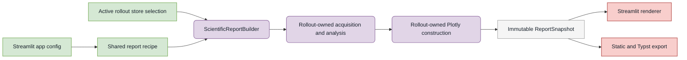

# ARIA-NBV Streamlit app

The Streamlit app is the interactive inspection surface for immutable root
stores, generated rollout stores, training-data readiness, bounded generation,
model diagnostics, and single-step oracle foundations.

## Launch

From `aria_nbv/` in the active worktree:

```bash
uv run nbv-st
```

The launcher reads `../.configs/streamlit_app.toml` by default. That composition
config selects the shared scientific-report recipe and S² section used by
Rollout Supervision and Campaign Generation. Override it with a script argument
after Streamlit's `--` delimiter:

```bash
uv run nbv-st -- --config-path .configs/streamlit_app.toml
```

Pass Streamlit server options before `--`, for example:

```bash
uv run nbv-st --server.port 8502
```

The wrapper uses Streamlit's automatic watcher and rerun-on-save by default.
Override either server setting when needed:

```bash
uv run nbv-st --server.fileWatcherType=poll
```

or set `STREAMLIT_SERVER_FILE_WATCHER_TYPE=poll`.

## Ownership boundary



Streamlit panels own widget state, explicit dispatch, and rendering only. They
must not open rollout stores, reduce evidence, or build figures. The rollout
package owns acquisition, analysis, and deterministic Plotly specifications;
`aria_nbv.reporting` seals those products for identical app and thesis use.

## Typed section lifecycle

Every migrated section follows one reviewed lifecycle without sharing a
framework implementation:

```text
typed controls
  -> validated domain request
  -> explicit dispatch
  -> replacement-sensitive source check
  -> domain-owned I/O, validation, reduction, and plotting
  -> frozen serializable evidence or a session-local live result
  -> identity-bound retained state
  -> Streamlit-only rendering
```

A path locates a source; it is not source identity. Store-backed work binds the
selected-entry generation before acquisition, verifies that generation again
after acquisition, and fails closed if the entry was replaced. Expensive work
is dispatched by a button, form, or open dynamic tab. A collapsed expander or
inactive ordinary tab is not a computation boundary. Display limits bound only
rendering unless the control explicitly declares a diagnostic subset; complete
scientific populations and their exclusions retain their factual denominators.

Persistent TOML-backed computation configuration uses the existing
`ConfigDocument` lifecycle. View controls, selected rows, request-only limits,
retained results, live handles, and other transient state remain namespaced
Streamlit session state and never become a second persistent configuration
plane.

### Ownership matrix

| Concern | Authoritative owner | App responsibility | Forbidden in a panel |
| --- | --- | --- | --- |
| Configuration validation and cache projection | Concrete domain `BaseConfig` subclasses and `ConfigDocument` | Render/edit controls and produce a validated draft | Duplicate config models, ad-hoc signatures, or runtime construction during inspection |
| Discovery and replacement-sensitive generation | The selected domain source owner | Select an entry and request refresh | Filesystem identity algorithms or treating a path as identity |
| Rollout Zarr open and validation | `aria_nbv.rollouts` | Render typed trust and failure products | `RolloutZarrStoreReader`, Zarr handles, or reader closures in app/cache state |
| VIN sample and target acquisition | `data_handling.vin_store` and Oracle pipeline owners | Select split/index/target and dispatch | Dataset iteration or `.setup_target()` during ordinary render |
| Candidate, scorer, and rollout execution | `pose_generation`, `oracle`, and `rollouts` | Dispatch and render progress/errors | CUDA probes, scorer construction, or rollout generation outside a domain facade |
| Scientific reduction | Domain analysis modules | Select typed request controls | NumPy/Pandas scientific reduction |
| Plot construction | Domain plotting modules | Render canonical Plotly specifications | `plotly.express`, `go.Figure`, or trace construction |
| Theory and provenance | Domain/report scientific products | Render explanations and links | Page-authored scientific interpretation |
| Publication | `aria_nbv.reporting` | Explicitly build and retain the exact snapshot | Reacquisition or recomputation during export |
| Cache lifecycle | Each explicit section cache owner | Dispatch, retain, and clear dependent page state | Generic dispatcher, global cache registry, or unproved shared resource |
| Session state | The section adapter | Namespaced controls and identity-bound retained result | Persistent/domain truth or an unbounded request-result dictionary |
| Rerun process | App operational adapter and Rerun inspector owner | Explicit launch, stop, and status | Mutation of persisted rollout evidence or scientific reduction |

### Prohibited framework shapes

The lifecycle is a contract, not a base class. Do not introduce a universal
page/section base, generic context object, central section or projection
registry, string-keyed dispatcher, event bus, dependency-injection container,
automatic renderer dispatch, or duplicate application configuration plane.
Cache-facing requests and products stay domain-specific, typed, frozen, and
CPU-serializable; they do not contain mutable dictionaries/DataFrames,
readers, tensors, meshes, CUDA/model/scorer objects, subprocess handles, or
secrets. `st.cache_resource` is prohibited for target-section readers and
runtimes unless a separately reviewed proof establishes process-shared safety,
cleanup, replacement behavior, and bounded ownership.

## PR 0 current dispatch inventory

This behavior-freeze inventory covers every independently computed unit in the
three initial target surfaces: Training Dataset, Live Rollout Lab, and Rollout
Supervision, including its private stored-rollout sections. Rows distinguish
population, cost, dispatch, or invalidation boundaries; downloads that merely
serialize an already displayed product are recorded with their owning unit.

Runtime policies are: **A**, a frozen serializable `st.cache_data` projection;
**B**, a bounded session-local live object/result; and **C**, a process-shared
resource that is prohibited without separate proof. Publication values mean
**now** (already an immutable reporting transaction), **later** (eligible only
after domain extraction and parity proof), or **never** (interactive,
diagnostic, privileged, or operational).

| ID | Section/control and current boundary | Source population and boundedness | Cost | Current result owner | Policy | Publication |
| --- | --- | --- | --- | --- | --- | --- |
| TD-01 | Training Dataset initial render | One selected root plus selected rollout-store metadata; metadata-only summary, invalid stores retained | Metadata | `training_dataset._cached_bundle_summary(validate_rollouts=False)` | A | Later |
| TD-02 | **Validate bundle** | Complete selected bundle validation; all selected rollout stores remain visible | Metadata/array scan | `training_dataset._cached_bundle_summary(validate_rollouts=True)` | A | Later |
| TD-03 | **Preflight Q_H corpus** | All selected training stages/chains admitted by the production dataset/DataModule contract | Dataset construction/array scan | `training_dataset._cached_qh_readiness` | A | Later |
| TD-04 | **Preview one chain and batch** | One selected stage/chain and one production-collated batch; diagnostic subset | Dataset construction/array materialization | `training_dataset._cached_qh_preview` | A | Never |
| TD-05 | **Deep statistics / target scan** | Complete selected root/rollout bundle; target and candidate denominators are complete | Array scan | `training_dataset._cached_deep_statistics` | A | Later |
| TD-06 | **Download resolved bundle evidence JSON** | Exact currently retained light/deep/Q_H products; no reacquisition | Serialization | `training_dataset._download_payload` | A | Later |
| LR-01 | **Load sample and targets** | One split-local VIN sample and a seeded, capped Oracle-GT target-task population | Dataset I/O/CPU sampling | `counterfactual_rollouts._load_vin_offline_sample` plus `OracleTargetTaskSampler` | B | Never |
| LR-02 | **Run / refresh live rollouts** | One loaded sample, one selected target when required, and the configured bounded candidate/beam/horizon population | CPU or GPU/runtime | `counterfactual_rollouts._run_live_rollout` | B | Never |
| LR-03 | Paths, Step Shell, Selected Depth, and Logs ordinary tabs | The retained live result; selected trajectory/step views are subsets and do not define new scientific populations | CPU rendering; selected-depth tensor projection | `counterfactual_rollouts._render_rollout_result` | B | Never |
| SR-01 | Rollout Supervision initial render and active-store validation | Discovered rollout entries plus one active store; metadata-first, invalid/unopenable entries visible and unpooled | Metadata/open validation | `_stored_rollouts.session._cached_inventory` and `open_stored_rollout_session` | A | Later |
| SR-02 | **Build corpus summary** | Exactly the selected compatible corpus; complete pooled summaries retain incompatible/invalid exclusions | Array scan | `_stored_rollouts.session._cached_corpus_summary` | A | Later |
| SR-03 | Overview open dynamic tab: trust/topology | One active store plus discovered VIN roots; topology may be metadata-bounded or source-selected | Metadata/array scan | `StoredRolloutSession.invariants`, `header`, and `topology` | A | Later |
| SR-04 | Reward & reconstruction open dynamic tab | The retained selected-corpus summary; no additional store acquisition when the summary is absent | Rendering only | `RolloutCorpusSummary` renderers | A | Later |
| SR-05 | Admission & feasibility open dynamic tab: corpus evidence | The retained selected-corpus admission/support population with explicit invalid/unpooled stores | Rendering only | `RolloutCorpusSummary` renderers | A | Later |
| SR-06 | Admission & feasibility: active-store target/mask/provenance and bounded geometry | Complete active-store targets/masks/factual steps; geometry is a user-bounded candidate display subset | Array scan | `StoredRolloutSession.targets`, `masks`, `steps`, `candidate_flow`, `ranks`, `candidates`, `proposal_geometry`, and `trajectory_geometry` | A | Later |
| SR-07 | **Build immutable candidate benchmark card** | Optional state key and bounded candidate rows; benchmark export retains the complete benchmark contract for that selection | Array scan/Plotly | `StoredRolloutSession.candidate_benchmark_records` and `candidate_benchmark_export` | A | Later |
| SR-08 | **Load complete candidate aggregate breakdowns** | Complete active-store candidate audit; display controls do not reduce denominators | Heavy array scan | `StoredRolloutSession.candidate_population` and `steps` | A | Later |
| SR-09 | **Load complete candidate-family lineage and choice evidence** | Complete active-store candidate/family allocation, validity, policy-mass, and realized-selection population | Heavy array scan | `StoredRolloutSession.candidate_population`, `candidate_flow`, and `ranks` | A | Later |
| SR-10 | Failures open dynamic tab and threshold controls | Findings over the complete active store under explicit active thresholds | Array scan | `StoredRolloutSession.failures` | A | Never |
| SR-11 | Drill-down open dynamic tab: scientific evidence | Complete active-store steps/cohorts and one selected temporal grouping; raw trajectory view is one selected rollout | Array scan/Plotly | `StoredRolloutSession.cohorts`, `paired`, `steps`, and `temporal` | A | Later |
| SR-12 | **Load reconstruction endpoints, discounted returns, and oracle headroom** | Complete active-store reconstruction rows, factual endpoints, selected returns, and exact-role headroom contrasts | Array scan/Plotly | `StoredRolloutSession.reconstruction_metrics`, `reconstruction_endpoints`, `discounted_returns`, and `headroom` | A | Later |
| SR-13 | **Load branching, rank/regret, and root-relative evidence** | Every factual active-store step and candidate shell; rendered root geometry is bounded but CSV is complete | Heavy array scan/Plotly | `StoredRolloutSession.tree`, `ranks`, and `root_geometry` | A | Later |
| SR-14 | Drill-down query scope and **Apply query** | Selected steps, selected rollout, selected step, or explicitly requested complete candidate store; preview limits never truncate export | Array scan/Pandas query | `StoredRolloutSession.steps` or `candidates` plus query workbench state | A | Never |
| SR-15 | Selected rollout/step candidate and depth drill-down | One selected rollout/step candidate population and its privileged selected-depth artifact | Array/image read | `StoredRolloutSession.candidates`, `depth_summary`, and `selected_depth_preview` | A | Never |
| SR-16 | **Count current-store Q_H masks** | Metadata-only when off; bounded prefix or complete active-store Q_H states when on, read in cancellable chunks | Metadata or array scan | `StoredRolloutSession.q_h` / `q_h_progressive` | A | Later |
| SR-17 | **Build complete target-frame S² report** | Every admissible factual selected path in the active store; projection overlays may be bounded but support denominators are complete | Complete-store scan/Plotly | Bound `ScientificReportConfig` producing `ReportSnapshot` | A | Now |
| SR-18 | Deterministic evidence-bundle download | Complete active-store canonical evidence for selected pilot/confirmatory status; lazy on click | Serialization/array scan | `StoredRolloutSession.evidence_bundle` | A | Later |
| SR-19 | **Launch / Restart / Stop Rerun** | One selected rollout and configured diagnostic layers; optional `.rrd`/viewer process | Subprocess/runtime | Rerun launch adapter and process handle | B; C prohibited | Never |

Refresh controls clear the dependent retained/cache state and cause the next
dispatch to reacquire under a fresh generation. No row authorizes an eager
reader/model/scorer resource, publication from a live result, or export-time
recomputation.

## Normative MUST-to-test traceability

PR 0 records the current proof and the known gaps; it does not claim that a
future landing contract is already implemented. PR identifiers below are the
stable work-package IDs from the accepted plan, not GitHub pull-request
numbers.

| ID | Required contract | PR 0 proof or characterized current gap | Exact landing proof | Landing PR |
| --- | --- | --- | --- | --- |
| `MUST-IDENT-01` | Replacing a selected entry invalidates its generation, including same-path replacement. | **Partial current proof:** `tests/app/panels/test_training_dataset_panel.py::test_artifact_identity_includes_promotion_sidecars_and_detects_same_path_replacement` and `tests/app/panels/test_stored_rollouts_projection_laziness.py::{test_all_store_backed_caches_follow_atomic_same_path_replacement,test_fixed_session_rejects_mid_handle_swap,test_session_open_rejects_mid_open_generation_swap}` characterize the current app-private seams. Training, rollout, and VIN generation identities are not yet domain-owned. | Port the alias/same-path/broken-alias, pre/post-read swap, canonical-population, and no-payload-enumeration matrix to each named domain generation seam; add live reacquisition and descriptor/reference mismatch integration cases. | PR 2 (training), PR 4 (stored rollout), PR 7a/7b (live profiles) |
| `MUST-CACHE-01` | A cached computation accepts one complete, typed request; every compute field affects identity and view-only state does not. | **Gap characterized:** current page-private caches still accept fragmented arguments. `tests/app/panels/test_training_dataset_panel.py::{test_qh_preview_reuses_only_exact_selection_and_controls,test_qh_readiness_hides_stale_preflight_after_loader_control_changes}` and `tests/app/panels/test_stored_rollouts_projection_laziness.py::test_stored_rollout_session_topology_preserves_structured_cache_arguments` lock the behavior to preserve, not the target request shape. | For every migrated request, assert deterministic digesting, every compute-field key change, view-field non-change, contract-version change, invalid-variant rejection, and frozen CPU-serializable cache products. | Each migrated slice in PR 2-7b; final static enforcement in PR 9 |
| `MUST-RUNTIME-01` | No reader, model, scorer, CUDA object, or other process-shared resource exists without a separate safety/lifecycle proof. | **Gap characterized:** `tests/app/panels/test_stored_rollouts_projection_laziness.py::test_stored_rollout_session_cache_decorator_matrix_is_explicit` intentionally records the two current stored-rollout `cache_resource` owners; it is not proof that they satisfy the target policy. | Prove scope-local reader construction and non-escape across two sessions and replacement, then use an AST/runtime inventory to show no `cache_resource` remains in the target pages after topology migration. | PR 4 (reader), PR 5a (topology), PR 9 (enforcement) |
| `MUST-LIVE-01` | Live and persisted-writer execution use the same composition for each target profile. | **Current gap:** `tests/app/panels/test_counterfactual_rollouts_panel.py` characterizes the live panel, but the panel still composes and executes the runtime directly; no live/writer parity test exists yet. | Profile-specific integration tests must bind identical source generation, selection/admission config, target reference, rollout config, and seed, then compare policy identity, admission, candidate allocation/validity, selected actions, score labels, trajectory geometry, and evaluation facts. | PR 7a (`oracle_gt_diagnostic`), PR 7b (`observed_v1`) |
| `MUST-UI-01` | Expensive nested content is absent until explicit dispatch or an open dynamic tab. | **Current proof:** `tests/app/panels/test_stored_rollouts_projection_laziness.py::{test_stored_rollout_workspaces_keep_explicit_dynamic_dispatch,test_corpus_summary_remains_behind_named_user_dispatch,test_lightweight_dispatch_does_not_materialize_candidate_audit}` and the target-page AppTests characterize current gating. | For each migrated section, AppTest must prove no initial acquisition, exactly one call after dispatch, reuse on unchanged rerun, stale-result hiding on compute changes, preservation on view changes, refresh invalidation, and no acquisition from inactive content. | Each affected adapter in PR 2-7b |
| `MUST-TYPE-01` | Every changed typed seam passes repository-configured strict targeted mypy. | **Not applicable to the PR 0 docs-only delta:** no typed seam changes here. The executable gate already exists as `make mypy-targeted MYPY_PATHS="<changed package and contract-test paths>"`; passing it for future code is not claimed by PR 0. | Run that exact target with every changed domain/app interface and its contract tests in each implementation PR; PR 9 also runs the final target-panel architecture checks. | Each implementation PR; final enforcement in PR 9 |
| `MUST-LOG-01` | Observers and captured events are per run, isolated, and exclude secrets or large configuration payloads. | **Current gap:** `aria_nbv.app.panels.counterfactual_rollouts._run_live_rollout` uses the process-global `Console.set_sink`; current tests do not prove concurrent isolation. | Run two concurrent live executions with separate observers and assert each receives only its own structured, sanitized events; separately verify deterministic provenance excludes operational telemetry. | PR 7a |
| `MUST-STATE-01` | Per-session live state is bounded and bound to the selected target profile and request identity. | **Current gap:** the live panel retains request-keyed `cf_live_source_cache` and `cf_live_rollout_cache` dictionaries; no bounded-slot or cross-session/profile-isolation proof exists. | Two independent AppTest sessions must not share widgets, preview, result, or events; repeated requests must retain at most one preview and one result slot, and profile/source/request changes must hide or clear stale values. | PR 7a/7b |

## Navigation

| Group | Purpose |
| --- | --- |
| Training Dataset | Training/Q_H corpus composition and bounded readiness checks. |
| Training Data | Immutable root-store inspection and persisted rollout supervision. |
| Generation | Bounded campaign operation, live rollout experiments, and candidate proposals. |
| Models & Experiments | VIN, RRI binning, W&B, and Optuna diagnostics. |
| Reporting & Configuration | Immutable report preview/export and safe trusted-TOML authoring. |
| Foundations / Single-step | One observed snippet, candidate rendering, and oracle RRI. |

Rollout Supervision and Root Observation Store are read-mostly inspection
surfaces. Campaign Generation and the live/single-step pages can execute
bounded local computation. Rerun launch controls are post-hoc inspection tools;
they do not alter persisted rollout evidence.

The default path configuration resolves data beneath `.data/` and external
dependencies beneath `external/`, relative to the repository root. Individual
pages expose typed path or store selectors where their owner permits overrides.

Scientific Reporting builds one immutable snapshot only after explicit user
dispatch and exports that exact preview without reacquiring evidence. The
[reporting module](../reporting/README.md) owns the snapshot architecture and
bundle layout. The app composition config points to a report recipe rather than
copying its analysis or theme fields. Configuration Workspace inspects a code-owned catalog of root
models, derives widgets and help from Pydantic plus source docstrings, and
defaults to comment-preserving save-as-copy; see the
[config authoring workflow](../configs/README.md).

## Troubleshooting

- **Code changed but the page did not:** refresh the browser. Enable the polling
  watcher only when active hot reload is worth the extra filesystem work.
- **A store still shows old evidence:** use the page's refresh action. Store
  caches bind validated identity, but an already rendered browser session may
  still need a rerun.
- **A page cannot find data or configuration:** launch from `aria_nbv/` in the
  intended worktree and verify `.data/`, `external/`, and the selected path.
- **Rerun fails to open:** inspect the displayed command/status, port conflicts,
  and stdout/stderr. Native and web-viewer launch modes are separate from the
  Streamlit server.
- **The app fails during import:** verify the console entrypoint remains
  import-light and that the selected page owns its panel import.

## Focused verification

From `aria_nbv/`:

```bash
uv run pytest -q tests/app/test_app_router.py tests/test_streamlit_entry.py
uv run pytest -q tests/app/panels/test_training_dataset_panel.py
uv run pytest -q tests/app/panels/test_counterfactual_rollouts_panel.py
uv run pytest -q tests/app/panels/test_stored_rollouts_projection_laziness.py
```

Use AppTest for rerun, widget, session-state, and rendered-output contracts.
Use a browser or Rerun smoke when the claim depends on visual layout or viewer
behavior.

## Adding or changing a page

1. Add one lazy callback in `app.py` and place it in the appropriate navigation
   group.
2. Keep the page presentation-only; put reusable computation in its typed
   package owner.
3. Consume sealed DTOs or report snapshots; do not construct domain plots or
   open domain stores in a panel.
4. Namespace page/session keys and gate expensive work behind explicit
   dispatch.
5. Add a focused AppTest or router regression for the changed contract.
