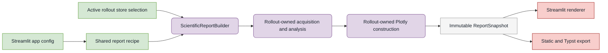

# ARIA-NBV Streamlit app

The Streamlit app is the interactive inspection surface for immutable root
stores, generated rollout stores, training-data readiness, bounded generation,
model diagnostics, and single-step oracle foundations.

## Launch

From `aria_nbv/` in the active worktree:

```bash
uv run nbv-st
```

The launcher reads `../.configs/streamlit_app.toml` by default. That composition
config selects the shared scientific-report recipe and S² section used by
Rollout Supervision and Campaign Generation. Override it with a script argument
after Streamlit's `--` delimiter:

```bash
uv run nbv-st -- --config-path .configs/streamlit_app.toml
```

Pass Streamlit server options before `--`, for example:

```bash
uv run nbv-st --server.port 8502
```

The wrapper uses Streamlit's automatic watcher and rerun-on-save by default.
Override either server setting when needed:

```bash
uv run nbv-st --server.fileWatcherType=poll
```

or set `STREAMLIT_SERVER_FILE_WATCHER_TYPE=poll`.

## Ownership boundary



Streamlit panels own widget state, explicit dispatch, and rendering only. They
must not open rollout stores, reduce evidence, or build figures. The rollout
package owns acquisition, analysis, and deterministic Plotly specifications;
`aria_nbv.reporting` seals those products for identical app and thesis use.

## Navigation

| Group | Purpose |
| --- | --- |
| Training Dataset | Training/Q_H corpus composition and bounded readiness checks. |
| Training Data | Immutable root-store inspection and persisted rollout supervision. |
| Generation | Bounded campaign operation, live rollout experiments, and candidate proposals. |
| Models & Experiments | VIN, RRI binning, W&B, and Optuna diagnostics. |
| Reporting & Configuration | Immutable report preview/export and safe trusted-TOML authoring. |
| Foundations / Single-step | One observed snippet, candidate rendering, and oracle RRI. |

Rollout Supervision and Root Observation Store are read-mostly inspection
surfaces. Campaign Generation and the live/single-step pages can execute
bounded local computation. Rerun launch controls are post-hoc inspection tools;
they do not alter persisted rollout evidence.

The default path configuration resolves data beneath `.data/` and external
dependencies beneath `external/`, relative to the repository root. Individual
pages expose typed path or store selectors where their owner permits overrides.

Scientific Reporting builds one immutable snapshot only after explicit user
dispatch and exports that exact preview without reacquiring evidence. The
[reporting module](../reporting/README.md) owns the snapshot architecture and
bundle layout. The app composition config points to a report recipe rather than
copying its analysis or theme fields. Configuration Workspace inspects a code-owned catalog of root
models, derives widgets and help from Pydantic plus source docstrings, and
defaults to comment-preserving save-as-copy; see the
[config authoring workflow](../configs/README.md).

## Troubleshooting

- **Code changed but the page did not:** refresh the browser. Enable the polling
  watcher only when active hot reload is worth the extra filesystem work.
- **A store still shows old evidence:** use the page's refresh action. Store
  caches bind validated identity, but an already rendered browser session may
  still need a rerun.
- **A page cannot find data or configuration:** launch from `aria_nbv/` in the
  intended worktree and verify `.data/`, `external/`, and the selected path.
- **Rerun fails to open:** inspect the displayed command/status, port conflicts,
  and stdout/stderr. Native and web-viewer launch modes are separate from the
  Streamlit server.
- **The app fails during import:** verify the console entrypoint remains
  import-light and that the selected page owns its panel import.

## Focused verification

From `aria_nbv/`:

```bash
uv run pytest -q tests/app/test_app_router.py tests/test_streamlit_entry.py
uv run pytest -q tests/app/panels/test_training_dataset_panel.py
uv run pytest -q tests/app/panels/test_counterfactual_rollouts_panel.py
uv run pytest -q tests/app/panels/test_stored_rollouts_projection_laziness.py
```

Use AppTest for rerun, widget, session-state, and rendered-output contracts.
Use a browser or Rerun smoke when the claim depends on visual layout or viewer
behavior.

## Adding or changing a page

1. Add one lazy callback in `app.py` and place it in the appropriate navigation
   group.
2. Keep the page presentation-only; put reusable computation in its typed
   package owner.
3. Consume sealed DTOs or report snapshots; do not construct domain plots or
   open domain stores in a panel.
4. Namespace page/session keys and gate expensive work behind explicit
   dispatch.
5. Add a focused AppTest or router regression for the changed contract.
