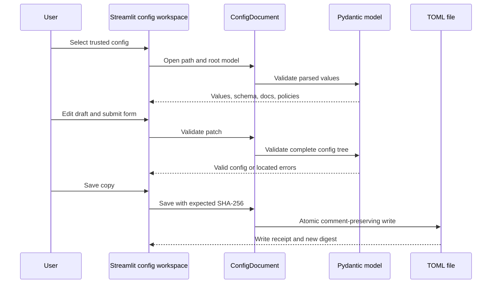

# Configuration authoring

`aria_nbv.configs` exposes trusted configuration families and a safe authoring
transaction around their existing `BaseConfig` validation. It does not import
runtime targets merely to inspect a file, and it never discovers model classes
from strings stored in TOML.



## Workflow

Open a trusted path together with its root model, inspect field descriptors,
validate a partial patch, review the semantic diff, and save a copy with the
digest observed at open time:

```python
from aria_nbv.configs import ConfigDocument, WandbConfig

document = ConfigDocument.open(path, WandbConfig)
updated = document.validate_patch({"project": "aria-nbv-reporting"})
print(document.diff(updated))
receipt = document.save_copy(copy_path, expected_sha256=document.source_sha256)
```

Save-as-copy is the UI default. An in-place save uses the same optimistic
concurrency check and therefore refuses to overwrite an externally changed
file. Inline Python field docstrings own field meaning; Pydantic owns types and
constraints; `json_schema_extra["aria"]` carries only structured edit,
sensitivity, and theory-link policy.

The generated [configuration API reference](../../../docs/reference/configs.qmd)
contains exact field and error contracts. Streamlit behavior belongs to
`aria_nbv.app`; scientific report recipes belong to `aria_nbv.reporting`.
