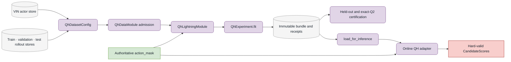

# Lightning Training

`aria_nbv.lightning` owns training-stage admission, objectives, optimization,
checkpoint selection, metrics, and experiment publication. VIN owns scorer
architecture; data handling owns actor/supervision DTOs; rollouts own factual
replay and stored masks.

## One-Step VIN

The public command-line training path remains the one-step CORAL control:

```sh
cd aria_nbv
uv run nbv-train --help
uv run nbv-summary --help
```

`AriaNBVExperimentConfig`, `VinDataModuleConfig`, and
`VinLightningModuleConfig` provide the corresponding config-as-factory Python
surface.

## Finite-Horizon QH

Finite-horizon fitting is a programmatic, immutable experiment API rather than
a second CLI. The normal lifecycle is:



```python
from aria_nbv.lightning.qh_experiment import (
    QhCheckpointSelectionSpec,
    QhExperimentConfig,
    QhFitRequest,
)
from aria_nbv.lightning.qh_module import QhLightningModuleConfig
from aria_nbv.vin.models.target_finite_horizon import (
    TargetFiniteHorizonScorerConfig,
)

experiment = QhExperimentConfig(
    scorer=TargetFiniteHorizonScorerConfig(max_horizon=4),
    module=QhLightningModuleConfig(
        actor_state_contract_hash="bound-during-fit",
        learning_contract_hash="bound-during-fit",
    ),
).setup_target()

result = experiment.fit(
    QhFitRequest(
        train=train_dataset_config,
        validation=validation_dataset_config,
        test=test_dataset_config,
        warm_start_from=None,
        checkpoint_selection=QhCheckpointSelectionSpec(),
        seed=23,
        output_bundle_dir=bundle_dir,
    )
)
runtime = experiment.load_for_inference(result.bundle, device="cuda")
```

The train, validation, and test configs must identify non-empty,
scene-disjoint populations with compatible learning semantics. The output
directory must not already exist. Fit publishes scorer weights, a manifest,
and hashed training/checkpoint-selection receipts; it does not publish
optimizer state as an inference dependency.

For a bounded one-epoch smoke, set the nested `TrainerFactoryConfig` to one
epoch and one train/validation batch. The executable example is maintained in
`tests/lightning/test_qh_experiment.py::test_qh_fit_publishes_new_bundle_and_hashed_receipts`.

## Mask and Gradient Ownership

`QhLightningModule.forward()` exposes the scorer's raw, action-mask-independent
`QhScoreOutput`. Training then applies separate support contracts:

- `candidate_mask` identifies materialized rows;
- `action_mask` defines legal backup and policy support;
- `q_label_mask` identifies factual one-step label support;
- fitted-Q admission selects realized horizon targets;
- step and padding masks exclude unrealized storage rows.

Feasibility learns from labelled valid and invalid materialized rows. Q loss and
bootstrap participation remain zero outside Q-label and hard-action support.
Zero-filled padding or invalid rows can therefore never win a masked selection,
including when all valid Q values are negative.

## Objective and Decoders

The fitted-Q objective uses Huber loss, online argmax/target evaluation, exact
`h -> h - 1` recursion, and hard-valid next-action support. The scorer may use:

- direct continuous regression, the canonical decoder; or
- CORAL with a manifest-bound support and calibration identity.

Decoder selection belongs to `TargetFiniteHorizonScorerConfig`; Lightning
dispatches the corresponding loss without changing mask semantics.

## Bundle and Online Use

`QhExperiment.load_for_inference()` verifies the manifest, configuration,
weights, trained horizons, representation semantics, calibration, geometry,
and actor/learning identities. The online adapter in
`aria_nbv.oracle.pipelines.online_qh` rejects mismatched contexts and converts
only hard-valid conditional values into `CandidateScores`.

Learned feasibility is auxiliary in the deployed core. It does not replace the
authoritative analytic/observed action mask.

## Verification

```sh
cd aria_nbv
uv run ruff check aria_nbv/lightning
uv run pytest tests/lightning/test_qh_datamodule.py
uv run pytest tests/lightning/test_qh_module.py
uv run pytest tests/lightning/test_qh_experiment.py
uv run pytest tests/lightning/test_qh_q2_certification.py
```

Use `tests/lightning/test_qh_fast_dev_run.py` for the smallest complete
Lightning transaction.
