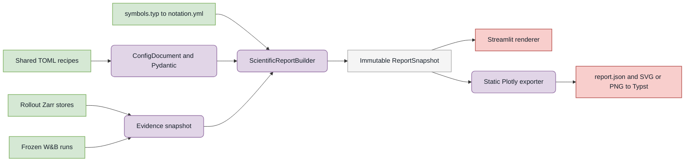

# Scientific reporting

`aria_nbv.reporting` builds figures, tables, and named quantities once, seals
them in an immutable `ReportSnapshot`, and gives the exact snapshot to
Streamlit preview and static/Typst export. Export never receives a report
recipe, so it cannot silently reacquire a changed W&B run or rollout store.



## Build, preview, and export

```python
from aria_nbv.reporting import ScientificReportConfig, write_report_snapshot

# First replace the template's empty source selections with immutable stores
# and exact W&B run IDs.
recipe = ScientificReportConfig.from_toml(".configs/reports/qh-thesis.toml")
snapshot = recipe.setup_target(wandb_api=wandb_api).build()

# Streamlit reconstructs go.Figure from figure.plotly_json.
for figure in snapshot.figures:
    st.plotly_chart(plotly.io.from_json(figure.plotly_json.decode()))

# Static export consumes the exact previewed snapshot; it performs no source reads.
write_report_snapshot(snapshot, Path("build/qh-thesis-report"))
```

`nbv-report build --config ... --output ...` is the same composition as the
Python example. A bundle contains `recipe.toml`, `report.json`, canonical
Plotly JSON under `figures/`, static assets under `assets/`, and an integrity
`manifest.json`. Two-dimensional figures default to SVG; WebGL/3D figures use
configured high-resolution PNG.

### Target-frame S² reports

The `rollout_s2` section freezes the same target-frame movement,
camera-forward, and calibrated proxy-frustum Plotly figures shown by the
stored-rollout application:

```toml
[[sections]]
kind = "rollout_s2"
id = "s2"
channels = ["movement", "view_direction", "frustum"]

[sections.analysis]
azimuth_bins = 36
elevation_bins = 18
projection_limit = 2000
```

The complete equal-solid-angle histograms and scalar support quantities are
computed from every admitted selected step. `projection_limit` bounds only the
incidence overlay. Surface colour represents complete cell counts; incidence
colour represents rollout-chain index and marker shape represents persisted
step index. The frustum channel reports geometric potential support on a
geometric-mean-scale target proxy, not observed target-mesh visibility.

`.configs/reports/s2-thesis-pilot.toml` is the exact pilot recipe used by the
development thesis. Regenerate its immutable bundle with:

```sh
cd aria_nbv
uv run nbv-report build \
  --config ../.configs/reports/s2-thesis-pilot.toml \
  --output ../docs/typst/thesis/data/s2-rollout-pilot
```

Typst loads the resulting `report.json` and resolves figure paths through
`experiment_data.typ`; it does not execute Python or reacquire rollout data.

The manifest fingerprints Plotly, Kaleido, Chrome, the resolved font files,
template payloads, locale, timezone, and Plotly's MathJax/TopoJSON defaults.
Report execution never installs browser assets. Recipes intended for isolated
publication must avoid map tiles, remote images, and other URL-backed traces;
the exporter rejects explicit remote resources before launching Kaleido.

## Ownership

- `aria_nbv.rollouts` owns Zarr validation, evidence compatibility, rollout
  reductions, configured S² acquisition, and the shared Plotly builder used by
  Streamlit and this module. Reporting freezes those products without
  reimplementing geometry.
- W&B remains an external evidence store. Confirmatory recipes name exact,
  finished run IDs and acquire complete `scan_history` rows.
- `docs/typst/shared/symbols.typ` and `equations.typ` own notation and theory.
  Reports carry only validated canonical IDs.
- This README owns the public workflow and architecture. Public Python
  docstrings own exact fields, invariants, failures, and lifecycle. Typst owns
  scientific claims, captions, equations, and interpretation.

See the generated [reporting API reference](../../../docs/reference/reporting.qmd)
for the detailed interface. Report construction is explicitly dispatched;
configuration inspection and ordinary Streamlit reruns do not read full rollout
arrays or W&B histories.
