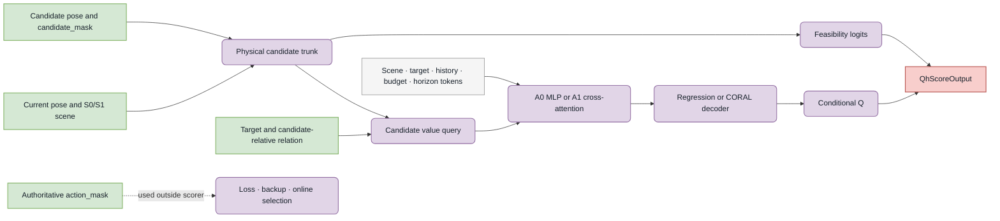

# VIN Scorers

`aria_nbv.vin` owns actor-side candidate scoring. It contains the historical
one-step VIN control and the modular target-conditioned finite-horizon scorer.
Oracle RRI labels are supervision, not model inputs; Lightning owns losses,
hard masking, and optimization.

## Choose a Scorer

| Scorer | Use | Output |
| --- | --- | --- |
| `VinModelV3` | Target-agnostic one-step control used by the seminar pipeline. | CORAL `VinPrediction` rows. |
| `TargetFiniteHorizonScorer` | Actor-only conditional values for a target, state, candidate, budget, and requested horizon. | `QhScoreOutput` with `conditional_q`, `feasibility_logits`, and optional CORAL auxiliaries. |

Import the one-step stable surface from `aria_nbv.vin`. Import QH contracts from
their leaf modules so the two training objectives remain explicit.

```python
from aria_nbv.vin.models.target_finite_horizon import (
    TargetFiniteHorizonScorerConfig,
)

scorer = TargetFiniteHorizonScorerConfig(
    hidden_dim=128,
    max_horizon=4,
).setup_target()

output = scorer(actor, requested_horizon=None)
q = output.conditional_q
feasibility = output.feasibility_logits
```

`requested_horizon=None` queries `actor.horizon_remaining`. Explicit realized
queries are scalar `int64[B,S]` values satisfying `1 <= h <= b_t`; padding uses
zero and unsupported values fail closed.

## Finite-Horizon Architecture



The implementation has two deliberately different branches:

- The physical candidate trunk uses materialized candidate rows and
  `candidate_mask`. It is independent of the target, requested horizon,
  supervision, and authoritative `action_mask`, and feeds the feasibility head.
- The conditional-Q branch adds the target token, candidate-relative target
  relation, scene summary, causal history, remaining budget, and requested
  horizon. A0 scores rows independently; A1 lets each candidate query state
  tokens without candidate-to-candidate attention.

Changing only `action_mask` must not change raw Q or feasibility. Lightning and
online policy adapters apply that mask to losses, backups, and selection.

## Representation Modules

The default configuration is intentionally compositional:

| Axis | Implementations |
| --- | --- |
| Scene | S0 root moments; S1 selected-surface residual over S0. |
| History | H0 masked mean; H1 ordered causal transformer. |
| State fusion | A0 independent MLP; A1 candidate-to-state cross-attention. |
| Value decoding | Direct regression; CORAL over a manifest-bound support. |

The scorer preserves candidate permutation equivariance because candidates do
not exchange information. Padding is zeroed. Materialized invalid rows receive
finite conditional predictions, but those values are neither supervised nor
deployable unless admitted by the external hard mask.

S1 is an implemented privileged experimental profile and remains unpromoted;
deployable bundle publication currently admits actor-only CF0.

## Regression and CORAL

Direct continuous regression is the canonical decoder and needs no support
calibration. Select CORAL when the experiment has a frozen train-fitted support
or a predeclared physical support whose calibration identity can be bound into
the bundle. Legacy fixed support remains inspection-only and is not publishable:

```python
from aria_nbv.vin.models.target_finite_horizon import (
    TargetFiniteHorizonScorerConfig,
)
from aria_nbv.vin.modules.qh_value_decoders import (
    QhCoralValueDecoderConfig,
    QhPredeclaredPhysicalCoralSupport,
)

support = QhPredeclaredPhysicalCoralSupport.create(
    source_population_digest="population-v1",
    ordered_input_digest="physical-rule-inputs-v1",
    physical_rule="symmetric-root-gain-support-v1",
    bin_edges=(-0.5, 0.5),
    bin_values=(-1.0, 0.0, 1.0),
)
config = TargetFiniteHorizonScorerConfig(
    max_horizon=4,
    value_decoder=QhCoralValueDecoderConfig(
        support=support,
        preinit_bias=False,
    ),
)
```

Quantile decoding is the next distributional family suggested by the current
design, but is not implemented or part of the core architecture.

## Detailed Contracts

- Actor inputs: `aria_nbv.data_handling.qh_data.views.QhActorTensors`
- Structured output and scorer: `aria_nbv.vin.models.target_finite_horizon`
- Scene/history/fusion/decoder modules: `aria_nbv.vin.modules.qh_*`
- Bundle identity: `aria_nbv.vin.qh_bundle`
- Scientific estimand: [finite-candidate value model](../../../docs/typst/thesis/sections/04-method/04-05-finite-candidate-value-model.typ)
- Human-facing API: [generated reference](../../../docs/reference/index.qmd)

## Verification

```sh
cd aria_nbv
uv run ruff check aria_nbv/vin
uv run pytest tests/vin/test_target_finite_horizon.py
uv run pytest tests/vin/test_qh_value_decoders.py tests/vin/test_qh_state_fusion.py
```

Include Lightning experiment tests whenever output, decoder, or bundle identity
changes.
