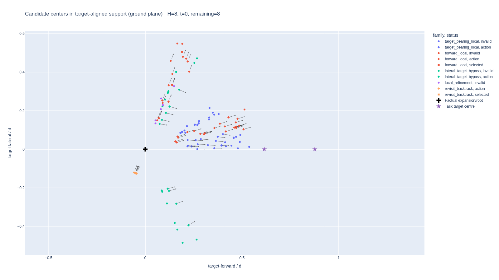
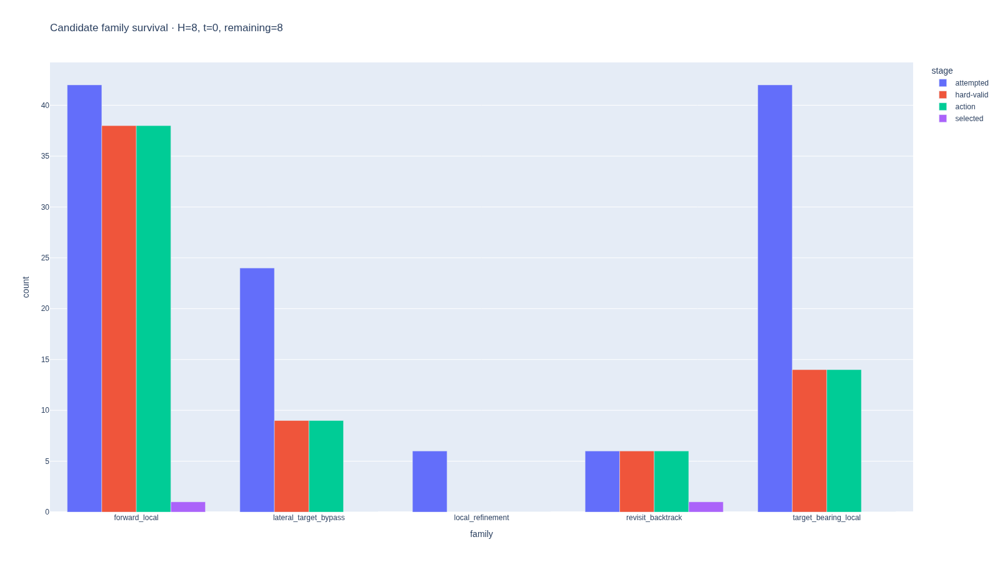

# Canonical candidate evidence: two real rollout states

This bundle exercises the presentation-free `CandidateEvidenceSnapshot` and
snapshot-only plot models on two factual CUDA pilot rollouts. It contains the
first factual state from scenes `81286` and `81483`, with 60 attempted rows per
state. The source stores are the immutable shards `0573c5a225d7e4c2` and
`34ff1e8e9bd95572` of campaign
`cuda-rollouts-v1-pilot-corrected-v11`; their exact manifest hashes are frozen
in [`snapshots.json`](snapshots.json).

The committed snapshot bundle is reader-free. Rebuild the four exact Plotly
JSON and portable HTML artifacts with:

```console
cd aria_nbv
python ../docs/contents/evidence/candidate_evidence_snapshot_real_scenes/build_evidence.py
```

The plots retain the full attempted shell and distinguish invalid, hard-valid,
action, and selected rows. Titles retain the common rollout horizon and the
factual step/budget. Family names from these older stores are explicitly
legacy display labels; they are not upgraded to canonical semantic family IDs.
The old stores also predate persisted view-jitter evidence, so the jitter plot
truthfully remains empty rather than inventing zero residuals or a bounded box.

- [`candidate-ground-support.html`](candidate-ground-support.html): normalized
  target-aligned ground support with action gaze arrows.
- [`candidate-support-3d.html`](candidate-support-3d.html): normalized 3-D
  support with root and target anchors.
- [`candidate-family-survival.html`](candidate-family-survival.html): attempted,
  hard-valid, action, and selected survival by legacy display family.
- [`candidate-view-jitter.html`](candidate-view-jitter.html): explicit absence
  of jitter evidence in these legacy stores.





[`summary.json`](summary.json) records the aggregate N/V/A/K counts, immutable
snapshot hashes, and source-bound plot identities. This is visualization and
adapter evidence, not a new data-quality claim and not authorization for
larger-scale generation.
