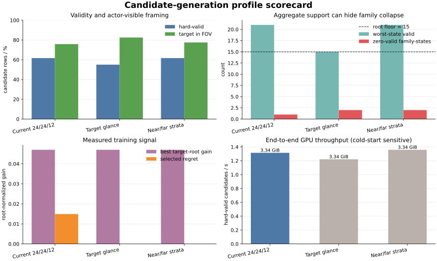
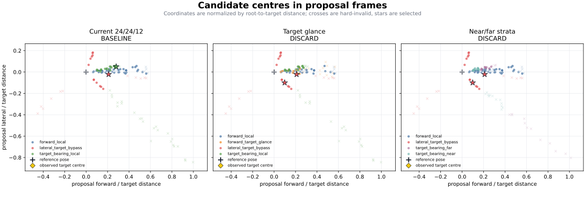
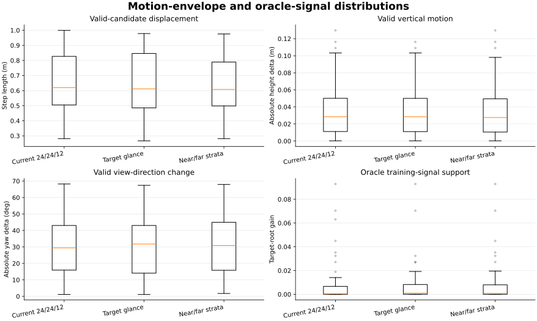
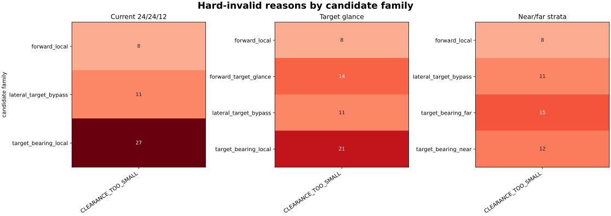

This page records the current pre-scale decision for ARIA-NBV candidate
generation. It is a bounded pilot report, not evidence that any candidate
family is ready for broad rollout or training.

> **Decision: NO-GO for larger-scale generation.** The current production
> mixture and both tested challenger mixtures contain family/state support
> collapse. The challengers are retained as negative evidence, but neither is
> promoted.

## Question and protocol

The question was whether a small change to the finite candidate mixture would
improve useful training support while preserving geometric validity, target
framing, diversity, and CUDA throughput. The frozen evaluator used the same
two reviewed rows from the 100-row rollout source manifest, seed `20260728`,
60 candidates per scene, V0/GT target evaluation, candidate feasibility rules,
and target-RRI scorer for every profile. The run used a CUDA RTX 3080 Ti. The
pilot therefore measures two scenes and one seed; it does not estimate a
population-level effect or uncertainty interval.

The production reference is the [CUDA campaign writer
config](../../../.configs/build_rollouts_v1_cuda_campaign_writer.toml), with
the [reviewed 100-row source manifest](../../../.configs/rollout_campaign100_source_manifest.json).
The campaign wrapper is [`build_rollouts_v1_cuda_campaign.toml`](../../../.configs/build_rollouts_v1_cuda_campaign.toml).
The candidate-family implementation is
[`candidate_mixture.py`](../../../aria_nbv/aria_nbv/pose_generation/candidate_mixture.py);
single-family sampling and view-jitter semantics are owned by
[`candidate_generation.py`](../../../aria_nbv/aria_nbv/pose_generation/candidate_generation.py).

The two experimental arms change only the following mixture entries; all
other writer settings, feasibility rules, and the 60°/30° view-jitter caps
remain fixed:

| profile | exact delta from `realistic_core` |
|---|---|
| forward_target_glance | reduce `forward_local` and `target_bearing_local` from 24 to 18 each; add 12 `forward_target_glance` rows with `position=forward_local`, `view=target_point` |
| radius_stratified | replace 24 `target_bearing_local` rows at radius `[0.4, 1.1]` m with 12 `target_bearing_near` rows at `[0.4, 0.65]` m and 12 `target_bearing_far` rows at `[0.65, 1.1]` m |

These discarded experimental deltas are also embedded in the public evidence
JSON; they are not production configuration options.

## Matched results

All values below are copied from the evaluator's per-profile evidence JSON.
`actor-valid` is the fraction of candidates surviving the actor-visible
validity mask; `joint NN` and the position/gaze nearest-neighbour values are
descriptive diversity measures, not realism guarantees. Higher NN distances
indicate more separated samples. `family-zero states` counts state/family
cells with no hard-valid proposal.

| profile | actor-valid count / fraction | best target-root gain (mean over states) | family-zero states | target in FOV | median position NN (m) | median gaze NN (deg) | joint unique | candidates/s | valid candidates/s | peak memory (MB) |
|---|---:|---:|---:|---:|---:|---:|---:|---:|---:|---:|
| realistic_core (reference) | 74 / 0.617 | 0.0469993 | 1 | 0.758 | 0.0430 | 7.92 | 1.0 | 2.13 | 1.31 | 3416 |
| forward_target_glance | 66 / 0.550 | 0.0469976 | 2 | 0.825 | 0.0530 | 8.75 | 1.0 | 2.22 | 1.22 | 3424 |
| radius_stratified | 74 / 0.617 | 0.0469991 | 2 | 0.775 | 0.0430 | 7.69 | 1.0 | 2.20 | 1.36 | 3424 |

The primary estimand is effectively tied: both challengers are below the
reference by `-1.68e-6` and `-2.47e-7`, respectively, within the frozen
`0.0001` tie tolerance. The frozen family-support non-regression criterion
rejects both challengers: `family-zero states` increases from 1 to 2. The
modest framing improvement of `forward_target_glance` (target in FOV `0.825`)
is therefore not sufficient to promote it, and
`radius_stratified` does not improve position separation or primary gain.

| profile | median target pixel margin (px) | median target view angle (deg) | selected regret | jitter nonzero | jitter bounded |
|---|---:|---:|---:|---:|---:|
| realistic_core (reference) | 41.36 | 39.70 | 0.0149 | 1.0 | 1.0 |
| forward_target_glance | 45.33 | 37.99 | 0.0000 | 1.0 | 1.0 |
| radius_stratified | 41.36 | 39.70 | 0.0000 | 1.0 | 1.0 |

The challenger framing changes are geometric diagnostics only. The zero
selected-regret values in the challengers do not demonstrate better policy
learning: the pilot has two states, a V0/GT oracle, and no downstream Q-model
fit.

### Motion envelope and oracle-signal distribution

The motion columns report the 5th percentile / median / 95th percentile over
actor-valid candidates. The target-root gain column reports the same quantiles
over candidates with an oracle label; missing values are counted in the public
JSON. These are finite-proposal diagnostics, not a learned human-motion prior.

| profile | step length (m) | absolute height delta (m) | absolute yaw delta (deg) | target-root gain | path evaluated / proposed | path collisions | clearance-invalid |
|---|---:|---:|---:|---:|---:|---:|---:|
| realistic_core | 0.309 / 0.620 / 0.962 | 0.001 / 0.028 / 0.100 | 4.43 / 29.43 / 61.94 | -5.29e-7 / 0.000346 / 0.03863 | 74 / 120 | 0 | 46 |
| forward_target_glance | 0.307 / 0.612 / 0.961 | 0.001 / 0.028 / 0.097 | 4.48 / 31.76 / 60.97 | 3.14e-7 / 0.000933 / 0.02711 | 66 / 120 | 0 | 54 |
| radius_stratified | 0.309 / 0.608 / 0.920 | 0.001 / 0.028 / 0.094 | 4.43 / 30.87 / 60.35 | -4.52e-7 / 0.000771 / 0.03336 | 74 / 120 | 0 | 46 |

Every hard-invalid row in this pilot is labelled `CLEARANCE_TOO_SMALL`; the
challengers therefore do not reveal a new failure class, but
`forward_target_glance` increases its count from 46 to 54. The available path
predicate is evaluated only after earlier feasibility checks and reports no
collision among those evaluated. It is a reference-to-centre chord check, not
a swept-body or navigability guarantee. Per-family and per-state invalid
counts, motion quantiles, target-RRI quantiles, and path-evaluation denominators
are retained in `evidence.json`.

### Per-family support

The family funnel is the important failure signal. Counts are
`hard-valid / attempted`; `worst-state` is the smallest hard-valid count for
that family in either evaluated state.

| profile | family | hard-valid / attempted | hard-valid fraction | worst-state | target in FOV |
|---|---|---:|---:|---:|---:|
| realistic_core | forward_local | 40 / 48 | 0.833 | 20 | 0.479 |
| realistic_core | target_bearing_local | 21 / 48 | 0.438 | 0 | 0.917 |
| realistic_core | lateral_target_bypass | 13 / 24 | 0.542 | 1 | 1.000 |
| forward_target_glance | forward_local | 28 / 36 | 0.778 | 14 | 0.472 |
| forward_target_glance | forward_target_glance | 10 / 24 | 0.417 | 0 | 1.000 |
| forward_target_glance | target_bearing_local | 15 / 36 | 0.417 | 0 | 0.944 |
| forward_target_glance | lateral_target_bypass | 13 / 24 | 0.542 | 1 | 1.000 |
| radius_stratified | forward_local | 40 / 48 | 0.833 | 20 | 0.479 |
| radius_stratified | target_bearing_near | 12 / 24 | 0.500 | 0 | 1.000 |
| radius_stratified | target_bearing_far | 9 / 24 | 0.375 | 0 | 0.917 |
| radius_stratified | lateral_target_bypass | 13 / 24 | 0.542 | 1 | 1.000 |

The reference itself is not scale-ready: one target-bearing family/state cell
has zero support. This is a pre-existing blocker tracked by
[issue #54](https://github.com/JanDuchscherer104/ARIA-NBV/issues/54), with
proposal-support and benchmark gaps in [#71](https://github.com/JanDuchscherer104/ARIA-NBV/issues/71)
and [#73](https://github.com/JanDuchscherer104/ARIA-NBV/issues/73). The two
challengers make this failure worse, so their higher aggregate FOV or
throughput values must not be interpreted as a positive training-data delta.

## What the plots can establish

The public evidence bundle contains static exports suitable for review:

The machine-readable summary is
[`evidence.json`](candidate_generation_scaleup_pilot/evidence.json). It retains
all 120 audit rows per profile, exact input hashes, zero dropped plot rows,
profile and family-state diagnostics, evaluator identity, and missing-value
denominators. The generated
[`artifact-manifest.json`](candidate_generation_scaleup_pilot/artifact-manifest.json)
records the committed JSON and SVG hashes. Rerendering requires the local frozen
measurement bundle; the raw rollout stores and their interactive
candidate-centre, target-framing, view-jitter, support, and family-funnel views
are not published in this PR. Those private exploratory views were generated
from the same persisted rows but are not independent measurements. In
particular, a candidate inside a geometric shell is not proof of line of sight,
collision-free execution, depth-rendering fidelity, or visual realism.

The diagnostic persistence and inspection seam is under review in
[PR #178](https://github.com/JanDuchscherer104/ARIA-NBV/pull/178). It keeps
per-candidate target framing fields and view-jitter provenance in the rollout
store, so reviewers can inspect the generated support instead of relying on
aggregate validity counts. The predecessor investigation is documented in
[PR #116](https://github.com/JanDuchscherer104/ARIA-NBV/pull/116) and its
salvage in [PR #153](https://github.com/JanDuchscherer104/ARIA-NBV/pull/153).
Campaign observability and truthful target-audit persistence are tracked in
[#53](https://github.com/JanDuchscherer104/ARIA-NBV/issues/53) and
[#55](https://github.com/JanDuchscherer104/ARIA-NBV/issues/55).

## Jitter and realism boundary

The production mixture retains the seminar invariant: azimuth view jitter is
`60.0` degrees, elevation view jitter is `30.0` degrees, and roll jitter is
`0.0` degrees. Every profile in this pilot reports
`view_jitter_nonzero_fraction = 1.0` and
`view_jitter_bounded_fraction = 1.0`. A zero-cap legacy spherical sampler is
not evidence of a bounded box; it must be represented as uncapped spherical
support with fixed yaw/pitch display axes. This distinction is covered by the
candidate-generation regression tests and should remain unchanged when new
families are added.

## Executable evidence, external grounding, and inference

### Executable local evidence

- The evaluator uses the committed writer config, reviewed source manifest,
  CUDA execution, equal candidate budgets, and exact per-family provenance.
- The store contract proposed by PR #178 persists candidate jitter and
  target-framing diagnostics. Relevant tests on that PR head are
  [`test_candidate_mixture.py`](../../../aria_nbv/tests/pose_generation/test_candidate_mixture.py),
  [`test_zarr_store.py`](../../../aria_nbv/tests/rollouts/test_zarr_store.py),
  [`test_inspection.py`](../../../aria_nbv/tests/rollouts/test_inspection.py),
  and
  [`test_stored_rollouts_candidate_choice.py`](../../../aria_nbv/tests/app/panels/test_stored_rollouts_candidate_choice.py).
- The measured result is descriptive pilot evidence over two scenes. It is not
  a claim about all 100 source rows, downstream Q training, or deployment.

### External grounding

- [GenNBV (CVPR 2024)](https://openaccess.thecvf.com/content/CVPR2024/html/Chen_GenNBV_Generalizable_Next-Best-View_Policy_for_Active_3D_Reconstruction_CVPR_2024_paper.html)
  separates a continuous camera position from yaw and pitch. Its coverage
  reward and free-space action assumptions are not interchangeable with
  ARIA-NBV target-RRI labels. The local primary source is
  [`arXiv-GenNBV`](../../literature/tex-src/arXiv-GenNBV/main.tex).
- [Hestia (WACV 2026)](https://openaccess.thecvf.com/content/WACV2026/html/Lu_Hestia_Voxel-Face-Aware_Hierarchical_Next-Best-View_Acquisition_for_Efficient_3D_Reconstruction_WACV_2026_paper.html)
  provides a useful precedent for hierarchical, voxel-face-aware candidate
  acquisition and directional observability. Its object-centric coverage
  setting does not validate ARIA-NBV's target-RRI mixture. The local source is
  [`arXiv-Hestia`](../../literature/tex-src/arXiv-Hestia/main.tex).
- [Project Aria MPS](https://facebookresearch.github.io/projectaria_tools/docs/ARK/mps)
  documents calibrated trajectories and semi-dense observed support. We infer
  that these actor-visible signals are suitable inputs for a future empirical
  motion prior; the documentation does not itself validate any ARIA-NBV
  candidate family.
- [PyTorch `SobolEngine`](https://docs.pytorch.org/docs/stable/generated/torch.quasirandom.SobolEngine.html)
  is a ready-made low-discrepancy stream primitive for a deterministic,
  state-keyed proposal experiment. It does not by itself enforce feasibility
  or realism.
- [Habitat `PathFinder`](https://aihabitat.org/docs/habitat-sim/classesp_1_1nav_1_1PathFinder.html)
  documents a navigable-space/geodesic primitive that can inform a future
  swept-path feasibility family. Habitat's navigation mesh is not currently
  an ARIA-NBV source of truth.

### Inference boundary

The measured low support is consistent with a proposal distribution that does
not allocate enough feasible mass to every family/state cell, but the pilot
does not identify whether the dominant cause is shell geometry, target
association, motion limits, camera/depth projection, or mesh collision
sampling. The relevant diagnosis and scale gates remain open in [#79](https://github.com/JanDuchscherer104/ARIA-NBV/issues/79),
[#80](https://github.com/JanDuchscherer104/ARIA-NBV/issues/80),
[#81](https://github.com/JanDuchscherer104/ARIA-NBV/issues/81),
[#82](https://github.com/JanDuchscherer104/ARIA-NBV/issues/82), and
[#120](https://github.com/JanDuchscherer104/ARIA-NBV/issues/120).

The broader implementation program is tracked by the candidate-quality epic
[#67](https://github.com/JanDuchscherer104/ARIA-NBV/issues/67), reusable audit
projection work [#57](https://github.com/JanDuchscherer104/ARIA-NBV/issues/57)
and [#94](https://github.com/JanDuchscherer104/ARIA-NBV/issues/94), the cached
online environment [#74](https://github.com/JanDuchscherer104/ARIA-NBV/issues/74),
fixed-table and hierarchical proposal learning [#75](https://github.com/JanDuchscherer104/ARIA-NBV/issues/75)
and [#76](https://github.com/JanDuchscherer104/ARIA-NBV/issues/76), surrogate
refinement [#77](https://github.com/JanDuchscherer104/ARIA-NBV/issues/77), and
path-length/discount semantics [#106](https://github.com/JanDuchscherer104/ARIA-NBV/issues/106).

## Simplest testable additions

The following order keeps each change independently measurable on the same
two-scene frozen pilot:

1. **Family-aware bounded reservoir and refill.** Draw a bounded proposal
   reservoir per family and state, reject invalid rows, then refill until a
   configured minimum support or an explicit exhaustion reason. Persist
   attempted, accepted, exhausted, and selected counts. This directly tests
   [#71](https://github.com/JanDuchscherer104/ARIA-NBV/issues/71) and the
   family-support criterion in [#54](https://github.com/JanDuchscherer104/ARIA-NBV/issues/54).
2. **State-keyed Sobol streams.** Replace independent IID angular draws within
   one family with a deterministic Sobol stream keyed by source/state/family,
   while retaining the same jitter caps and feasibility mask. Compare family
   survival, position/gaze NN distances, and valid throughput against the
   current seed. This is the smallest experiment for [#68](https://github.com/JanDuchscherer104/ARIA-NBV/issues/68).
3. **Repair, then retest target-then-pose.** Keep the
   `forward_target_glance` idea only as a paired ablation: target-conditioned
   look-at plus a separately sampled feasible centre, with a family floor and
   the unchanged 60°/30° seminar jitter. Promote only if every family/state
   cell survives and the primary gain remains tied or better.
4. **Add one orbit/standoff family.** Sample a target-relative lateral or
   back-side arc with explicit standoff and endpoint/swept-path checks. Keep it
   behind the same support gate; this is the bounded MVP for [#69](https://github.com/JanDuchscherer104/ARIA-NBV/issues/69)
   and [#72](https://github.com/JanDuchscherer104/ARIA-NBV/issues/72).

History-aware scheduling and empirical MPS motion priors in [#70](https://github.com/JanDuchscherer104/ARIA-NBV/issues/70),
proposal/selection identity and oracle reuse in [#117](https://github.com/JanDuchscherer104/ARIA-NBV/issues/117),
and bounded scoring/caching in [#119](https://github.com/JanDuchscherer104/ARIA-NBV/issues/119)
should follow support correctness. They may improve throughput or temporal
plausibility, but they cannot repair missing family support on their own.

## Scope and limitations

- The comparison covers only two source scenes, one seed, and V0/GT target
  labels. It has no confidence intervals and cannot support a claim about the
  full 100-scene population.
- Throughput is a cold-start pilot measurement and includes the evaluated
  writer/scorer path. It should not be used as a steady-state production
  benchmark until warm-cache and repeated-run measurements exist.
- Target in-FOV, pixel margin, and view angle are geometric framing diagnostics.
  They do not establish visibility, occlusion handling, camera/depth
  projection fidelity, swept collision safety, or human/robot motion realism.
- The primary gain is a V0/GT oracle signal. It is useful for candidate-support
  screening, but it is not a downstream Q-training or deployment result.
- The negative challenger artifacts remain part of the evidence record. Their
  rejection is specifically due to the secondary family-support non-regression
  criterion, not evidence that target glances or radius strata can never be
  useful after support repair.
