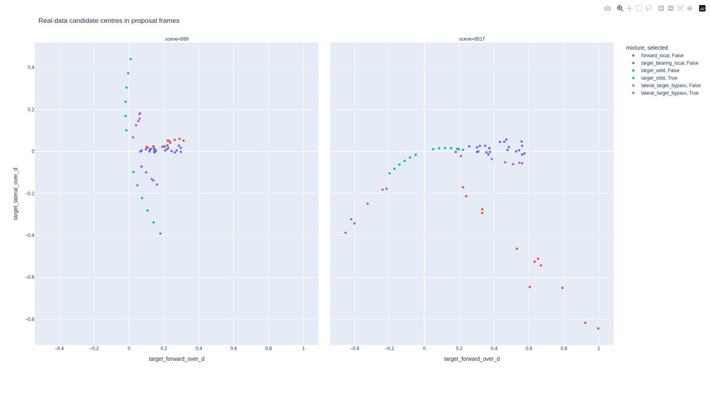

# Target-orbit candidate MVP: two-scene CUDA pilot

## Scope

This evidence bundle compares the existing 60-row `realistic_core` candidate
mixture with an equal-budget challenger that replaces 12 target-bearing rows
with 12 deterministic, bilateral partial-orbit rows. The production mixture and
its nonzero 60°/30° seminar view jitter remain unchanged.

The new family preserves the current horizontal target standoff. For target
bearing $b$, world-up tangent $l$, standoff $d$, and signed angle $\alpha_i$,
the world-horizontal offset is

$$
o_i = d b - d\cos(\alpha_i)b + d\sin(\alpha_i)l.
$$

Negative and positive angle subsets are interleaved, so attempted proposals
cover both target sides. Collision, free-space, clearance, and motion rules may
still reject either side; this MVP does not implement family-aware refill.

## Result

The exact post-review candidate was evaluated on the first two real scenes in
[`rollout_campaign100_source_manifest.json`](../../../../.configs/rollout_campaign100_source_manifest.json)
with the CUDA campaign writer configuration and seed `20260728`.

| Metric | `realistic_core` | target-orbit MVP | Interpretation |
| --- | ---: | ---: | --- |
| best target-root gain, mean over states | 0.046999 | 0.048152 | +2.45% |
| target lateral-balance score | 0.000 | 0.208 | one-sided support is reduced |
| target-relative orbit-angle span | 9.84° | 17.05° | broader target-side support |
| worst-state valid candidates | 21 | 26 | stronger minimum root support |
| actor-valid candidates | 74 / 120 | 72 / 120 | small aggregate-validity decrease |
| target in FOV | 75.8% | 77.5% | modest framing increase |
| family/state pairs with zero valid rows | 1 | 1 | scale-up blocker remains |
| nonzero / bounded view jitter | 100% / 100% | 100% / 100% | seminar invariant preserved |

The observed valid-throughput result was 1.31 versus 1.66 candidates/s, but
renderer cold-start and compilation cost confound a two-run timing comparison;
it is not treated as a general speedup claim.

The interactive Streamlit inspection path uses the same persisted candidate
audit fields and automatically separates the new `target_orbit` component by
`component_name` and stable `position_id=6`.

## Interpretation and limits

This is a positive endpoint-prior MVP, not evidence that people universally
orbit objects. It follows the higher-level pattern used by target-centric NBV
work: propose target-relative views, then restrict them by feasible motion. The
[OA-NBV preprint](https://arxiv.org/abs/2603.11072) combines target-centric
visibility scoring with traversable poses, while
[Where to Look Next](https://arxiv.org/abs/2203.02381) separates recommended
viewpoints from a dynamically feasible, collision-free local planner. These
robotics results ground the separation of proposal and feasibility; they do not
establish a wearable-human orbit distribution.

The highest-ROI realism follow-up is therefore empirical calibration against
Project Aria motion. Official [MPS trajectory documentation](https://facebookresearch.github.io/projectaria_tools/docs/ARK/mps)
provides high-frequency 6DoF trajectories, and
[Aria Digital Twin](https://openaccess.thecvf.com/content/ICCV2023/html/Pan_Aria_Digital_Twin_A_New_Benchmark_Dataset_for_Egocentric_3D_ICCV_2023_paper.html)
provides real egocentric sequences with continuous device poses. Those sources
can estimate conditional step-length, yaw-rate, lateral-motion, and dwell priors
without assuming that a mobile-robot trajectory model transfers directly to a
head-worn camera.

The remaining immediate blocker is not the orbit equation: one target-bearing
family/state pair still has zero valid actions. That belongs to bounded
family-aware refill and admission work, not this proposal-family PR.

## Related owners and issues

- Config owners: [`build_rollouts_v1_realistic.toml`](../../../../.configs/build_rollouts_v1_realistic.toml), [`build_rollouts_v1_cuda_campaign_writer.toml`](../../../../.configs/build_rollouts_v1_cuda_campaign_writer.toml)
- Bounded target-orbit MVP: [#180](https://github.com/JanDuchscherer104/ARIA-NBV/issues/180)
- Broad candidate-family issue: [#69](https://github.com/JanDuchscherer104/ARIA-NBV/issues/69)
- Family-collapse evidence: [#54](https://github.com/JanDuchscherer104/ARIA-NBV/issues/54)
- Empirical Aria motion prior: [#70](https://github.com/JanDuchscherer104/ARIA-NBV/issues/70)
- Family-aware reservoir/refill: [#71](https://github.com/JanDuchscherer104/ARIA-NBV/issues/71)
- Equal-compute benchmark: [#73](https://github.com/JanDuchscherer104/ARIA-NBV/issues/73)
- Scale-up admission gate: [#120](https://github.com/JanDuchscherer104/ARIA-NBV/issues/120)

Machine-readable provenance and exact scalar results are in
[`manifest.json`](manifest.json).
