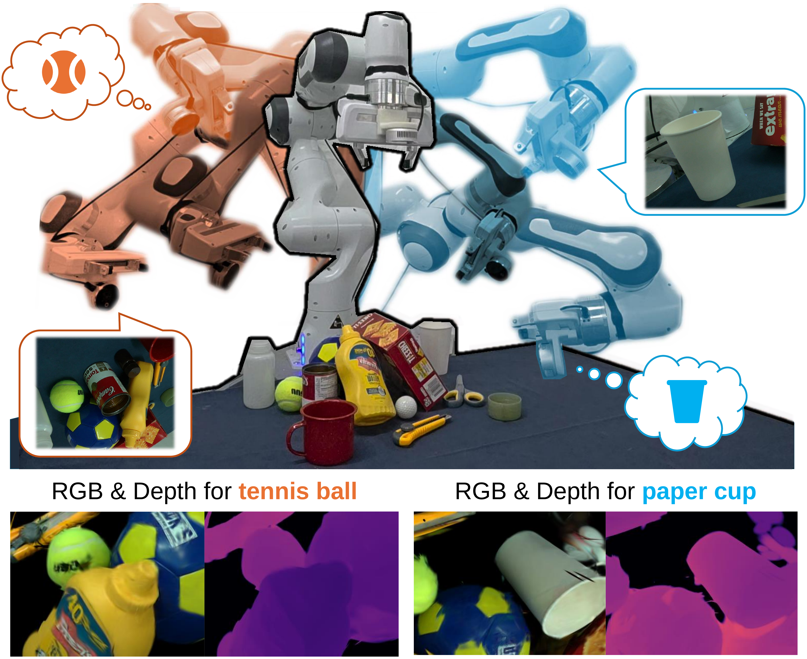
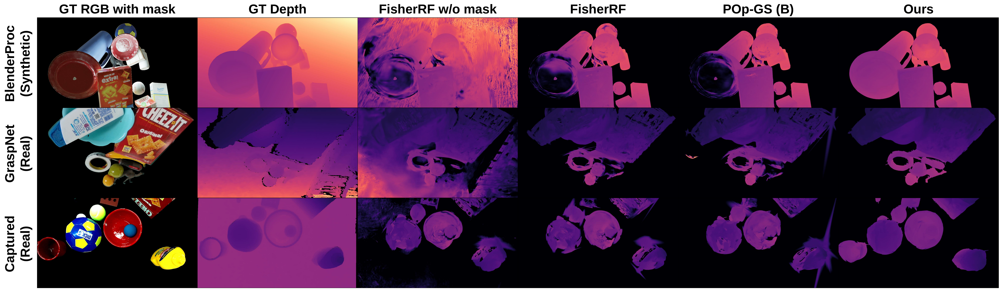
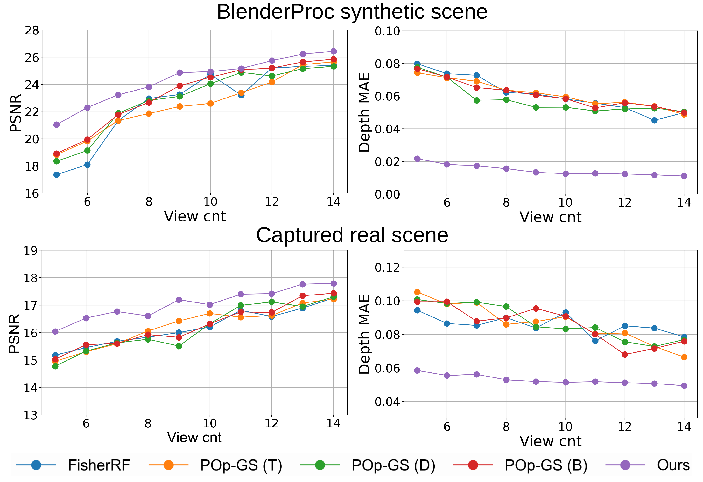
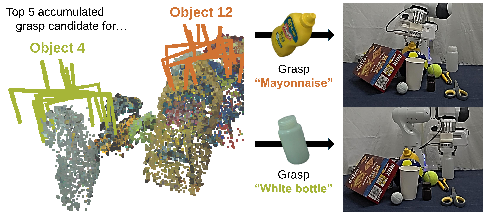

## Informative Object-centric NBV for Object-aware 3DGS {#instance-aware-object-centric-3dgs-nbv}

**Primary source.** *Informative Object-centric Next Best View for Object-aware 3D Gaussian Splatting in Cluttered Scenes* [@ObjectCentricNBV-jeong2026].

**Local source.** [`root.tex`](../../literature/tex-src/arXiv-Instance-NBV/root.tex), the method and experiment sections under [`ver3_rpm/`](../../literature/tex-src/arXiv-Instance-NBV/ver3_rpm/), and the source tables under [`tab/`](../../literature/tex-src/arXiv-Instance-NBV/tab/).

**Preserved figures.** All eight original figure PDFs from the paper's TeX bundle, rendered PNG previews, and checksums are stored under [`figures/external/arXiv/Instance-NBV/`](../../figures/external/arXiv/Instance-NBV/).

**Related ARIA-NBV pages.** [Active 3DGS and targeted NBV](active_3dgs_nbv.qmd), [EFM3D/EVL](efm3d.qmd), [VIN-NBV](vin_nbv.qmd), [RRI theory](../theory/rri_theory.qmd), [candidate sampling and target selection](../theory/candidate_sampling_target_selection.qmd), and [RL planning](rl_planning.qmd).

::: {.callout-important title="Thesis verdict"}
This is a highly relevant systems paper because it makes the reconstruction target explicit and demonstrates that a view set optimized for one object differs from a view set optimized for the whole scene. Its strongest reusable contributions are the actor-interpretable per-Gaussian instance state, image-free candidate scoring, and separation of RGB, depth, and object information channels.

It is **not** a drop-in backbone for ARIA-NBV. The paper has no learned NBV-policy backbone: candidate utility is computed analytically from a differentiable 3DGS rasterizer and a block-diagonal Gauss--Newton information matrix, followed by greedy one-step selection. ARIA-NBV should retain EFM3D/EVL plus semi-dense/ray-aware evidence as the actor-visible backbone, use the paper's Gaussian information channels as an auxiliary proposal/diagnostic branch, and keep target-specific RRI as the authoritative label and evaluation signal.
:::

### Executive peer-review assessment

| dimension | assessment |
|---|---|
| Conceptual novelty | Strong. It converts a whole-scene 3DGS information objective into an instance-aware and target-selective objective with a simple, explicit state. |
| Technical novelty | Moderate to strong. The one-hot Gaussian feature is straightforward; the main technical contribution is confidence-reweighted, block-diagonal Fisher/Gauss--Newton scoring across RGB, depth, and object outputs. |
| Empirical strength | Strong for object-pixel depth, mixed for appearance metrics. The largest ablation gain comes from object-supervised reconstruction rather than the final information-gain scaling. |
| Robotics relevance | Strong motivation and useful integration demonstration, but manipulation evidence is qualitative and omits success-rate, time, collision, and motion-cost comparisons. |
| Theoretical completeness | Limited. Stabilization, parameterization dependence, singular blocks, score calibration, and the claimed exploration interpretation need more analysis. |
| Reproducibility | The TeX source is detailed about losses and hyperparameters, but the evaluation would benefit from code/runtime disclosure, per-scene results, confidence intervals, and exact numerical safeguards. |
| Recommendation | Accept-quality systems contribution; substantial clarification would be required before treating the information score as a theoretically justified reconstruction utility. |

## 1. Problem formulation and relation to ARIA-NBV

The paper considers an active reconstruction loop with a current training-view set \(T\), a finite candidate set \(C\), an object-aware Gaussian map \(G_T\), and optionally a target object \(e\). At each step it evaluates every candidate camera pose without needing that candidate's RGB image, greedily selects the highest information-gain candidate, captures the observation, and re-optimizes the map.

The conceptual comparison to ARIA-NBV is:

| contract | Instance-aware 3DGS NBV | ARIA-NBV thesis contract |
|---|---|---|
| Scene state | Re-optimized 3D Gaussian map with color, opacity, geometry, and instance logits | Actor-visible EVL/EFM3D evidence, predicted OBBs, semi-dense/fused points, ray-aware persistent memory, finite candidates |
| Target state | Fixed-dimensional per-Gaussian instance posterior and a hard target-ID gate | Actor-visible target record from predicted/observed OBB support, class/confidence, local evidence, optional logged descriptors |
| Candidate set | Poses sampled on a sphere around a known scene centroid | Validity-filtered finite candidate table; later target-then-pose or continuous bridge |
| One-step utility | D-optimal log-determinant increase in weighted rendering information | Learned one-step target-RRI estimate, calibrated against mesh-supervised oracle target RRI |
| Horizon | Greedy one step | Bounded oracle lookahead and learned finite-horizon \(Q_H\) |
| Successor state | New image is captured; the 3DGS is reinitialized and optimized again | Leakage-controlled update from an actually logged or rendered successor observation |
| Feasibility | Candidate geometry is largely pre-arranged by the experimental setup | Hard validity masks, invalid reasons, clearance, and optional motion/path cost |
| Evaluation | PSNR, SSIM, LPIPS, object-pixel depth MAE, qualitative grasping | Scene RRI, target-specific RRI, cumulative endpoint quality, validity, motion cost, rank/value calibration |

The paper directly strengthens the motivation for **target-specific** utility: optimizing the whole scene and optimizing one selected entity are different objectives. It does not answer the thesis's sequential question, because its policy remains myopic and does not model future candidate sets, intermediate information-revealing motions, or finite-horizon return.

## 2. Most relevant contributions

### 2.1 Object-aware Gaussian state

Each Gaussian stores the normal 3DGS parameters plus an \(n+1\)-dimensional object-logit vector. Instance masks supervise the logits through differentiable alpha blending. This creates an explicit 3D instance posterior attached to the reconstruction primitives rather than a separate post-hoc segmentation.

**Why it matters to the thesis.** It is a concrete example of target identity becoming part of the reconstruction state. For ARIA-NBV, the analogue should be actor-visible target support from EVL detections, predicted OBBs, tracked masks, and semi-dense evidence; GT instance identities must remain label/evaluation assets.

### 2.2 Confidence-reweighted information gain

Standard Hessian/Fisher scoring can be dominated by well-observed Gaussians because those Gaussians contribute strongly to rendered pixels and hence to the Jacobian. The paper upweights Gaussians with low opacity and diffuse object posterior, attempting to turn an exploitation-heavy information score into an exploration-oriented score.

**Why it matters.** This is a useful auxiliary signal for distinguishing “strongly observed” from “weakly localized or under-observed.” It should be tested for rank correlation with oracle target RRI rather than assumed equivalent to reconstruction improvement.

### 2.3 Efficient block-diagonal approximation

The full rendering information matrix couples all Gaussian parameters and is too large to evaluate candidate by candidate. The method keeps only within-Gaussian parameter correlations, making the determinant a sum of small per-Gaussian log-determinants.

**Why it matters.** The resulting candidate score can be computed without a candidate image and is therefore potentially usable for arbitrary ATEK candidate poses, provided a current Gaussian state exists.

### 2.4 Multi-output utility

The method separately evaluates RGB, depth, and object-output information, normalizes each channel, and combines them with explicit coefficients. This makes the score more inspectable than a single opaque uncertainty scalar.

**Why it matters.** ARIA-NBV should preserve this inspectability: target RRI, scene RRI, validity, motion cost, target visibility, uncertainty, and semantic support should be logged separately even when a learned model consumes them jointly.

### 2.5 Target-conditioned view selection and manipulation

A simple target gate restricts information gain to Gaussians assigned to one object. The resulting view distribution moves toward that object, and the selected multi-view reconstruction is used to obtain grasp proposals.

**Why it matters.** This is the closest contribution to the thesis claim. The target-specific results also expose the expected tradeoff: target accuracy improves while whole-scene accuracy can worsen.

## 3. Method and important mathematics

### 3.1 Gaussian parameterization and rendering

For Gaussian \(g_i\), the paper uses the standard parameterization

$$
g_i =
\left(
\mu_i,\,
s_i,\,
r_i,\,
\sigma_i,\,
c_i,\,
o_i
\right),
$$

where \(\mu_i\in\mathbb R^3\) is the center, \(s_i\in\mathbb R^3\) is scale, \(r_i\in\mathbb R^4\) is rotation, \(\sigma_i\) is opacity, \(c_i\) contains spherical-harmonic color coefficients, and \(o_i\in\mathbb R^{n+1}\) is the added object-logit vector. The spatial covariance is

$$
\Sigma_i = R_i S_i S_i^\top R_i^\top.
$$

For a property \(f_i\), such as color or depth, front-to-back alpha compositing gives

$$
F =
\sum_{i\in\mathcal N}
f_i\alpha_i T_i,
\qquad
T_i =
\prod_{j=1}^{i-1}(1-\alpha_j).
$$

The important point is that the paper renders instance probabilities through the same ordered visibility model rather than assigning labels after rendering.

### 3.2 Rendering the object vector

With \(n\) object instances and background class \(0\), the unnormalized per-pixel object vector is

$$
O'
=
\sum_i
\operatorname{softmax}(o_i)\,
\alpha_i T_i,
\qquad
T_i =
\prod_{j=1}^{i-1}(1-\alpha_j).
$$

Because accumulated opacity can be below one, the residual transmittance is assigned to the background channel:

$$
O
=
O'
+
[1,0,\ldots,0]\,
\left(
1-\mathbf 1^\top O'
\right).
$$

The object-vector loss is

$$
L_{\mathrm{obj}}
=
(1-\lambda_{\mathrm{Dice}})L_{1,\mathrm{obj}}
+
\lambda_{\mathrm{Dice}}L_{\mathrm{Dice}}.
$$

The full reconstruction loss is

$$
L_{\mathrm{overall}}
=
(1-\lambda)L_1
+
\lambda L_{\mathrm{SSIM}}
+
\lambda_{\mathrm{obj}}L_{\mathrm{obj}}.
$$

After supervision, the per-Gaussian object posterior is

$$
p_i=\operatorname{softmax}(o_i).
$$

The implementation prunes a Gaussian when \(\max_k p_{i,k}<\delta_{\mathrm{obj}}\), with \(\delta_{\mathrm{obj}}\) chosen near the uniform prior \(1/(n+1)\).

### 3.3 Greedy information gain

For current training views \(T\) and candidate \(c\),

$$
IG(T,c)
=
f(T\cup\{c\})-f(T),
\qquad
c^\star
=
\operatorname*{arg\,max}_{c\in C}
IG(T,c).
$$

Under an i.i.d. Gaussian pixel-noise and least-squares interpretation, linearizing the renderer gives the Gauss--Newton approximation

$$
H_V
\approx
\sum_{v\in V}J_v^\top J_v,
$$

where \(J_v\) is the Jacobian of the rendered output at view \(v\) with respect to Gaussian parameters. The inverse \(H^{-1}\) is treated as a covariance proxy. The paper chooses a D-optimal score:

$$
f(V)
=
\log\det(H_V)
=
\log\det
\left(
\sum_{v\in V}
J_v^\top J_v
\right).
$$

For \(n\) Gaussians with \(l\) optimized parameters each, the full matrix is \(nl\times nl\). Retaining only per-Gaussian blocks yields

$$
H_V
\approx
\operatorname{blockdiag}
\left(
H_{V,1},\ldots,H_{V,n}
\right),
$$

and therefore

$$
\log\det(H_V)
=
\sum_{g=1}^{n}
\log\det(H_{V,g}).
$$

The source claims this reduces determinant complexity from \(O(l^3n^3)\) to \(O(l^3n)\).

### 3.4 Confidence-weighted information

The paper defines

$$
c_g
=
\max_k(p_{g,k})^{-\alpha_{\mathrm{obj}}}
\sigma_g^{-\alpha_{\mathrm{opa}}},
$$

then repeats the scalar over the \(l\) parameters of Gaussian \(g\):

$$
C_g
=
\operatorname{diag}
(c_g,\ldots,c_g)
\in\mathbb R^{l\times l}.
$$

With

$$
C
=
\operatorname{blockdiag}
(C_1,\ldots,C_n),
$$

the weighted information matrix is

$$
H
\coloneqq
J^\top C J.
$$

The negative exponents are important: \(c_g\) is not a conventional confidence in \([0,1]\). It is an **inverse-confidence priority multiplier**. Low maximum object probability or low opacity increases the Gaussian's contribution to the information score.

### 3.5 RGB, depth, and object-channel normalization

For rendered feature \(f\in\{\mathrm{rgb},d,o\}\), the paper normalizes candidate gain by the average gain assigned to the current training views:

$$
\widetilde{IG}_{f}(T,c)
=
\frac{
IG_f(T,c)
}{
|T|^{-1}
\sum_{t\in T}
IG_f(T,t)
}.
$$

The final score is

$$
\widetilde{IG}(T,c)
=
\widetilde{IG}_{\mathrm{rgb}}(T,c)
+
\beta_d\widetilde{IG}_{d}(T,c)
+
\beta_o\widetilde{IG}_{o}(T,c).
$$

The reported coefficients are \(eta_d=10\) and \(eta_o=1\).

### 3.6 Object-centric target gate

For target instance \(e\), the paper replaces the whole-scene multiplier by

$$
c_{g,e}
=
\begin{cases}
p_{g,e}^{-\alpha_{\mathrm{obj}}}
\sigma_g^{-\alpha_{\mathrm{opa}}},
&
\operatorname*{arg\,max}_k p_{g,k}=e,\\[4pt]
0,
&
\text{otherwise}.
\end{cases}
$$

This is the entire conversion from whole-scene to object-centric NBV: only Gaussians whose winning instance ID is the target contribute.

### 3.7 Reported optimization schedule and hyperparameters

The source describes the following schedule:

- begin from a few predefined views;
- with \(m\) acquired views, optimize for \(100m\) iterations before the next selection;
- use spherical-harmonic degree \(0\) until the final view;
- reinitialize Gaussians from random points at every NBV step;
- after collecting the final view set, optimize for 3,000 iterations at spherical-harmonic degree \(3\);
- report fewer than 10,000 total iterations, compared with the standard 30,000-iteration reference setup.

Reported method hyperparameters are

$$
\lambda_{\mathrm{Dice}}=0.5,\quad
\lambda_{\mathrm{obj}}=0.1,\quad
\delta_{\mathrm{obj}}=0.1,
$$

$$
\alpha_{\mathrm{obj}}=0.3,\quad
\alpha_{\mathrm{opa}}=0.3,\quad
\beta_d=10,\quad
\beta_o=1.
$$

## 4. Important source figures

All original PDFs are retained; the PNGs below are repository-local previews generated from those exact PDFs.

### 4.1 Task-level motivation

{#fig-instance-nbv-main}

[Original TeX-source PDF](../../figures/external/arXiv/Instance-NBV/fig1_ver5.pdf)

**Review.** This is the paper's central conceptual contribution. It makes clear that “best view” is conditional on the requested entity. It also shows that the intended operating regime is constrained tabletop manipulation, not open-world egocentric navigation.

### 4.2 Object-vector rendering and supervision

{#fig-instance-nbv-object-vector}

[Original TeX-source PDF](../../figures/external/arXiv/Instance-NBV/fig2_ver4.pdf)

**Review.** This is a clean and interpretable way to attach instance state to the reconstruction. Its fixed \(n+1\) output dimension is less suitable for a long ATEK stream where objects enter, leave, split, or are re-associated across snippets.

### 4.3 Analytic NBV pipeline

{#fig-instance-nbv-pipeline}

[Original TeX-source PDF](../../figures/external/arXiv/Instance-NBV/fig3_ver4.pdf)

**Review.** Image-free candidate evaluation is the most directly reusable property for ARIA-NBV. The missing piece is a valid successor-state update: a pose can be scored without an image, but a rollout cannot advance honestly without an acquired, logged, or explicitly simulated observation.

### 4.4 Exploration heuristic

{#fig-instance-nbv-confidence}

[Original TeX-source PDF](../../figures/external/arXiv/Instance-NBV/fig4_ver6.pdf)

**Review.** The intuition is plausible but not sufficient to establish calibrated epistemic uncertainty. Low opacity can also mean background, transient evidence, regularization, poor initialization, or an object boundary. The score needs calibration against actual reconstruction improvement.

### 4.5 Whole-scene reconstruction quality

{#fig-instance-nbv-whole-scene}

[Original TeX-source PDF](../../figures/external/arXiv/Instance-NBV/fig5_ver2.pdf)

**Review.** The qualitative depth improvement supports the object-vector regularization story. It is less diagnostic of the NBV score itself because both the reconstruction model and the selected views change.

### 4.6 Target-conditioned view distributions

{#fig-instance-nbv-object-centric}

[Original TeX-source PDF](../../figures/external/arXiv/Instance-NBV/fig6_ver2.pdf)

**Review.** This figure most clearly validates target dependence. It should motivate an ARIA-NBV diagnostic showing how candidate ranks and selected trajectories change when only the target record changes.

### 4.7 Convergence with view budget

{#fig-instance-nbv-convergence}

[Original TeX-source PDF](../../figures/external/arXiv/Instance-NBV/fig7_ver4.pdf)

**Review.** Faster convergence is relevant to acquisition efficiency, but a principled early-stopping criterion is not provided. ARIA-NBV should evaluate endpoint target RRI at equal acquisition budgets and separately report whether a stopping rule reaches a quality threshold earlier.

### 4.8 Downstream grasping

{#fig-instance-nbv-grasping}

[Original TeX-source PDF](../../figures/external/arXiv/Instance-NBV/fig8_ver3.pdf)

**Review.** The demonstration is useful evidence of integration feasibility. It is not a quantitative manipulation evaluation: the paper does not report trial counts, success rate, failure taxonomy, cycle time, or comparison with fixed-view and non-targeted acquisition.

## 5. Experimental evidence

### 5.1 Protocol

The paper evaluates:

- ten BlenderProc synthetic scenes;
- ten real GraspNet scenes;
- four captured BOP-format scenes, of which two use Grounded SAM2 masks and two use manually produced SAM masks;
- four initial views followed by six selected views;
- random and spiral candidates sampled on a sphere around the scene centroid;
- random, spiral, farthest-point sampling, FisherRF, and three POp-GS variants as baselines;
- PSNR, SSIM, LPIPS, and object-pixel depth MAE;
- three runs per experiment.

This protocol is useful for controlled candidate comparison, but it is substantially easier than ATEK/egocentric deployment: poses are known, the object workspace is bounded, candidates lie on a designed sphere, and path feasibility is not part of the score.

### 5.2 Whole-scene results with object masks

#### BlenderProc synthetic scenes

| method | PSNR \(\uparrow\) | SSIM \(\uparrow\) | LPIPS \(\downarrow\) | depth MAE \(\downarrow\) |
|---|---:|---:|---:|---:|
| All candidate views | 29.95 | 0.9646 | 0.0601 | 0.0552 |
| Spiral | 25.69 | 0.8836 | 0.1047 | 0.0694 |
| Random | 24.91 | 0.9079 | 0.0978 | 0.0716 |
| FPS | 24.47 | 0.9026 | 0.1020 | 0.0733 |
| FisherRF | 25.34 | 0.9253 | 0.0873 | 0.0695 |
| POp-T | 26.54 | 0.9366 | 0.0783 | 0.0651 |
| POp-D | 26.64 | 0.9387 | 0.0770 | 0.0641 |
| POp-B | 26.69 | 0.9393 | **0.0766** | 0.0636 |
| **Instance-aware NBV** | **26.90** | **0.9408** | 0.0773 | **0.0144** |

The depth improvement is very large. Appearance improvement over the strongest POp-GS baseline is small, and LPIPS is slightly worse than POp-B.

#### GraspNet scenes

| method | PSNR \(\uparrow\) | SSIM \(\uparrow\) | LPIPS \(\downarrow\) | depth MAE \(\downarrow\) |
|---|---:|---:|---:|---:|
| All candidate views | 23.15 | 0.8759 | **0.1590** | 0.0664 |
| Spiral | **21.69** | 0.8414 | 0.1605 | 0.0739 |
| Random | 20.44 | 0.7997 | 0.1830 | 0.0786 |
| FPS | 21.25 | 0.8346 | 0.1706 | 0.0786 |
| FisherRF | 21.22 | 0.8328 | 0.1715 | 0.0768 |
| POp-T | 21.10 | 0.8310 | 0.1733 | 0.0768 |
| POp-D | 21.16 | 0.8313 | 0.1731 | 0.0770 |
| POp-B | 21.12 | 0.8315 | 0.1731 | 0.0768 |
| **Instance-aware NBV** | 21.47 | **0.8430** | 0.1653 | **0.0487** |

The proposed method again has the best depth MAE and SSIM, but not the best PSNR or LPIPS among selected-view methods. The paper is therefore strongest as a geometry/depth result, not as a uniform novel-view-synthesis win.

### 5.3 Captured-scene results with masks

| mask/source | method | PSNR \(\uparrow\) | SSIM \(\uparrow\) | LPIPS \(\downarrow\) | depth MAE \(\downarrow\) |
|---|---|---:|---:|---:|---:|
| Grounded SAM2 | All | 17.23 | 0.8333 | 0.2053 | 0.1169 |
| Grounded SAM2 | Spiral | 16.66 | 0.8072 | 0.2152 | 0.1128 |
| Grounded SAM2 | FisherRF | 15.60 | 0.7677 | 0.2405 | 0.1135 |
| Grounded SAM2 | POp-D | 16.28 | 0.7894 | 0.2264 | 0.1188 |
| Grounded SAM2 | **Instance-aware NBV** | **16.74** | **0.8148** | **0.2064** | **0.0527** |
| Manual SAM | All | 18.27 | 0.7839 | 0.2936 | 0.0494 |
| Manual SAM | Spiral | 15.49 | 0.6554 | 0.3511 | 0.0792 |
| Manual SAM | FisherRF | 15.34 | 0.6697 | 0.3472 | 0.0761 |
| Manual SAM | POp-D | 15.65 | 0.6927 | 0.3350 | 0.0773 |
| Manual SAM | **Instance-aware NBV** | **16.71** | **0.7280** | **0.3102** | **0.0461** |

The depth result remains strong under pseudo masks. However, “All” should not be described as a strict reconstruction upper bound under this protocol: using all views sometimes produces worse depth than the selected subset. With a fixed or imperfect optimization schedule, more views can change convergence, capacity allocation, mask conflict, and the number of effective updates.

### 5.4 Ablation evidence

| method variant | synthetic PSNR | synthetic D-MAE | GraspNet PSNR | GraspNet D-MAE | captured PSNR | captured D-MAE |
|---|---:|---:|---:|---:|---:|---:|
| FisherRF with mask | 25.34 | 0.0695 | 21.23 | 0.0768 | 15.25 | 0.0913 |
| + object vector | 25.60 | 0.0189 | **21.44** | **0.0486** | 16.05 | 0.0583 |
| + confidence score | 26.84 | **0.0143** | 21.39 | 0.0488 | 16.29 | 0.0521 |
| + IG scaling (full method) | **26.92** | 0.0144 | 21.37 | 0.0491 | **16.34** | **0.0507** |

This table materially changes the interpretation of the paper:

1. The dominant depth gain comes from adding the object-vector reconstruction objective.
2. Confidence weighting adds a meaningful synthetic/captured improvement.
3. The final IG scaling improves PSNR, but slightly **worsens** depth MAE relative to the confidence-only row on both synthetic data (\(0.0143\to0.0144\)) and GraspNet (\(0.0488\to0.0491\)).
4. The paper's central depth claim therefore mixes a reconstruction-model contribution with a view-selection contribution.

A stronger evaluation would hold the reconstruction backend fixed and cross the two factors:

$$
\{\text{RGB-only},\ \text{object-aware reconstruction}\}
\times
\{\text{baseline view selector},\ \text{proposed selector}\}.
$$

### 5.5 Object-centric depth tradeoff

The target-specific experiment chooses four spatially separated corner objects and a center-object target. Selected values are:

#### Synthetic scene

| selection objective | NW | NE | SW | SE | center objects | total objects |
|---|---:|---:|---:|---:|---:|---:|
| Whole scene | 0.0180 | 0.0365 | 0.0130 | 0.0215 | 0.0162 | **0.0193** |
| Corresponding corner target | **0.0132** | **0.0124** | **0.0114** | **0.0166** | 0.0149 | 0.0205 |
| Center target | 0.0182 | 0.0503 | 0.0151 | 0.0286 | **0.0148** | 0.0225 |

#### Captured real scene

| selection objective | NW | NE | SW | SE | center objects | total objects |
|---|---:|---:|---:|---:|---:|---:|
| Whole scene | 0.0621 | 0.2632 | 0.0695 | 0.0777 | 0.0334 | **0.0517** |
| Corresponding corner target | **0.0490** | 0.1963 | **0.0624** | **0.0619** | 0.0313 | 0.0540 |
| Center target | 0.1000 | **0.1816** | 0.0683 | 0.0647 | **0.0304** | 0.0535 |

The experiment supports the target-specific premise, but not a universal “target mode always wins” claim. In the real north-east column, center-target selection happens to beat the corresponding corner-target row. More importantly, the total-object metric becomes worse when the policy specializes. That is expected and should be made explicit in ARIA-NBV as a target/global Pareto tradeoff.

## 6. Peer review

### 6.1 Strengths

1. **The target is explicit.** The method answers “best for which object?” rather than treating scene completeness as task-independent.
2. **Candidate images are not required.** Candidate scoring uses the current differentiable map and pose, which is a strong fit for finite pose tables.
3. **The state is interpretable.** Per-Gaussian opacity, instance posterior, and modality-specific information can be inspected and ablated.
4. **The block approximation is practical.** Per-Gaussian blocks preserve local parameter correlation while avoiding an intractable global determinant.
5. **Depth results are substantial.** Improvements appear on synthetic, benchmark-real, and captured data.
6. **The paper tests pseudo masks.** This is more realistic than relying only on perfect instance annotations.
7. **The target/global tradeoff is visible.** The object-wise table provides direct evidence that specialized acquisition reallocates a finite view budget.
8. **The system closes a robotics loop.** Target selection, active reconstruction, multi-view grasp inference, and robot execution are integrated in one demonstration.

### 6.2 Major technical concerns

#### A. The “confidence” score is an inverse-confidence multiplier

For \(p,\sigma\in(0,1]\),

$$
p^{-\alpha_{\mathrm{obj}}}\sigma^{-\alpha_{\mathrm{opa}}}\ge 1
$$

and diverges as either term approaches zero. The source does not specify an epsilon, maximum clamp, or treatment of exactly zero opacity/probability. This matters both numerically and semantically: a nearly irrelevant or uninitialized Gaussian can dominate the score.

A safer implementation is

$$
\bar c_g
=
\operatorname{clip}
\left[
(\max(p_g,\epsilon_p))^{-\alpha_p}
(\max(\sigma_g,\epsilon_\sigma))^{-\alpha_\sigma},
\,1,\,
c_{\max}
\right],
$$

with an ablation over \(\epsilon\), \(c_{\max}\), and monotone alternatives such as entropy or effective observation count.

#### B. The log-determinant is underspecified for singular blocks

A Gauss--Newton block is positive semidefinite and may be singular, especially with sparse views, SH degree \(0\), occlusion, or parameters that do not affect the current rendering. Then \(\log\det H\) is undefined or \(-\infty\).

The source should state whether it computes

$$
f_\lambda(V)
=
\sum_g
\log\det
\left(
H_{V,g}+\lambda I
\right),
$$

a pseudo-determinant, Cholesky with jitter, or another stabilized quantity. ARIA-NBV must record the damping convention in provenance because candidate rankings can change with \(\lambda\).

#### C. Fisher information is parameterization- and scale-dependent

The Jacobian mixes location, scale, rotation, opacity, color, depth, and object logits. Reparameterizing scale or rotation, changing output resolution, or rescaling depth changes \(J^\top J\). Normalizing RGB/depth/object gains does not solve the within-block unit problem.

Required analyses include:

- whitening or natural parameterization;
- separate parameter groups;
- score sensitivity to image resolution and depth units;
- comparison with trace, pseudo-logdet, and diagonal variants;
- calibration against realized RRI/depth improvement.

#### D. The block diagonal drops the interactions that create occlusion

Visibility is produced by ordered alpha compositing. Gaussians compete for transmittance, and moving or changing one Gaussian affects the contribution of others along the same ray. Discarding cross-Gaussian blocks removes exactly these occlusion and redundancy interactions. The approximation may still work, but its error should be measured on small scenes where a fuller matrix or grouped ray/object blocks are feasible.

#### E. The normalization argument is not theoretically secure

The paper divides candidate gain by the mean gain assigned to training views. Under independent measurement noise, an additional observation from a previously seen pose can legitimately add Fisher information; it is not expected to be exactly zero. The denominator may also be small or unstable, and no epsilon is shown.

A more defensible version would compare:

$$
\frac{IG_f(T,c)}
{\epsilon + \operatorname{median}_{t\in T} IG_f(T,t)},
$$

z-score or robust-rank each modality over the current candidate set, or learn only a monotone calibration from analytic channels to realized target RRI.

#### F. The method remains manually weighted

Despite the adaptive normalization, the final utility uses \(eta_d=10\) and \(eta_o=1\). This is a task-dependent scalarization. The paper does not report sensitivity, transfer across scenes, or a Pareto analysis.

#### G. Hard target assignment discards useful uncertainty and context

The object-centric gate is discontinuous at the posterior argmax and ignores a Gaussian with substantial second-best target probability. It also sets surrounding context to zero, despite the manipulation motivation often requiring support surfaces, free approach space, and occluders around the target.

A better target-context weight is

$$
w_{g,e}
=
p_{g,e}^{\gamma}
\exp
\left(
-\frac{d(\mu_g,B_e)^2}{2\tau^2}
\right),
$$

where \(B_e\) is the actor-visible target OBB and \(	au\) controls a context shell. Target-only, target-plus-context, and whole-scene modes can then be evaluated as distinct utilities.

#### H. The planner is myopic

The method has no horizon, path cost, collision feasibility, stopping rule, candidate generation policy, or belief over future observations. A greedy candidate can be locally informative but block access to a better sequence or consume excessive motion. This is the precise gap addressed by ARIA-NBV's oracle-lookahead and \(Q_H\) questions.

### 6.3 Major experimental concerns

1. **Reconstruction and selection improvements are confounded.** The object-vector loss changes the map, and the map changes candidate scores. The ablation shows the reconstruction change causes most of the depth improvement.
2. **“All views” is not an upper bound.** It can have worse depth under the paper's optimization schedule; it should be called an all-candidate reference.
3. **No uncertainty on reported means.** Three runs are mentioned, but standard deviations, confidence intervals, and per-scene distributions are absent.
4. **The mask pipeline is brittle.** Cross-view instance association errors can propagate into geometry, pruning, information gain, and target selection.
5. **The candidate manifold is favorable.** A sphere centered on a known workspace does not test irregular egocentric reachability, occlusion corridors, or constrained motion.
6. **No candidate-score calibration.** The paper does not show Spearman correlation, top-\(k\) recall, regret, or calibration between predicted information gain and realized reconstruction improvement.
7. **No runtime table.** Per-candidate Jacobian time, memory, Gaussian count, optimization time, and total acquisition cycle time are needed for a robotic active-perception claim.
8. **Reinitialization is not an online map update.** Reconstructing from random points at every step may reduce local-minimum dependence, but it discards persistent optimizer state and can be too expensive for long ATEK sequences.
9. **Appearance results are mixed.** The strongest evidence is object-pixel depth, while PSNR and LPIPS do not consistently dominate.
10. **Manipulation is qualitative.** Successful snapshots do not establish a grasp success-rate improvement or robustness advantage.
11. **Known poses and static scenes simplify the task.** Pose uncertainty, dynamic objects, rolling-shutter effects, and calibration error are not included.
12. **Object-count scaling is unclear.** Fixed \(n+1\) logits and a threshold near \(1/(n+1)\) change behavior as the number of tracked instances changes.

### 6.4 Minor clarity and reporting concerns

- Rename \(c_g\) to an exploration weight or inverse-confidence multiplier.
- State all numerical stabilizers and exact determinant implementation.
- State which Gaussian parameters are included in each RGB/depth/object Jacobian block.
- Explain whether mask background pixels contribute to RGB/depth optimization.
- Report candidate counts and the number retained after geometric filtering.
- Report how instance IDs are made consistent across views.
- Separate acquisition time, segmentation time, reconstruction time, score time, and grasp-inference time.
- Report failure cases where target specialization hurts the target.
- Do not bold a full-method depth value when a preceding ablation row is numerically better.

## 7. Backbone recommendation for ARIA-NBV

### 7.1 What the paper itself uses

The paper does **not** contain a learned policy backbone. Its effective computational backbone is:

1. an object-aware 3DGS representation;
2. instance masks from a segmentation foundation model or manual annotation;
3. a modified differentiable CUDA rasterizer that exposes rendering Jacobians;
4. block-diagonal Gauss--Newton/D-optimal candidate scoring;
5. a greedy argmax policy;
6. CLIP for optional language-to-object selection;
7. EconomicGrasp for the downstream manipulation demonstration.

Calling this a neural NBV backbone would be misleading.

### 7.2 Recommended thesis backbone

The preferred ARIA-NBV stack is:

| layer | recommended component | role |
|---|---|---|
| Core visual-spatial backbone | **EFM3D/EVL** | Actor-visible local voxel and image-foundation evidence; predicted OBB target proposals; calibrated Aria geometry |
| Persistent geometry | **Collapsed semi-dense/fused points plus ray-aware occupied/free/unknown memory** | Evidence beyond the local EVL cube, support counts, uncertainty, directional history |
| Target representation | **Predicted OBB/track plus observed point/voxel support and optional logged DINO descriptor** | Target identity and support without GT leakage |
| Candidate encoder | **Shared candidate-to-state MLP first** | Strong, interpretable finite-candidate baseline with hard mask isolation |
| Candidate interaction | **Deep Sets or masked Set Transformer ablation** | Tests whether candidate competition/context adds value |
| Analytic auxiliary branch | **Object-weighted 3DGS/Fisher channels from this paper** | Proposal, diagnostic, and candidate-token features |
| Learning objective | **One-step target-RRI regression/ranking, then fitted Double-Q \(Q_H\)** | Keeps realized reconstruction quality and multi-step value central |
| Oracle-only branch | **ASE mesh and GT target surfaces** | RRI labels and evaluation only, never actor input |

The 3DGS branch should be treated as a **state-derived sensor**, not the authority on utility. A candidate token can include

$$
z_{t,i}
=
\left[
z^{\mathrm{EVL}}_{t,i},
z^{\mathrm{ray}}_{t,i},
z^{\mathrm{target}}_{t,i},
\widetilde{IG}^{rgb}_{t,i},
\widetilde{IG}^{d}_{t,i},
\widetilde{IG}^{obj}_{t,i},
v_{t,i}^{target},
h_{t,i}^{obj},
u_{t,i}^{opacity},
m_{t,i},
\rho_{t,i},
\Delta T_{t,i},
c^{motion}_{t,i}
\right],
$$

where \(v^{target}\) is predicted target visibility/support, \(h^{obj}\) is object-posterior entropy, \(u^{opacity}\) is an opacity-deficit summary, \(m\) is validity, \(
ho\) is an invalid/low-support reason, and \(\Delta T\) is target/current-pose-relative geometry.

### 7.3 Ranked implementation options

1. **Recommended minimum:** EVL + semi-dense/ray-aware state + target-RRI scorer. Add the paper's analytic signals only as scalar candidate features.
2. **Strong ablation:** initialize a lightweight persistent Gaussian map from actor-visible semi-dense points and logged RGB, attach target posteriors, and compute damped per-Gaussian logdet channels.
3. **Direct paper reproduction:** object-aware 3DGS with mask logits, random reinitialization, modified rasterizer, and greedy information gain. Use this as an external-method baseline, not the thesis default.
4. **Heavy future bridge:** make the Gaussian map itself the persistent \(Q_H\) state and learn candidate value over Gaussian/target tokens. This should be attempted only after leakage, runtime, and one-step calibration are controlled.

## 8. Employing the method for ATEK snippets

### 8.1 Available snippet contract

The repository's `EfmSnippetView` already exposes the inputs needed for a leakage-clean adaptation:

- `camera_rgb`, `camera_slam_left`, and `camera_slam_right`: image tensors, calibration, timestamps, frame IDs, and optional metric ray distances;
- `trajectory`: world-to-rig pose sequence and gravity;
- `semidense`: world-frame points, distance uncertainty, timestamps, volume bounds, and true point counts;
- `obbs`: padded snippet-level OBB predictions when available;
- optional `mesh` and GT OBB structures, which are oracle/evaluation assets only.

A useful initialization call is conceptually

```python
snippet = loader.load(scene_id=scene_id, snippet_id=snippet_id)
rgb = snippet.camera_rgb
traj = snippet.trajectory
points = snippet.semidense.collapse_points(
    include_inv_dist_std=True,
    include_obs_count=True,
)
predicted_obbs = snippet.obbs
```

The adaptation must preserve the actor/oracle boundary: `snippet.mesh`, GT boxes, and GT target crops may generate labels and diagnostics, but cannot define the selected target or candidate score.

### 8.2 Root-state construction

For root snippet \(x_t\):

1. Load synchronized RGB/SLAM streams, calibration, and trajectory.
2. Collapse semi-dense points while retaining inverse-distance uncertainty and observation count.
3. Run or load EVL outputs and predicted OBBs.
4. Select/track an actor-visible target record \(e_t\).
5. Associate logged masks or soft target support to observations. Prefer predicted masks/OBBs and cross-view tracking; reserve GT masks for oracle ablations.
6. Initialize or update a persistent Gaussian auxiliary map from observed points and images.
7. Attach a **binary target posterior** \(p_{g,e}\) or an embedding/track representation rather than a scene-global fixed \(n+1\) vector when object cardinality changes across snippets.
8. Store all provenance: segmentation checkpoint, EVL checkpoint, camera stream, frame indices, map version, damping, score parameters, and target-track ID.

### 8.3 Candidate scoring

For each valid candidate pose \(q_i\):

1. Transform the candidate camera through the ATEK calibration chain.
2. Query EVL local evidence when the candidate/target lies within EVL support; otherwise emit an explicit out-of-extent flag.
3. Ray-query the persistent semi-dense/occupied/free/unknown map.
4. Rasterize the current Gaussian map at \(q_i\) and compute damped RGB/depth/target-object information channels.
5. Pool per-Gaussian signals over the target, a target context shell, and the candidate frustum.
6. Append validity, clearance, relative pose, target bearing/range, and motion cost.
7. Score the candidate with the shared one-step head or \(Q_H\), applying hard validity masking before argmax.

The analytic branch can score a candidate without its RGB image. This property must not be confused with a complete counterfactual transition model.

### 8.4 Leakage-clean successor states

A rollout successor \(s_{t+1}\) requires an observation. Three protocols are defensible:

| protocol | candidate action | successor observation | use |
|---|---|---|---|
| Logged-frame transition | Candidate is restricted or snapped to a future logged ATEK camera pose | Actual logged RGB/depth/mask evidence | Primary real-data/offline protocol |
| ASE oracle-render transition | Candidate may be arbitrary but the simulator/GT mesh renders the next sensor observation | Rendered observation, with explicit simulator provenance | Oracle lookahead and controlled synthetic experiments |
| Score-only counterfactual | Candidate is arbitrary and only analytic current-map features are computed | No successor observation | One-step proposal/rank diagnostic only; not a valid multi-step rollout |

Do not fabricate future DINO/EVL features from a candidate pose unless a separately validated renderer produces the future image. Do not update the object posterior from GT target geometry in the actor branch.

### 8.5 Persistent-map adaptation

The paper reinitializes Gaussians at every acquisition step. For ATEK snippets, the default should instead be one persistent map per sequence or scene segment:

$$
G_{t+1}
=
\mathcal U
\left(
G_t,\,
y_{t+1},\,
T_{w\leftarrow c,t+1}
\right),
$$

where \(y_{t+1}\) is the actually acquired/logged observation. Reinitialization should remain an ablation because it changes both runtime and the semantics of “state.”

Persistent mapping introduces drift and local-minimum risk, but it is the only option that scales naturally across adjacent snippets and makes the optimization state part of the observation history.

### 8.6 Recommended ATEK target weight

A fixed hard instance argmax is brittle across snippets. Use a soft target-plus-context weight such as

$$
w_{g,e}
=
\underbrace{
\left(
\max(p_{g,e},\epsilon)
\right)^\gamma
}_{\text{target membership}}
\underbrace{
\exp
\left(
-\frac{d(\mu_g,B_e)^2}{2\tau^2}
\right)
}_{\text{context shell}}
\underbrace{
\left(
\max(\sigma_g,\epsilon)
\right)^{-\alpha_\sigma}
}_{\text{under-observation priority}},
$$

then compute

$$
H_{V,g}^{(e)}
=
\sum_{v\in V}
J_{v,g}^\top
\left(
w_{g,e}I
\right)
J_{v,g}.
$$

This supports target-only (\(	au\to0\)), target-plus-context, and near-global modes without changing the model interface.

### 8.7 Suggested data products

For every \((\text{snippet},e,q_i)\) row, persist:

- scene/snippet IDs and source frame lineage;
- target-track ID, predicted class, OBB, confidence, observed-support count;
- candidate pose, calibration, validity mask, invalid reason, and motion cost;
- EVL extent/coverage and pooled target/candidate features;
- semi-dense/ray support, free/unknown lengths, directional observation history;
- Gaussian count and map-update version;
- \(\widetilde{IG}_{rgb}\), \(\widetilde{IG}_d\), \(\widetilde{IG}_{obj}\);
- damped logdet, object entropy, opacity statistics, target-visible mass;
- one-step scene and target oracle RRI labels;
- rollout return and successor provenance when a real/simulated successor exists;
- all hyperparameters and checkpoint hashes.

## 9. Thesis experiments enabled by this paper

### 9.1 One-step calibration

Test whether analytic information predicts realized target reconstruction improvement:

$$
\rho_{\mathrm{rank}}
=
\operatorname{Spearman}
\left(
\widetilde{IG}_e(q_i),
RRI_e(q_i)
\right).
$$

Report top-\(1\) regret, top-\(k\) oracle recall, pairwise ranking accuracy, and calibration by target visibility/size/occlusion.

### 9.2 Feature-value ablation

Compare:

1. EVL/geometry candidate scorer;
2. analytic object-weighted IG alone;
3. EVL/geometry + analytic IG channels;
4. object-aware Gaussian map encoded by simple pooling;
5. object-aware Gaussian map with a heavier point/set encoder.

The key question is whether the paper's channels add information beyond actor-visible support and observation count.

### 9.3 Hard versus soft target assignment

Compare:

- hard posterior argmax from the paper;
- soft \(p_{g,e}\);
- binary target/non-target posterior;
- OBB-distance context kernel;
- target-plus-occluder/support-surface context.

### 9.4 Myopic versus finite-horizon planning

Use the same candidate table and state channels for:

- greedy analytic IG;
- greedy learned one-step target-RRI;
- bounded oracle lookahead;
- direct finite-horizon return regression;
- fitted Double-Q \(Q_H\).

This cleanly separates representation quality from planning horizon.

### 9.5 Persistent versus reinitialized 3DGS

Measure:

- target RRI and depth error;
- score stability;
- total optimization time;
- Gaussian count;
- drift/floater rate;
- sensitivity to mask errors.

### 9.6 Stabilization and scale sensitivity

A required matrix of numerical ablations is:

$$
\lambda I
\in
\{10^{-8},10^{-6},10^{-4},10^{-2}\},
$$

$$
c_{\max}
\in
\{10,10^2,10^3,\infty\},
$$

plus depth-unit, image-resolution, Gaussian-parameter-group, and output-weight sensitivity. A score that changes drastically under harmless reparameterization should not be treated as a robust utility.

### 9.7 Target/global Pareto analysis

Report both

$$
\Delta_e(q)
\quad\text{and}\quad
\Delta_{\mathrm{scene}}(q)
$$

for every selected sequence. Plot the Pareto frontier rather than claiming object specialization is unconditionally better.

## 10. Adoption decision

### Adopt now

- explicit actor-visible target record;
- target-conditioned candidate metrics;
- separate scene and target evaluation;
- image-free analytic candidate channels as diagnostics;
- object posterior entropy, opacity deficit, and target-visible mass;
- blockwise computation where runtime demands it;
- a target/global Pareto report.

### Adopt behind an evidence gate

- persistent object-aware Gaussian map initialized from ATEK evidence;
- damped target-weighted logdet as candidate-token features;
- mask/OBB-to-Gaussian association;
- 3DGS-backed successor updates for logged or simulated observations;
- language-to-target matching.

### Do not adopt as thesis core

- replacing target-specific RRI with Fisher/logdet information;
- hard target argmax as the only target representation;
- random Gaussian reinitialization at every step;
- sphere-only candidates around a known centroid;
- greedy score maximization as evidence of multi-step planning;
- GT masks, GT boxes, or GT mesh geometry in actor-visible scoring;
- qualitative grasp snapshots as the primary thesis endpoint.

## 11. Final assessment

The paper is relevant because it demonstrates a fact central to ARIA-NBV: reconstruction utility is conditional on the target entity and finite acquisition budget. Its best contribution is not a new neural backbone; it is an explicit target-aware reconstruction state plus an efficient analytic candidate signal that can be computed before acquiring the candidate image.

For the thesis, the correct synthesis is

$$
\boxed{
\text{EVL/ATEK actor-visible state}
+
\text{persistent ray-aware memory}
+
\text{optional object-weighted Gaussian information}
\longrightarrow
\text{target-RRI scorer / }Q_H
}
$$

rather than

$$
\boxed{
\text{3DGS logdet}
=
\text{ground-truth NBV utility}.
}
$$

The paper should therefore be cited as a strong object-centric active-reconstruction precedent, implemented as an analytic baseline and auxiliary feature branch, and used to sharpen the thesis's target/global, one-step/multi-step, and actor/oracle distinctions.
