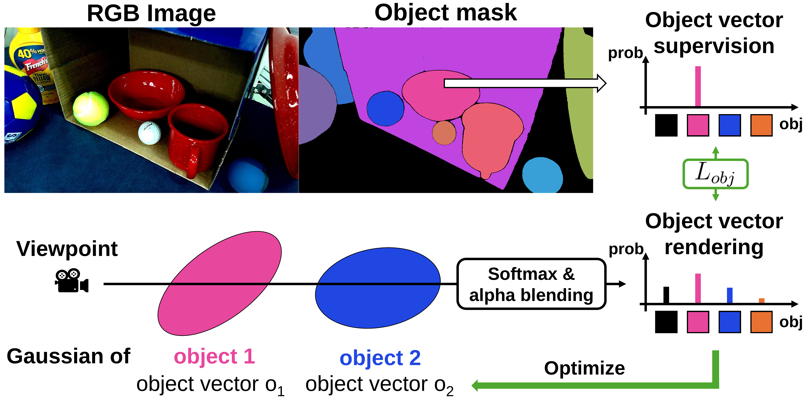
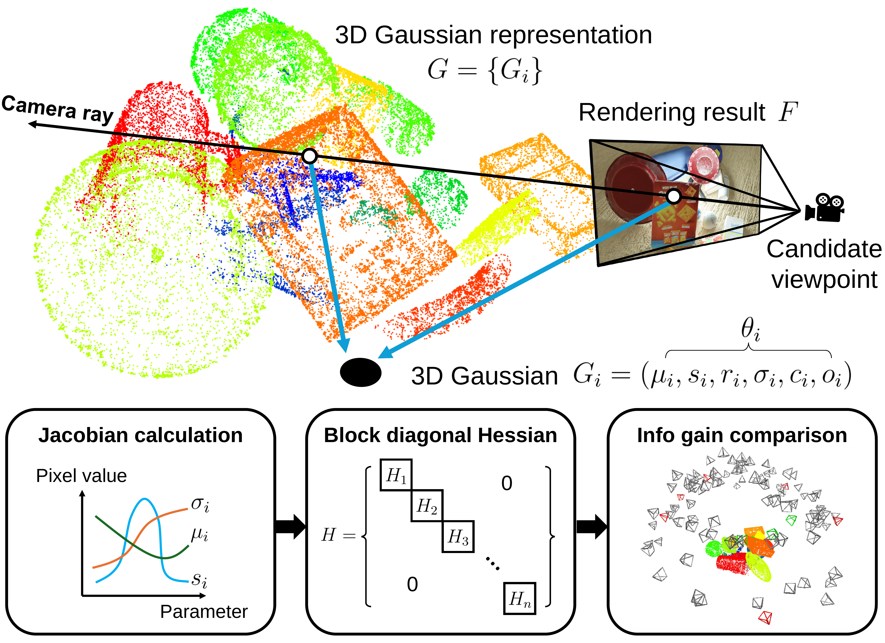
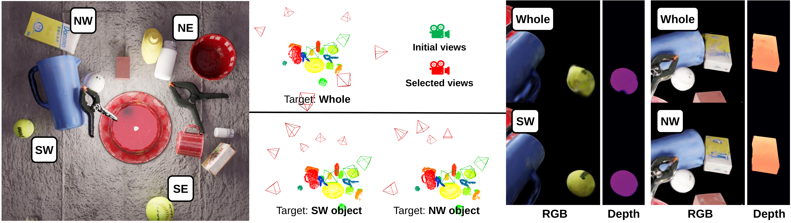

## Informative Object-centric NBV for Object-aware 3DGS {#instance-aware-object-centric-3dgs-nbv}

**Primary source.** *Informative Object-centric Next Best View for Object-aware 3D Gaussian Splatting in Cluttered Scenes* [@ObjectCentricNBV-jeong2026].

**Local source.** [`root.tex`](../../literature/tex-src/arXiv-Instance-NBV/root.tex), [`ver3_rpm/3_method_ver3_rpm.tex`](../../literature/tex-src/arXiv-Instance-NBV/ver3_rpm/3_method_ver3_rpm.tex), [`ver3_rpm/4_experiment_ver3_rpm.tex`](../../literature/tex-src/arXiv-Instance-NBV/ver3_rpm/4_experiment_ver3_rpm.tex), and the source tables under [`tab/`](../../literature/tex-src/arXiv-Instance-NBV/tab/).

**Preserved figures.** The three figures needed to understand the transferable method are stored as PNGs under [`figures/external/arXiv/Instance-NBV/`](../../figures/external/arXiv/Instance-NBV/): object-vector supervision, analytic candidate scoring, and target-conditioned view selection.

**Related ARIA-NBV pages.** [Active 3DGS and targeted NBV](active_3dgs_nbv.qmd), [EFM3D/EVL](efm3d.qmd), [VIN-NBV](vin_nbv.qmd), [RRI theory](../theory/rri_theory.qmd), [candidate sampling and target selection](../theory/candidate_sampling_target_selection.qmd), and [RL planning](rl_planning.qmd).

::: {.callout-important title="Thesis verdict"}
The paper is directly relevant because it makes the reconstruction target explicit: the views that best improve one object are not generally the views that best improve the whole scene. Its most useful ideas for ARIA-NBV are an instance-conditioned spatial state, image-free candidate diagnostics, and separate RGB/depth/object utility channels.

It is **not** a replacement for the thesis backbone or objective. The paper has no learned NBV backbone; it repeatedly optimizes an object-aware 3DGS map and greedily ranks candidates by a confidence-weighted Gauss--Newton log-determinant. For ATEK, retain EFM3D/EVL plus semi-dense and ray-aware evidence as the actor-visible backbone, and treat object-aware 3DGS information as an optional proposal or candidate feature calibrated against target-specific RRI.
:::

## 1. Distillation of the method

The active loop maintains a set of acquired views $T$, reconstructs an object-aware Gaussian map $G_T$, scores a finite candidate set $C$ without acquiring candidate images, selects the largest one-step information gain, captures that view, and rebuilds the map. The policy is therefore analytic and greedy rather than learned or finite-horizon.

The paper contributes four ideas that matter to ARIA-NBV:

1. **Instance state is embedded in the 3D representation.** Every Gaussian receives an object-logit vector supervised by 2D instance masks, so color, depth, and target identity share the same visibility and compositing model.
2. **Under-observed primitives are explicitly prioritized.** Low opacity and diffuse object posteriors increase a Gaussian's contribution to candidate information gain.
3. **Candidate scoring is image-free.** Rendering Jacobians at a hypothetical camera pose estimate information without requiring the candidate's RGB/depth observation.
4. **Whole-scene and target-object selection share one interface.** A target gate changes which Gaussians contribute, causing the selected viewpoint distribution to move toward the requested object.

The most important empirical qualification is that the ablation attributes most of the depth improvement to **object-supervised reconstruction**, not to the final information-gain normalization. Reconstruction-state gains and view-selection gains must therefore be separated in any ARIA-NBV reproduction.

## 2. Object-aware Gaussian representation

{#fig-instance-nbv-object-vector width=95%}

For Gaussian $g$, let $o_g\in\mathbb R^{n+1}$ be logits for $n$ instances plus background and let $p_g=\operatorname{softmax}(o_g)$. The rendered, unnormalized object vector along a ray is

$$
O'
=
\sum_g p_g\,\alpha_g T_g,
\qquad
T_g=\prod_{j<g}(1-\alpha_j).
$$

Residual transmittance is assigned to background so the vector is a probability distribution:

$$
O
=
O'
+
[1,0,\ldots,0]
\left(1-\mathbf 1^\top O'\right).
$$

The instance loss and complete reconstruction loss are

$$
L_{\mathrm{obj}}
=
(1-\lambda_{\mathrm{Dice}})L_{1,\mathrm{obj}}
+
\lambda_{\mathrm{Dice}}L_{\mathrm{Dice}},
$$

$$
L_{\mathrm{overall}}
=
(1-\lambda)L_1
+
\lambda L_{\mathrm{SSIM}}
+
\lambda_{\mathrm{obj}}L_{\mathrm{obj}}.
$$

The source prunes a Gaussian when $\max_k p_{g,k}<\delta_{\mathrm{obj}}$. This suppresses unconstrained/background primitives, but it also couples map topology to mask quality and to the number of active instances.

### Transferable lesson

A target should not be only a scalar class ID appended at the end of a scorer. Target membership should be attached to the spatial evidence being projected or queried. For ATEK this does **not** require a Gaussian map: the same principle can be implemented as soft target support over EVL voxels and semi-dense/fused points.

## 3. Confidence-weighted analytic candidate score

{#fig-instance-nbv-pipeline width=95%}

For a view set $V$, the renderer Jacobian $J_v$ gives a Gauss--Newton information approximation

$$
H_V
\approx
\sum_{v\in V} J_v^\top J_v.
$$

The paper uses a D-optimal objective

$$
f(V)=\log\det(H_V),
$$

and one-step information gain

$$
IG(T,c)=f(T\cup\{c\})-f(T),
\qquad
c^\star=\operatorname*{arg\,max}_{c\in C}IG(T,c).
$$

The full matrix couples all Gaussian parameters. The implementation retains only within-Gaussian blocks,

$$
H_V
\approx
\operatorname{blockdiag}(H_{V,1},\ldots,H_{V,N_G}),
\qquad
\log\det H_V
=
\sum_g\log\det H_{V,g},
$$

reducing the stated determinant complexity from $O(l^3N_G^3)$ to $O(l^3N_G)$ for $l$ parameters per Gaussian.

To prioritize weakly observed primitives, the paper defines an inverse-confidence multiplier

$$
c_g
=
\max_k(p_{g,k})^{-\alpha_{\mathrm{obj}}}
\sigma_g^{-\alpha_{\mathrm{opa}}},
$$

where $\sigma_g$ is opacity, repeats it over the Gaussian's parameter block, and computes

$$
H\coloneqq J^\top C J.
$$

Despite its name, $c_g$ is not confidence in $[0,1]$: lower object certainty or opacity produces a **larger** weight. A numerically defensible implementation requires floors/clamps and positive damping,

$$
\widetilde H_{V,g}=H_{V,g}+\lambda I,
$$

with the damping and parameter subset recorded in every experiment.

### Multiple rendered outputs

For $f\in\{\mathrm{rgb},d,o\}$, each channel is normalized by the average gain assigned to the already acquired views:

$$
\widetilde{IG}_f(T,c)
=
\frac{IG_f(T,c)}{|T|^{-1}\sum_{t\in T}IG_f(T,t)}.
$$

The final score is

$$
\widetilde{IG}(T,c)
=
\widetilde{IG}_{\mathrm{rgb}}(T,c)
+
\beta_d\widetilde{IG}_{d}(T,c)
+
\beta_o\widetilde{IG}_{o}(T,c).
$$

This is useful mainly as a design pattern: preserve geometry, target/semantic evidence, uncertainty, feasibility, and cost as separate inspectable channels. It is not evidence that this scalarization equals reconstruction improvement.

## 4. Object-centric specialization

{#fig-instance-nbv-object-centric width=100%}

For target object $e$, the paper uses the hard gate

$$
c_{g,e}
=
\begin{cases}
p_{g,e}^{-\alpha_{\mathrm{obj}}}\sigma_g^{-\alpha_{\mathrm{opa}}},
& \operatorname*{arg\,max}_k p_{g,k}=e,\\
0,&\text{otherwise}.
\end{cases}
$$

This validates the central thesis intuition that a target-conditioned policy should change its ranking when only the target changes. The exact hard gate is less transferable: it is discontinuous, discards posterior uncertainty, and excludes context such as support surfaces, occluders, or approach space.

For ATEK, a soft target-plus-context weight is more appropriate:

$$
w_{x,e}
=
\bigl(\max(p_{x,e},\epsilon)\bigr)^\gamma
\exp\!\left(-\frac{d(x,B_e)^2}{2\tau^2}\right)
\bigl(\max(u_x,\epsilon)\bigr)^{-\alpha},
$$

where $x$ may be a Gaussian, voxel, or point; $B_e$ is the actor-visible target OBB/support; $u_x$ is an observation-confidence quantity; and $\tau$ controls the context shell. This yields target-only, target-plus-context, and near-global modes without changing the candidate interface.

## 5. Evidence and peer-review assessment

The reported whole-scene geometry results are strong. With masks, depth MAE on the BlenderProc scenes is $0.0144$, compared with $0.0695$ for FisherRF and $0.0636$ for the strongest POp-GS variant. On GraspNet it is $0.0487$, versus roughly $0.077$ for the information baselines. Captured scenes using Grounded SAM2 masks also improve substantially. The paper reports an additional object-depth reduction when selection is targeted to that object.

The ablation is the key evidence for interpretation:

| variant | synthetic D-MAE | GraspNet D-MAE | captured D-MAE |
|---|---:|---:|---:|
| FisherRF with mask | 0.0695 | 0.0768 | 0.0913 |
| + object vector | 0.0189 | **0.0486** | 0.0583 |
| + confidence weighting | **0.0143** | 0.0488 | 0.0521 |
| + output IG scaling | 0.0144 | 0.0491 | **0.0507** |

Thus:

- the object-vector loss supplies the dominant geometric gain;
- confidence weighting adds useful exploration pressure;
- final cross-output scaling is a smaller and mixed refinement;
- appearance metrics do not uniformly dominate the strongest baseline;
- manipulation is demonstrated qualitatively rather than through success rate, cycle time, or failure statistics.

### Main limitations for thesis use

| limitation | consequence for ARIA-NBV |
|---|---|
| Fixed $n+1$ instance vector | Poor fit for objects entering/leaving and identity reassociation across ATEK snippets; use tracks, binary target membership, or embeddings. |
| Mask dependence | Segmentation errors affect geometry, pruning, uncertainty, and selected views; use actor-visible predicted masks/OBBs and report mask-quality sensitivity. |
| Per-step map reinitialization | Not a persistent online state and expensive for long sequences; retain as a reproduction baseline only. |
| Sphere around known centroid | Does not represent egocentric reachability, irregular rooms, or path constraints; use the existing validity-filtered candidate table. |
| Greedy one-step score | Gives no evidence about oracle lookahead or $Q_H$; use only as a one-step proposal/feature. |
| Uncalibrated log-determinant | Sensitive to parameterization, damping, block approximation, and modality scaling; calibrate against realized target RRI. |
| No candidate-score diagnostics | Report Spearman/Kendall correlation, top-$k$ recall, regret, and calibration against oracle target RRI. |
| No runtime/path evaluation | Record Gaussian count, optimization time, Jacobian time, memory, candidate validity, and motion cost. |

## 6. Backbone choice for ARIA-NBV

### Recommended backbone

The default should remain **frozen EFM3D/EVL plus persistent semi-dense/ray-aware state**, not object-aware 3DGS. EVL already matches ATEK camera models, pose conventions, local voxel lifting, and predicted OBB support. A target-conditioned candidate head can consume:

- candidate pose relative to the current rig and target;
- pooled EVL voxel evidence;
- semi-dense projection coverage, uncertainty, and observation count;
- predicted target OBB/track and soft target support;
- hard validity and invalid-reason fields;
- optional object-aware 3DGS information channels.

The paper's method is best placed as an **auxiliary analytic branch**:

$$
z_{t,i}
=
[\,z^{\mathrm{EVL}}_{t,i},
z^{\mathrm{semidense}}_{t,i},
z^{\mathrm{target}}_{t,i},
\widetilde{IG}^{rgb}_{t,i},
\widetilde{IG}^{d}_{t,i},
\widetilde{IG}^{obj}_{t,i},
h^{obj}_{t,i},
u^{opacity}_{t,i},
m_{t,i},
c^{motion}_{t,i}\,].
$$

Train the one-step scorer and later $Q_H$ against target-specific RRI. The analytic channels may improve proposals or representation, but they never become oracle labels by definition.

### Ranked implementation choices

1. **Minimum, recommended:** EVL + semi-dense/ray-aware target state; implement object confidence, target-visible mass, and directional novelty directly on voxels/points. No 3DGS dependency.
2. **High-value ablation:** maintain a lightweight object-aware Gaussian map from logged ATEK observations and append damped RGB/depth/object log-determinant channels to candidate tokens.
3. **External-method reproduction:** reproduce the paper's object-aware 3DGS, greedy score, and reinitialization on a small ATEK/ASE subset to separate representation gains from selection gains.
4. **Future bridge:** use a persistent Gaussian map as part of a learned successor state only after one-step score calibration, runtime, identity tracking, and leakage are controlled.

## 7. ATEK snippet adaptation

ATEK snippets provide the ingredients needed for a leakage-clean adaptation: synchronized RGB/SLAM streams, calibration, gravity-aligned trajectory, semi-dense points with uncertainty/observation metadata, optional ray distance/depth, and OBB structures. GT meshes, GT boxes, and GT masks remain oracle/evaluation assets.

### 7.1 Build an actor-visible target state

For each snippet:

1. Load RGB/SLAM frames, calibrated camera models, rig poses, and gravity.
2. Collapse valid semi-dense points while preserving inverse-distance uncertainty and observation count.
3. run/load EVL and obtain actor-visible occupancy/centerness and predicted OBBs;
4. select or track a target using predicted OBBs, predicted/tracked masks, class confidence, and optional image-foundation descriptors;
5. lift soft target support into EVL voxels and semi-dense/fused points;
6. record target provenance and never use GT identity, mesh support, or GT boxes in actor-visible scoring.

A binary target posterior or target embedding is preferable to a scene-global $n+1$ vector because object cardinality changes across snippets.

### 7.2 Two practical adaptations

#### A. EVL-native adaptation without 3DGS

Replace each Gaussian quantity by an actor-visible voxel/point analogue:

| paper quantity | ATEK/EVL analogue |
|---|---|
| $p_{g,e}$ | soft target membership from predicted OBB/mask/track support |
| opacity $\sigma_g$ | observation count, occupancy confidence, ray termination support, or fusion weight |
| object entropy | target/class posterior entropy per voxel/point |
| rendering visibility | calibrated projection and ray queries from a candidate pose |
| per-Gaussian block | pooled target/context cells or points |
| log-determinant gain | optional novelty/uncertainty feature; not the training label |

This captures the paper's useful inductive bias with little engineering risk and no per-snippet 3DGS optimization.

#### B. Auxiliary object-aware 3DGS adaptation

For a stronger ablation:

1. initialize Gaussians from actor-visible semi-dense points and optional logged metric depth;
2. optimize RGB plus predicted/tracked instance-mask supervision over the snippet;
3. preserve a map across adjacent snippets rather than reinitializing at every decision;
4. compute damped block information for each candidate pose;
5. pool whole-scene, target-only, and target-plus-context channels;
6. append the resulting channels to the candidate row used by the one-step scorer or $Q_H$.

This branch must expose map age, Gaussian count, optimization iterations, mask source, damping, and runtime as data fields.

### 7.3 Candidate evaluation and successor-state rules

For each valid candidate $q_i$:

1. apply the ATEK calibration chain and express pose relative to rig and target;
2. project EVL voxels and semi-dense/fused points into the candidate camera;
3. compute target-visible mass, unknown/free-space ray statistics, incidence/directional novelty, and optional Gaussian information channels;
4. append hard validity, clearance, invalid reason, and motion cost;
5. rank with the one-step target-RRI scorer or masked $Q_H$.

Image-free analytic scoring does **not** provide a successor observation. Multi-step data must use one of these protocols:

| protocol | admissible successor |
|---|---|
| Logged ATEK transition | snap/restrict the action to a future logged pose and update with the actual logged observation |
| ASE oracle-render transition | render an explicit future sensor observation from the simulator/GT mesh with provenance |
| Score-only hypothetical candidate | one-step diagnostic only; no state transition and no multi-step rollout |

Do not fabricate future EVL/DINO features from a pose alone, and do not update actor-visible target state from GT geometry.

### 7.4 Required calibration experiment

Before adding the analytic branch to $Q_H$, compare candidate scores against oracle target RRI on identical candidate sets:

- Spearman and Kendall rank correlation;
- top-1/top-5 oracle recall;
- selected-view regret;
- calibration by target visibility, mask confidence, range, and acquisition stage;
- EVL-only versus EVL + object-confidence versus EVL + damped logdet;
- target-only versus target-plus-context versus whole-scene weighting;
- runtime and memory per candidate.

The branch is justified only if it improves held-out target-RRI ranking or downstream finite-horizon return beyond simpler EVL/semi-dense features.

## 8. Adopt / test / reject

| decision | item |
|---|---|
| **Adopt now** | Explicit target-conditioned state; soft target support over spatial evidence; separate geometry/semantic/uncertainty channels; candidate-rank diagnostics; target/global tradeoff reporting. |
| **Test as ablation** | Confidence weighting using target posterior and observation strength; target-plus-context shells; persistent object-aware Gaussian map; damped per-output logdet candidate features. |
| **Keep as external baseline** | Greedy object-aware 3DGS reproduction on a small controlled subset. |
| **Reject as thesis default** | Replacing EVL with 3DGS, using logdet as the reward, fixed hard instance IDs, GT masks/boxes as actor input, per-step random reinitialization, sphere-only candidates, and treating greedy selection as multi-step evidence. |

The paper's enduring contribution to ARIA-NBV is not a new thesis objective. It is the demonstration that **semantic target identity should alter the spatial evidence and candidate utility before selection**, together with a concrete analytic signal that can be tested against the thesis's mesh-supervised target-RRI authority.
